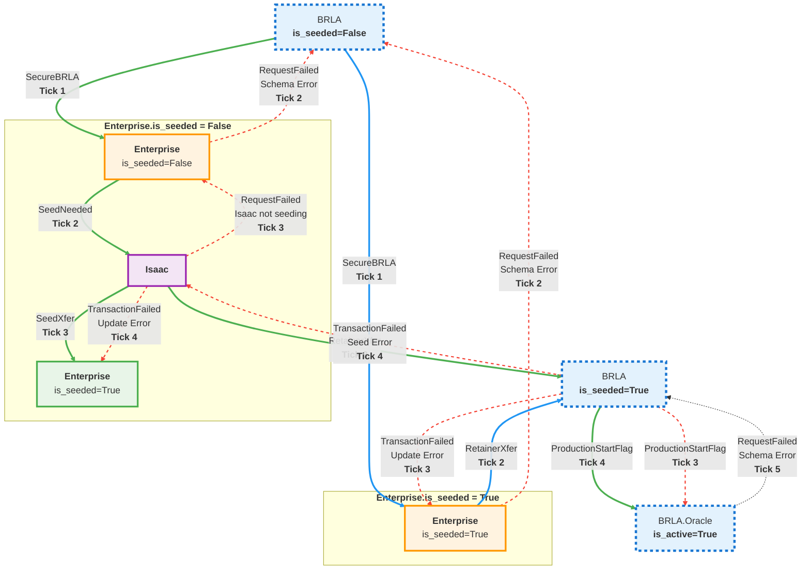

# SecureBRLA Flow Loop

SecureBRLA.py is the first cascading flow in the simulation, and can be used when an Enterprise needs to pay a BRLA Retainer Fee.

Later: Seeds require USD as collateral at going exchange rate.

## Actors Involved

| Actor | Initial State (if relevant) | Role | Final State (if relevant) |
|--------|-----------------------------|------|---------------------------|
| BRLA | BRLA.is_seeded = False | Source, Target | BRLA.is_seeded = True |
| Enterprise | Enterprise.is_seeded = False | Source, Target | Enterprise.is_seeded = True |
| Isaac | irrelevant | Source, Target | irrelevant |
| Oracle | Oracle.is_active = False | Target | Oracle.is_active = True |

## Flows Involved
| Flow | Flow Type | Spawned By | Spawns |
|------|-----------|------------|--------|
| SecureBRLA | Request Dart | `BRLA` | SeedNeeded or RetainerXfer |
| SeedNeeded | Request Dart | SecureBRLA | SeedXfer | 
| SeedXfer | Credit Dart | SeedNeeded | RetainerXfer |
| RetainerXfer | Credit Dart | SecureBRLA, SeedNeeded | ProductionStartFlag |
| RequestFailed | Failure Dart | SecureBRLA, SeedNeeded, SeedXfer, RetainerXfer | failure_retry_node Handles |
| TransactionFailed | Failure Dart | SeedXfer, RetainerXfer | failure_retry_node Handles |
| ProductionStartFlag | Request Dart | RetainerXfer | Production Loop |

## Dependencies, Assumptions, and Outputs
[Bulleted list of prerequisites, external factors, or configs.]
- **Assumes**: `Robonomics.tick()` is called to initialize.
- **Default parameters**: `brla_retainer_fee = 100,000`
- **No blocking/waiting**: All flows in this loop are *Dart Flows* that will flag themselves for removal at the end of the same tick they are created.
- **Logging output**: Appended to `src/asimov/output/flow_logs.txt`.
- **RequestFailed or TransactionFailed**: Spawn the flow, but actors handle retrys.
- **ProductionStartFlag signals successful Secure BRLA Flow Loop**

## Sequence of Steps
[Numbered list describing the exact flow in chronological order. Use sub-bullets for details like triggers, method calls, conditions, logging, and completion flags. Reference ticks/cycles for timing.]

1. **Called by Robonomics.tick()**
2. **SecureBRLA.tick()**
   - **Tick Count**: 1
   - **Triggered by**: Created during BRLA initialization with failure_retry_node=BRLA.UUID, activated by Robonomics.tick()
   - **Payload**: brla_retainer_fee
   - **Track**:
     - **Boolean**: success = True
     - **Boolean**: makeRequestFailed = False
     - **Dict**: failure_payload = {retry = True, reason = "", Flow = None}
     - **Boolean**: makeSeedNeeded = False
     - **Boolean**: makeRetainerXfer = False
   - **Schema Checks Total**: 1
     - **Schema to Check**: Enterprise.is_seeded == False
   - **try**: Core Flow Logic
     - if Enterprise.is_seeded == False
        - **Flow Path 1**: makeSeedNeeded = True
     - else
         - **Flow Path 2**: makeRetainerXfer = True
   - **catch**: Errors checking schema
     - **Flow Path 1.1**: makeRequestFailed = True
     - **Log**: "SecureBRLA [BRLA.UUID] unable to check schema on Step: [current_step], Tick: [current_tick], [error_message]"
   - **try**: Spawn Flows
     - **Flow Path 1**: if makeSeedNeeded
        - **Create Flow**: Initializes with source=`Enterprise.UUID`, target=`Isaac.UUID`, model=`robonomics`, float_payload=brla_retainer_fee, failure_retry_node=BRLA.UUID
        - **Log**: "SecureBRLA [BRLA.UUID] spawned SeedNeeded from [source.UUID] to [target.UUID] on Step: [current_step], Tick: [current_tick]"
     - **OR**
     - **Flow Path 2**: if makeRetainerXfer
        - **Create Flow**: Initializes with source=`Enterprise.UUID`, target=`BRLA.UUID`, model=`robonomics`, float_payload=brla_retainer_fee, failure_retry_node=Enterprise.UUID
        - **Log**: "SecureBRLA [BRLA.UUID] spawned RetainerXfer from [source.UUID] to [target.UUID] on Step: [current_step], Tick: [current_tick]"
     - **OR**
        - **Flow Path 1.1**: if makeRequestFailed
          - **Track**: failure_payload = {retry = True, reason = "Schema Check Failed", Flow = self}
          - **Create Flow**: Initializes with source=`Enterprise.UUID`, target=failure_retry_node, model=`robonomics`, failure_payload=failure_payload, failure_retry_node=Enterprise.UUID
          - **Log**: "SecureBRLA [BRLA.UUID] spawned RequestFailed from [source.UUID] to [target.UUID] on Step: [current_step], Tick: [current_tick] because [failure_payload.reason]"
   - **catch**: Errors creating flows
     - **Track**: success = False
     - **Log**: "SecureBRLA [BRLA.UUID] failed to spawn flow from [source.UUID] to [target.UUID] on Step: [current_step], Tick: [current_tick], [error_message]"
   - **try**: Flag for Dissolution
     - **Log**: "SecureBRLA [BRLA.UUID] flagged for dissolution on Step: [current_step], Tick: [current_tick]"
     - **Return**: success
   - **catch**: Errors in flagging for dissolution.
     - **Log**: "SecureBRLA [BRLA.UUID] not flagged for dissolution on Step: [current_step], Tick: [current_tick], [error message]"
     - **return**: False (No need to waste op setting result to False, it's used to track the case where flow creation fails but dissolution succeeds)

3. **Path 1 SeedNeeded.tick()**
   - **Tick Count**: 2
   - **Triggered by**: Created by SecureBRLA in tick cycle 1 with failure_retry_node=BRLA.UUID, called by Robonomics.tick()
   - **Payload**: brla_retainer_fee
   - **Track**: 
      - **Boolean**: success = True
      - **Boolean**: makeRequestFailed = False
      - **Dict**: failure_payload = {retry = True, reason = "", Flow = None}
      - **Float**: seed_to_enterprise, seed_to_brla
      - **Boolean**: makeSeedXfer = False
      - **Boolean**: makeRetainerXfer = False
   - **Schema Checks Total**: 1
     - **Schema to Check**: Isaac.is_seeding
   - **try**: Core Flow Logic
     - if Isaac.is_seeding
       - **Flow Path 1**: makeSeedXfer = True, makeRetainerXfer = True
     - else **Flow Path 1.2**: makeRequestFailed = True
   - **catch** Errors checking schema
        - **Flow Path 1.2**: makeRequestFailed = True
        - **Log**: "SeedNeeded [SeedNeeded.UUID] unable to check schema on Step: [current_step], Tick: [current_tick], [error_message]"
   - **try**: Spawn Flows
     - **Flow Path 1**: if makeSeedXfer
       - **Track**: seed_to_enterprise = Isaac.mint(Isaac.seed_scalar * brla_retainer_fee)
       - **Create Flow**: Initializes with source=`Isaac.UUID`, target=`Enterprise.UUID`, model=`robonomics`, float_payload=seed_to_enterprise, failure_retry_node=Isaac.UUID
       - **Log**: "SeedNeeded [SeedNeeded.UUID] spawned SeedXfer from [source.UUID] to [target.UUID] on Step: [current_step], Tick: [current_tick]"
     - if makeRetainerXfer
        - **Track**: seed_to_brla =  Isaac.mint(brla_retainer_fee)
        - **Create Flow**: Initializes with source=`Isaac.UUID`, target=`BRLA.UUID`, model=`robonomics`, float_payload=seed_to_brla, failure_retry_node=Isaac.UUID
        - **Log**: "SeedNeeded [SeedNeeded.UUID] spawned RetainerXfer from [source.UUID] to [target.UUID] on Step: [current_step], Tick: [current_tick]"
     - **OR**
     - **Flow Path 1.2**: if makeRequestFailed
       - **Track**: failure_payload = {retry = True, reason = "Isaac not seeding", Flow = self}
       - **Create Flow**: Initializes with source=`Isaac.UUID`, target=failure_retry_node, model=`robonomics`, failure_payload=failure_payload, failure_retry_node=BRLA.UUID
       - **Log**: "SeedNeeded [SeedNeeded.UUID] spawned RequestFailed from [source.UUID] to [target.UUID] on Step: [current_step], Tick: [current_tick] because [failure_payload.reason]"
   - **catch**: Errors creating flows
     - **Track**: success = False
     - **Log**: "SeedNeeded [SeedNeeded.UUID] failed to spawn flow from [source.UUID] to [target.UUID] on Step: [current_step], Tick: [current_tick], [error message]"
   - **try**: Flag for Dissolution
     - **Log**: "SeedNeeded [SeedNeeded.UUID] flagged for dissolution on Step: [current_step], Tick: [current_tick]"
     - **Return**: success
   - **catch**: Errors in flagging for dissolution.
     - **Log**: "SeedNeeded [SeedNeeded.UUID] not flagged for dissolution on Step: [current_step], Tick: [current_tick], [error message]"
     - **return**: False (No need to waste op setting success to False, it's used to track the case flow creation fails but dissolution succeeds)

4. **Path 1 SeedXfer.tick()**
   - **Tick Count**: 3
   - **Triggered by**: Created by SeedNeeded in tick cycle 2 with seed_to_enterprise and failure_retry_node=Isaac.UUID, called by Robonomics.tick()
   - **Payload**: seed_to_enterprise
   - **Track**: 
      - **Boolean**: success = True
      - **Boolean**: makeTransactionFailed = False
      - **Dict**: failure_payload = {retry = True, reason = "", Flow = None}
      - **Boolean**: makeRetainerXfer = False
   - **Schema Updates Total**: 2
     - **Schema to Update**:
        - Enterprise.robotorq_holdings
        - Enterprise.has_been_seeded
   - **try**: Core Flow Logic
      - Enterprise.robotorq_holdings += seed_to_enterprise
      - Enterprise.has_been_seeded = True
      - **Flow Path 1**: makeRetainerXfer = True
      - **Log**: "SeedXfer [SeedXfer.UUID] updated robotorq_holdings on Step: [current_step], Tick: [current_tick]"
     - **catch**:
        - **Flow Path 1.3**: makeTransactionFailed = True
        - **Log**: "SeedXfer [SeedXfer.UUID] unable to update schema on Step: [current_step], Tick: [current_tick], [error_message]"
   - **try**: Spawn Flows
     - **Flow Path 1**: if makeRetainerXfer
        - **Create Flow**: Initializes with source=`Enterprise.UUID`, target=Enterprise.BRLA.UUID, model=`robonomics`, float_payload=brla_retainer_fee, failure_retry_node=Isaac.UUID
        - **Log**: "SeedXfer [SeedXfer.UUID] spawned RetainerXfer from [source.UUID] to [target.UUID] on Step: [current_step], Tick: [current_tick]"
     - **OR**
     - **Flow Path 1.3**: if makeTransactionFailed
       - **Track**: failure_payload = {retry = True, reason = "Schema Update Failed", Flow = self}
       - **Create Flow**: Initializes with source=`Isaac.UUID`, target=`Enterprise.UUID`, model=`robonomics`, failure_payload=failure_payload, failure_retry_node=Isaac.UUID
       - **Log**: "SeedXfer [SeedXfer.UUID] spawned TransactionFailed from [source.UUID] to [target.UUID] on Step: [current_step], Tick: [current_tick] because [failure_payload.reason]"
   - **catch**: Errors creating flows
     - **Track**: success = False
     - **Log**: "SeedXfer [SeedXfer.UUID] failed to spawn flow from [source.UUID] to [target.UUID] on Step: [current_step], Tick: [current_tick], [error message]"
   - **try**: Flag for Dissolution
     - **Log**: "SeedXfer [SeedXfer.UUID] flagged for dissolution on Step: [current_step], Tick: [current_tick]"
     - **Return**: success
   - **catch**: Errors in flagging for dissolution.
     - **Log**: "SeedXfer [SeedXfer.UUID] not flagged for dissolution on Step: [current_step], Tick: [current_tick], [error message]"
     - **return**: False (No need to waste op setting success to False, it's used to track the case flow creation fails but dissolution succeeds)

5. **Path 1 RetainerXfer.tick()**
   - **Tick Count**: 3
   - **Triggered by**: Created by SeedNeeded in tick cycle 2 with failure_retry_node=Isaac.UUID, called by Robonomics.tick()
   - **Payload**: seed_to_brla
   - **Track**: 
      - **Boolean**: success = True
      - **Boolean**: makeTransactionFailed = False
      - **Boolean**: makeRequestFailed = False
      - **Dict**: failure_payload = {retry = True, reason = "", Flow = None}
      - **Boolean**: makeProductionStartFlag = False
   - **Schema Updates Total**: 2
     - **Schema to Update**:
        - BRLA.seed_remaining
        - BRLA.is_seeded
   - **try**: Core Flow Logic
      - if BRLA.is_seeded == False
         - **Track**: BRLA.seed_remaining += seed_to_brla
         - **Log**: "RetainerXfer [RetainerXfer.UUID] updated seed_remaining on Step: [current_step], Tick: [current_tick]"
         - **Track**: BRLA.is_seeded = True
         - **Flow Path 1**: makeProductionStartFlag = True
     - **catch**:
        - **Flow Path 1.4**: makeTransactionFailed = True
        - **Log**: "RetainerXfer [RetainerXfer.UUID] unable to update schema on Step: [current_step], Tick: [current_tick], [error_message]"
   - **try**: Spawn Next Flow Loop
     - **Flow Path 1**: if makeProductionStartFlag
        - **Create Flow**: Initializes with source=`BRLA.UUID`, target=BRLA.Oracle.UUID, model=`robonomics`, bool_payload=BRLA.is_seeded, failure_retry_node=BRLA.UUID
        - **Log**: "RetainerXfer [RetainerXfer.UUID] spawned ProductionStartFlag from [source.UUID] to [target.UUID] on Step: [current_step], Tick: [current_tick]"
   - **catch**: Errors creating flows
        - **Track**: success = False
        - **Log**: "RetainerXfer [RetainerXfer.UUID] failed to spawn next flow loop from [source.UUID] to [target.UUID] on Step: [current_step], Tick: [current_tick], [error message]"
   - **OR**
   - **try**: Handle Failed Transaction
     - **Flow Path 1.4**: if makeTransactionFailed
       - **Track**: failure_payload = {retry = True, reason = "Couldn't update seed remaining", Flow = self}
       - **Create Flow**: Initializes with source=`Enterprise.UUID`, target=`Enterprise.UUID`, model=`robonomics`, failure_payload=failure_payload, failure_retry_node=Isaac.UUID
       - **Log**: "RetainerXfer [RetainerXfer.UUID] spawned TransactionFailed from [source.UUID] to [target.UUID] on Step: [current_step], Tick: [current_tick] because [failure_payload.reason]"
   - **catch**: Errors creating flows
     - **Track**: success = False
     - **Log**: "RetainerXfer [RetainerXfer.UUID] failed to spawn flow from [source.UUID] to [target.UUID] on Step: [current_step], Tick: [current_tick], [error message]"
   - **try**: Flag for Dissolution
     - **Log**: "RetainerXfer [RetainerXfer.UUID] flagged for dissolution on Step: [current_step], Tick: [current_tick]"
     - **Return**: success
   - **catch**: Errors in flagging for dissolution.
     - **Log**: "RetainerXfer [RetainerXfer.UUID] not flagged for dissolution on Step: [current_step], Tick: [current_tick], [error message]"
     - **return**: False (No need to waste op setting success to False, it's used to track the case flow creation fails but dissolution succeeds)
     - **Flow Path 1 Completed**

6. **Path 2 RetainerXfer.tick()**
   - **Tick Count**: 2
   - **Triggered by**: Created by SecureBRLA in tick cycle 1 with failure_retry_node=Enterprise.UUID, called by Robonomics.tick()
   - **Payload**: seed_to_brla
   - **Track**: 
      - **Boolean**: success = True
      - **Boolean**: makeTransactionFailed = False
      - **Boolean**: makeRequestFailed = False
      - **Dict**: failure_payload = {retry = True, reason = "", Flow = None}
      - **Boolean**: makeProductionStartFlag = False
   - **Schema Updates Total**: 2
     - **Schema to Update**:
        - BRLA.seed_remaining
        - BRLA.is_seeded
   - **try**: Core Flow Logic
      - if BRLA.is_seeded == False
         - **Track**: BRLA.seed_remaining += seed_to_brla
         - **Log**: "RetainerXfer [RetainerXfer.UUID] updated seed_remaining on Step: [current_step], Tick: [current_tick]"
         - **Track**: BRLA.is_seeded = True
         - **Flow Path 2**: makeProductionStartFlag = True
      - else **Flow Path 2.1**: makeTransactionFailed = True
   - **catch**:
        - **Flow Path 2.1**: makeTransactionFailed = True
        - **Log**: "RetainerXfer [RetainerXfer.UUID] unable to update schema on Step: [current_step], Tick: [current_tick], [error_message]"
   - **try**: Spawn Next Flow Loop
     - **Flow Path 2**: if makeProductionStartFlag
        - **Create Flow**: Initializes with source=`BRLA.UUID`, target=BRLA.Oracle.UUID, model=`robonomics`, bool_payload=BRLA.is_seeded, failure_retry_node=BRLA.UUID
        - **Log**: "RetainerXfer [RetainerXfer.UUID] spawned ProductionStartFlag from [source.UUID] to [target.UUID] on Step: [current_step], Tick: [current_tick]"
   - **catch**: Errors creating flows
        - **Track**: success = False
        - **Log**: "RetainerXfer [RetainerXfer.UUID] failed to spawn next flow loop from [source.UUID] to [target.UUID] on Step: [current_step], Tick: [current_tick], [error message]"
   - **OR**
   - **try**: Handle Failed Transaction
     - **Flow Path 2.1**: if makeTransactionFailed
       - **Track**: failure_payload = {retry = True, reason = "Transaction Failed to update", Flow = self}
       - **Create Flow**: Initializes with source=`Enterprise.UUID`, target=`BRLA.UUID`, model=`robonomics`, failure_payload=failure_payload, failure_retry_node=Enterprise.UUID
       - **Log**: "RetainerXfer [RetainerXfer.UUID] spawned TransactionFailed from [source.UUID] to [target.UUID] on Step: [current_step], Tick: [current_tick] because [failure_payload.reason]"
   - **catch**: Errors creating flows
     - **Track**: success = False
     - **Log**: "RetainerXfer [RetainerXfer.UUID] failed to spawn flow from [source.UUID] to [target.UUID] on Step: [current_step], Tick: [current_tick], [error message]"
   - **try**: Flag for Dissolution
     - **Log**: "RetainerXfer [RetainerXfer.UUID] flagged for dissolution on Step: [current_step], Tick: [current_tick]"
     - **Return**: success
   - **catch**: Errors in flagging for dissolution.
     - **Log**: "RetainerXfer [RetainerXfer.UUID] not flagged for dissolution on Step: [current_step], Tick: [current_tick], [error message]"
     - **return**: False (No need to waste op setting success to False, it's used to track the case flow creation fails but dissolution succeeds)
     - **Flow Path 2 Completed**

## Completion Criteria and Outcomes
[Describe when the loop ends and final states.]
- Loop completes when: RetainerXfer successfully spawns ProductionStartFlag and then successfully removes itself.
- Expected Outcomes:
  - Enterprise seeded with RoboTorq.
  - BRLA receives retainer fee.
  - All temporary flows dissolved.

