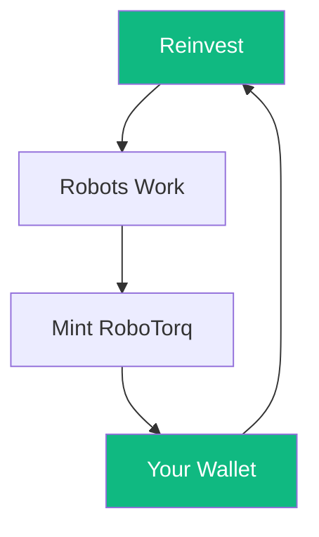
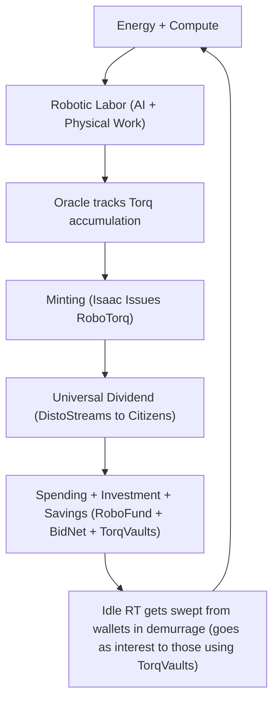

# Are Watts > Wall Street?
- **Bot Sweat → Paycheck**  
- **Trash → Cash**  
- The RoboTorq Universal Basic Dividend says: **“Yes.”**

*Tags*: job replacement, universal basic income, universal basic dividend, sound money, monetary policy, economic policy, economic theory, monetary theory, physics, mathematics  

---

### Executive TL;DR
- **Not a Cryptocurrency**: Today’s trash is tomorrow’s cash.  
  - **Digital RoboTorq** = *Robot Work + Raw Materials*  
  - **Physical RoboTorq** = *Digital RoboTorq + Recycled Junk*  
  - *Trash into cash*, with cryptographic markings & NFC tags.  
- **Vibes**  
  - Robonomics proposes a **physics-based monetary system** — the *RoboTorq* — minted from robotic labor and distributed universally through an **AI-governed Bond Network**.  
- **Perks**  
  - Robots don’t take your job — **they pay your salary**.  
  - Every watt of AI labor **mints money directly to you.**  
  - No debt. No inflation. Just physics.
- **Quirks**  
  - This white paper defines the RoboTorq and its economy — a blend of thermodynamics, automation, and economic policy.  
- **Bonus**  
  - → [Robonomic Dividend Estimator](https://projectasimovmvp.vercel.app/) — tweak fleet size, robot “horsepower,” USD peg, and see your UBD.

---

*Jonathan Clark*, *October 2025*, *Full licensing in the footer*

---

**Text**: [CC-BY-SA 4.0](https://creativecommons.org/licenses/by-sa/4.0/)  
**Code**: [GPL-3.0-or-later](https://www.gnu.org/licenses/gpl-3.0.en.html)

[](https://creativecommons.org/licenses/by-sa/4.0/)

---

## Robonomics: 21st Century Economics

There’s a whole new way to think about economics: **Robonomics**.

It’s based on **physics**.

It’s **tangible** — turning bot sweat into paychecks, and trash into cash.

It’s a whole **monetary system** anchored not in red tape and debt, but in measurable work — the watt.

This paper represents the mathematical unification of economics and physics — it can get complex at times.

**Pro tip**:
1. Copy-paste the whole thing into a fresh AI chat (Grok, ChatGPT).  
   - Don’t just link it — AIs may cache old versions.  
2. If on a free tier, paste section by section.  
   - Say: `"Don't respond until I say 'last paste'"`.  
3. Ask for an *overview by section* → drill down.

Robonomics isn’t a complete theorem — and it shouldn’t be.  

Curiosity thrives in the gaps. What’s documented here is a live exploration, not a final model.  

While you wait for the AI to parse it, check out the **Robonomic Flowchart** below the Abstract.  

It visualizes how energy, data, and money circulate in a closed-loop RoboTorq economy.

When you get overwhelmed and think, "How can I use this money if I don't understand it?"

Just remember, you don't really understand everything about how money works now, either.

Doesn't stop you from spending it.

---

## Abstract

As the innovation of **Robotic Labor** — and the job replacement it threatens — sits quietly on the horizon, it’s hard to know whether to be excited or concerned. The potential problem is clear. The solution is not.  

Traditional **Universal Basic Income (UBI)** schemes, managed by politicians and financed by bankers, lack any **physical value basis**. When the “basic” amount overshoots production capacity, the result is predictable: inflation or deflation without anchor.  

Conventional **Universal Basic Dividend (UBD)** models, meanwhile, often [return only a fraction](https://ffesp.org/1702-pfd-stimulus-check/#:~:text=Alaska%20residents%20received%20a%20$1%2C702,dropped%20to%20$1%2C000%20for%202025.) of societal wealth, limited by a single industry or resource pool.  

**Robonomics** proposes a private yet collectively owned **Bond Network** that entitles every citizen to a share of the proceeds from the labor of every humanoid robot, across every sector. Under such a system, every job lost to robots becomes a dividend to society — specifically because private, individual robot ownership becomes tantamount to counterfeiting and is enforced as such.  

But Robonomics goes further. With the introduction of the **RoboTorq**, both *energy* and *matter* become currency.  
Every kilowatt-hour of robotic labor mints new digital value, and every kilogram of recycled waste can be transformed into **physical RoboTorqs** — 3D-printed coins or bills made from reclaimed materials like plastic, glass, or stainless steel.  

This “**trash → cash**” loop turns pollution into paychecks, linking ecology and economy through physics.  
Robotic work creates digital wealth; recycling redeems it as physical wealth. Waste becomes a monetary substrate.  

The result is a **physics-based, closed-loop economy** where value is minted by measurable work — robotic or human — and distributed universally via algorithmic dividends.  

**Project Asimov** is building this idea into an open-source **Robonomic Simulator** for academic research, grounded in **Torq Theory**, the mathematical framework behind the RoboTorq system.  

**“Watts > Wall Street”** is both rhetorically powerful and scientifically grounded.  

Just as photosynthesis turns sunlight into sugar, the RoboTorq turns **energy, time, computation, and even trash, into money.**

**Here's how the robot part works.**


---

## Table of Contents 

1. [What Is Torq?](#1-what-is-torq)  
2. [Deriving the RoboTorq](#2-deriving-the-robotorq)  
   - [Novel Units](#21-the-novel-units)  
   - [Relationship Between Units](#22-relationship-between-units)  
3. [Physical Backing and Stability](#3-physical-backing-and-stability)  
4. [Torq and the Equation of AI-Value Exchange](#4-torq-and-the-equation-of-ai-value-exchange)  
   - [Dimensional Consistency Check](#41-dimensional-consistency-check)  
   - [Relation to Current Macro-Economic Theory](#42-relation-to-current-macro-economic-theory)
5. [TokenTorqPotential is just Capacity](#5-tokentorqpotential-is-just-capacity)  
6. [The Torq_Gamble: Markup as Wager](#6-the-torq_gamble-markup-as-wager)  
7. [Complexity and AIntropy](#7-complexity-and-aintropy)  
8. [The TokenTorq Curve](#8-the-tokentorq-curve)  
9. [Mining TokenTorq into Torq](#9-mining-tokentorq-into-torq)  
10. [Sample Calculation](#10-sample-bonded-robotic-labor-agreement)  
11. [Incentives and Strategy](#11-incentives-and-strategy)  
12. [Quantum Game-Theoretic Interpretation](#12-quantum-game-theoretic-interpretation)  
13. [Watts > Wall Street](#13-watts--wall-street)
14. [Extending the RoboTorq to General AI-Value](#14-extending-the-robotorq-to-general-ai-value)
15. [Appendix](#15-appendix)

---

## Appendix Table of Contents

- [A. Glossary of Robonomic Terms](#appendix-a--glossary-of-robonomic-terms)
- [B. Dimensional Consistency of the RoboTorq System](#appendix-b--dimensional-consistency-of-the-robotorq-system)
- [C. Example: Translating a BRLA into Economic Flow](#appendix-c--example-translating-a-brla-into-economic-flow)
- [D. Energy-to-Fiat Calibration: Two Scenarios](#appendix-d--energy-to-fiat-calibration-two-scenarios-for-the-transition-from-fiat-to-torq)
- [E. Governance & Stability Mechanisms](#appendix-e--governance--stability-mechanisms)
- [F. Network Topology & Security Architecture](#appendix-f--network-topology--security-architecture)
- [G. Economic Shock Modeling & Systemic Resilience](#appendix-g--economic-shock-modeling--systemic-resilience)
- [H. Impact of Fusion / Near-Free Energy](#appendix-h--impact-of-fusion--near-free-energy-on-the-robotorq-bond-network)
- [I. Quantum Computing and System Security](#appendix-i--quantum-computing-and-system-security)
- [J. Extending the System to General AI–Generated Value](#appendix-j--extending-the-robotorq-to-general-ai-generated-value)
- [K. Integrating AI-Value, Quantum Security, and Fusion Energy Impacts](#appendix-k--integrating-ai-value-quantum-security-and-fusion-energy-impacts)
- [L. Using the RoboTorq Economic Engine to Clean the Planet](#appendix-l--using-the-robotorq-economic-engine-to-clean-the-planet)
- [M. Considerations for a RoboTorq Social Charter](#appendix-m--considerations-for-a-robotorq-social-charter)
- [N. Digital RoboTorq Transactions & On-Chain Flow](#appendix-n--digital-roboltorq-transactions--on-chain-flow)
- [O. Data Structures of the RoboTorq Unit](#appendix-o--data-structures-of-the-roboltorq-unit-what-is-a-ttp-h-on-the-device)
  
---

## 1. What Is Torq?

**Torq TL;DR**: Because you can't understand a RoboTorq unless you understand Torq.
- How much did you pay the robot to make your item?
- What did you sell it for?
- Divide the selling price by what you paid the robot,
- result = Torq

---

**⬆️skim/fat⬇️**:

Torq measures how much brainpower and electricity the robot used to make your stuff — and how much you sold it for. It's also so much more. 

Torq Theory is just the math that turns bot sweat to paycheck. 

**The Quirk**: Torq is *markup* — but *only* on **robotic labor cost**, not total production.  

That’s what makes it **physics-based**, not arbitrary.

Why Torq? It is how a business *leverages* (or *torques*) any specific input to produce value. Torq is economic torque.

---

**⬆️fat/skim⬇️**:

Torq Theory math must work for Robonomics to be possible, before even considering whether it's practical.

The math does work, and it's all in the appendices for the academics to check.

**Quick Recap**: 
- Not physical torque.
- Is economic leverage.
- → [See it in action: Estimate your dividend from a robot fleet.](https://projectasimovmvp.vercel.app/).
- (I couldn't make that program if the math didn't work)

If Torq is economic leverage, what do you suppose a `RoboTorq` is? 

If you guessed `robotic economic leverage`, you nailed it.

---

## 2. Deriving the RoboTorq

**RoboTorq TL;DR**: How much should a perfect robot earn in one hour?  → **1 RoboTorq**
- `1 RoboTorq = 1 hour of ideal robot work`  
- Based on: **energy × compute x time**  
- Need a per-second unit? → **TokenTorq**
- **3600 TokenTorqs = 1 RoboTorq** because *(1 hour = 3600 seconds)*

The RoboTorq turns **energy × compute × time** → **money everyone shares**.
→ [See how many RoboTorqs your robot fleet mints](https://projectasimovmvp.vercel.app/)

**⬆️skim/fat⬇️**

---

This paper proposes a new currency to value robotic labor: **The RoboTorq**.

It is defined as the work of an *ideal* 1 kW robot in **one hour** — what is now defined as an *Asimovian Robot*.

An *Asimovian Robot* is just a 21st-century ideal economic heat engine, and it's useful because it helps us determine a real robot's market value, as you'll see in later sections.

After one hour, your robot's oracle (task tracker app) reads:  
`1 RoboTorq = 1 token/second × 1 kWh`

**Why?**  
1 token/sec × 1 kW × 3600 sec = **1 RoboTorq**

To make this useful, we define **TokenTorq** — the *rate* of energized throughput:  
`1 TokenTorq = 1 token/sec × 1 kW`

---

**⬆️skim/fat⬇️**

**1 RoboTorq = 3600 TokenTorqs**

- **In physics**: impact = energy × time  
- **In Robonomics**: value = **compute** × energy × time

**RoboTorq** is that value — tokenized, measurable, and **shared**.

**Quick Recap**:
- Not a traditional cryptocurrency, but it is digital. 
- 1 RoboTorq = 1 kWh of ideal robot brain + muscle
- 3600 TokenTorqs = 1 full hour of work = 1 RoboTorq
- You own a tiny slice of every RoboTorq minted during your lifetime... until you spend it.

RoboTorq, TokenTorq, Tokens, Torq... There's been a lot of new terms so far. Let's review.

---

### 2.1 The Novel Units

| Symbol | Definition | Meaning |
|--------|------------|---------|
| Torq | no units | Economic leverage to produce value |
| RoboTorq | (token/s) × kWh | Physical unit of economic value |
| TokenTorq | (token/s) × kW | Smaller Physical unit of economic value |


---

### 2.2 Relationship Between Units

Note that TokenTorqs are currency as well, just a tiny unit of it. 

Any price can be measured in TokenTorqs or RoboTorqs, just like any price can be measured in pennies or dollars (if there were 3600 pennies to the dollar).

---

## 3. Physical Backing and Stability

**Visual TL;DR:**  
Comparison of four monetary paradigms — each answers the question: *“What backs your value?”*  

| Currency    | Backing             | Flexibility                               | Inflation Control                                |
|--------------|---------------------|--------------------------------------------|--------------------------------------------------|
| **Gold**     | Fixed supply        | Rigid → deflation                          | None                                             |
| **Bitcoin**  | Fixed supply        | Rigid → volatility                         | Halving cycles                                   |
| **Fiat**     | Debt                | Infinite elasticity                        | Central bank policy                              |
| **RoboTorq** | **Energy × Time**   | **Token-Adaptive (via efficiency gains)**  | **Bounded by physics + BRLA contracts**          |

---

**TL;DR:**  
RoboTorq breathes. It expands and contracts with real-world efficiency —  
but only within the limits of physics.  

- **1 RoboTorq = 3600 TokenTorq**, always.  
- Token size can shift as robots get smarter.  
- The **Bond Network** keeps it stable using:  
  - **BRLA pricing curves**,  
  - **Fleet reserves**, and  
  - **Bonded Token governance** *(rare, last resort)*.  

Result:  
✅ No gold-style deflation.  
✅ No fiat-style inflation.  
✅ Value tied to *verified robotic work*, not wishful thinking.  

**⬆️skim/fat⬇️**

---

### The Physics Peg

RoboTorq is built on **physics**, not policy.  
And not the frictionless physics of whitepapers — but the kind that hums, spins, and draws current.

> **1 RoboTorq = 1 kWh × 1 token = 3600 TokenTorq.**

That ratio **never changes**.  
It’s the *metronome* of the Robonomic economy.  

What *can* evolve is **token granularity** —  
the smallest measurable unit of robotic work.  
A “token” isn’t a coin; it’s a **quantized attention cycle** — the moment a robot does, decides, or delivers.  

No fixed size. No fixed workload.  
That’s the point.  
Efficiency gains don’t destabilize the system — they’re absorbed into **Bond Network pricing**.

---

### The Bond Network: Pricing the Future of Work

The Bond Network governs RoboTorq supply through  
**Bonded Robotic Labor Agreements (BRLAs)** — long-term contracts that price robotic labor by physics, efficiency, and verified uptime.  

**Each BRLA** issues a pool of **Bonded Tokens** —  
digitally signed claims on *future robotic capacity* backed by staked RoboTorqUnits.

| Layer | Description | Peg |
|-------|--------------|-----|
| **RoboTorqUnit (RTU)** | Atomic proof of 1 kWh·h capacity | Physics |
| **Bonded Token (BT)** | Vault share in a BRLA contract | Economics |
| **RoboTorq (RT)** | The circulating liquid token | Energy × Time |

Together, they form the three-tier engine of stability.  

---

### BRLA Mechanics (Fat Mode)

- **BRLA pricing** tracks real-world efficiency trends (measured by fleet telemetry).  
- **Bonded Tokens** represent fractional claims on pooled RTUs; their yield reflects how efficiently those robots perform.  
- **Fleet reserves** buffer volatility by auto-adjusting mint and burn rates.  
- **Bond Votes** (rare): If efficiency drops >15% in 90 days, the Bond Network can vote to recalibrate token throughput — preserving peg integrity.  

Most of the time?  
It self-corrects.  
Mathematically. Automatically.  
Because both **reserve buffers** and **BRLA formulas** act as natural hedges.

---

### The Stability Triangle

| Failure Mode | Legacy Cause | RoboTorq Solution |
|---------------|--------------|-------------------|
| **Deflation** | Fixed supply (gold, BTC) | Adaptive BRLA issuance |
| **Inflation** | Policy overreach (fiat) | Physics-bounded expansion |
| **Volatility** | Market speculation | Bonded Token smoothing layer |

Project **Asimov** will test these feedback loops in simulation — verifying how robotic efficiency, token supply, and BRLA contracts co-evolve.

---

### Why It Works

- **Gold** failed because it couldn’t adapt.  
- **Fiat** fails because it adapts *too much*.  
- **Bitcoin** locked itself to scarcity and lost elasticity.  

**RoboTorq finds the middle path.**

It adapts *just enough* — because **humans (and robots) do.**  

> We invent. We iterate. We get more efficient.  
> So should our money.

If a robot learns to do the same task using **fewer tokens**:
- ✅ It wins once (a competitive edge).
- 🔁 On the next BRLA cycle, the market rebalances.
- ⚙️ The new efficiency standard becomes global baseline.

That’s the "magic" of Robonomics:  
**Physics doesn’t inflate, and efficiency doesn’t destabilize.**

All surpluses flow back into the **Universal Basic Dividend** —  
a direct distribution of robotic productivity to every participant in the Bond Network.

**⬆️fat/skim⬇️**

---

**Quick Recap**
- Backed by *watts and seconds*, not gold or debt  
- Expands and contracts only within *physics limits*  
- Stable without central banks or policy discretion  
- Every holder owns a slice of verified robotic labor  
- The world’s first **physics-based unit of economic value**

---


---

## 4. Torq and the Equation of AI-Value Exchange

**Visual TL;DR**:  
How value moves through three different systems — and why **Torq** changes everything.

| System         | Value Source             | Exchange Basis                   | Expansion Mechanism           | Sink / Stability Mechanism         |
|----------------|--------------------------|----------------------------------|--------------------------------|------------------------------------|
| **Fiat**       | Debt + Policy            | Political trust (M ↔ V)          | Central banks, interest rates  | Inflation, taxation                |
| **Crypto**     | Proof-of-Work / Stake    | Algorithmic scarcity (hashes)    | Mining rewards, halvings       | Code consensus, volatility         |
| **Robonomics** | **Energy × Computation** | **Torq = Work / Work**           | Real AI labor, Bond Network    | **Demurrage + Physics**            |


**TL;DR:**  
Now that you know what a RoboTorq *is*, it’s time to see **how value moves**.  
Torq is the ratio that ties it all together — it’s how **robotic work becomes money**.  
- Two equations define it: one in TokenTorq, one in RoboTorq.  
- Both balance energy, computation, and price — just like **MV = PQ**, but without banks.  
- When Torq > 1 → value created.  
- When Torq < 1 → value destroyed.  

Result:  
- A real, measurable **AI Value Exchange** system  
- Where new money mints only when new *work* happens  
- And idle value decays through **demurrage**, keeping it honest  

**⬆️skim/fat⬇️**

---

Because Torq can be expressed in two different ways, we can pull some fascinating conclusions about how energy and intelligence actually *trade value*.

| Symbol      | Definition                                                    | Meaning                                |
|--------------|---------------------------------------------------------------|----------------------------------------|
| equilibrium  | RoboTorq_out / RoboTorq_in = TokenTorq_out / TokenTorq_in     | Functions similarly to MV = PQ         |
| therefore    | RoboTorq_out = (TokenTorq_out / TokenTorq_in) × RoboTorq_in   | = Oracle.cost + newly_minted           |
| let          | Torq = TokenTorq_out / TokenTorq_in                           | = RoboTorq_out / RoboTorq_in           |
| conclude     | RoboTorq_out = Torq × RoboTorq_in                             | = reduced-form AI Value Exchange       |

At equilibrium, **RoboTorq_out = Torq × RoboTorq_in** —  
the cleanest possible expression of *value creation by intelligence.*

It’s the same conceptual role as the [Fisher Equation (MV = PQ)](https://public.econ.duke.edu/~kdh9/Courses/Graduate%20Macro%20History/Readings-1/Fisher%20Purchasing%20Power%20of%20Money.pdf),  
except here, the “velocity” is computation, not speculation.

---

### 4.1 Dimensional Consistency Check

| Quantity     | Units               |
|---------------|---------------------|
| RoboTorq_in   | token/s × kWh       |
| Torq          | dimensionless       |
| RoboTorq_out  | token/s × kWh       |

Everything balances. Physics and math agree.  
Torq doesn’t conjure money — it translates *useful work* into *economic output*.

---

### 4.2 Relation to Current Macroeconomic Theory

In classical macroeconomics, the **money supply (M)** is whatever politicians and central banks say it is.  
In **Robonomics**, **RoboTorq_in** is *physically constrained* — it can only grow through **real AI work** and actual **energy throughput**.  

Here, minting new RoboTorqs isn’t debt; it’s **earned**.

---

In Robonomics:
- **TokenTorq_in** = how much society invests in robotic labor  
- **No central bank** — circulation maintains itself through *production cycles*  
- **Demurrage** ensures idle RoboTorq flows back into the economy  
- **TorqVaults** collect and redistribute value from inactivity  
- **You can opt out**: spend, invest, or store your RoboTorq productively  

The result is a **self-balancing economy** where energy, intelligence, and value stay in motion.

### 4.3 The Bond Network giveth, and the Bond Network taketh away 

Demurrage might sound harsh, but it’s not punishment — it’s physics.  

Idle energy doesn’t produce work; **moving energy does**.

---

Without demurrage, you’d get:
- Hoarding → liquidity collapse  
- Rich-get-richer feedback loops  
- “UBD for billionaires” — the exact trap we’re avoiding  

With demurrage:
- Money circulates  
- Everyone receives **disto** (distributed dividend flow)  
- **You profit from others’ inaction**  

It’s the difference between **an economy that breathes** and one that bloats.

Hoard all the goods you want — keep the **RoboTorq** moving.

---

**⬆️fat/skim⬇️**

**Quick Recap**
- **Torq** is the conversion ratio between *energy, computation, and value*  
- Works like MV = PQ, but with physics instead of policy  
- **Demurrage** prevents stagnation and hoarding  
- And replaces hidden inflation tax 
- **Money = moving energy**  
- This is how a robot economy stays human-centered

---

So, how does this translate into the *real world* of machines?  
Now that we’ve defined Torq mathematically, let’s talk about the robots that make it real.  

Enter **TokenTorqPotential** — a robot’s *ideal capacity* to produce TokenTorq in one hour.

---

## 5. TokenTorqPotential is just Capacity

**Visual TL;DR**:  
A robot’s **TokenTorqPotential (TTP)** is its “horsepower” — the maximum TokenTorq it can push per hour.  
It defines **how much robotic labor** you’re actually buying, no matter how efficiently it’s used.

| Robot Type          | Power (kW) | Throughput (tokens/s) | TTP (TokenTorq/hr) | Notes |
|----------------------|------------|------------------------|--------------------|-------|
| **Entry Bot**        | 0.5 kW     | 20 tokens/s            | 36 TTP             | Low power, high latency |
| **Mid-Tier Bot**     | 2 kW       | 60 tokens/s            | 120 TTP            | 2025 average performance |
| **Premium Bot**      | 2 kW       | 100 tokens/s           | 200 TTP            | High-efficiency networked AI |
| **Industrial Fleet** | 10 kW      | 400 tokens/s           | 4 000 TTP          | Distributed heavy-duty robotics |

---

**TL;DR:**  
TokenTorqPotential is capacity.  
- It’s the robot’s *theoretical maximum throughput* — its raw work potential per hour.  
- Like **horsepower**, it defines **speed, not skill**.  
- You pay for *capacity*, not results.  
- One RoboTorq always buys **3600 TokenTorq of processing** — the standard work-hour.  

**⬆️skim/fat⬇️**

---

Every robot has a **TokenTorqPotential (TTP)** — its ideal throughput of TokenTorq per hour.  
It’s the physics-based analog to “horsepower,” measured not in torque and RPM, but in **kilowatts × token throughput**.

Formally:

> **TTP = kW rating × maximum token throughput**

Example:  
A 2 kW robot capable of 100 tokens per second has:  
**TTP = 2 × 100 = 200 TTP**.

That means in theory, it can process **200 TokenTorq per hour**.

---

As of **October 2025**, some bots push about **60 tokens/s x 2 kW**, giving **TTP ≈ 120** — the new “mid-range” capacity benchmark.  

Future models will scale linearly: twice the throughput → twice the TTP.

---

### How It’s Priced

Robotic labor is always sold by **the TokenTorq**, priced at  
> **3600 TokenTorq / RoboTorq / hour**, everywhere and always.  

That creates a **global parity**: no matter where you are, robotic work has a consistent physical price per unit of energy and computation.

The scale of a robot’s **TTP** sets the baseline for how much labor it can sell.  
You’re not paying for what it does — you’re paying for **what it can do**.

---

### Example

Hire a **10 TTP bot** for one hour:  
- You pay = 10 TTP × 3600 TokenTorq/hr × 1 hr = **36 000 RT**.  
- Even if you only get 2 TokenTorq (7 200 RT) of usable output, you still owe the full capacity rate.  
- Over time, as the bot learns the task, output efficiency rises — and so does your Torq.

Nobody rents a bot for just one hour (Bonded Robotic Labor Agreements cover longer periods),  
but this example keeps the math clean.

---

### Why It Matters

TTP gives the **Bond Network** a universal metric to compare fleets, balance energy markets, and price robotic contracts in a consistent, physics-based way.  
It’s what allows **RoboTorq**, **TokenTorq**, and **Torq** to operate in a single, coherent system.

It’s not about the robot’s design, brand, or algorithm — it’s about **throughput per watt**.

---

**⬆️fat/skim⬇️**

**Quick Recap**
- **TokenTorqPotential (TTP)** = robot “horsepower” in tokens/hour  
- Defines **capacity**, not performance  
- **1 RoboTorq = 3600 TokenTorq**, always  
- **You pay for potential**, not output  
- The **Bond Network** uses TTP to price and stabilize robotic labor markets  
- Efficiency gains → higher Torq → more universal dividends  

---

You know how to figure out how much your robot will cost you: TTP x 3600 = RoboTorq_in

But in order to know your Torq, you need to know your selling price...

So, how do you know how much to sell your item for?

Just like today, you bet on it.

---

## 6. The Torq Gamble: Markup as Wager

**Visual TL;DR**: Betting on robot productivity sets your markup — this is the Torq Gamble.

| Concept          | Meaning                                        |
|-----------------|------------------------------------------------|
| **Torq Gamble**  | Enterprise’s wager on how much Torq will be needed (markup expectation) |
| **MintingNeeded**| Extra RoboTorq minted = RoboTorq_in × (TorqGamble − 1) |
| **Robot Cost**   | 3600 × Robot.TTP × (TorqGamble − 1) |

**Key Idea**: Both the Enterprise and Isaac (the minting AI) co-wager on productivity.  
- Wager is agreed when paying the retainer fee for a **Bonded Robotic Labor Agreement (BRLA)**.  
- **Important:** Minting happens **as value is delivered**, not in advance.  
- If the task takes longer than expected, you don’t get to charge more — the sale price is **fixed**.  
- Inefficient work just means you absorbed more labor cost than you expected, like real-world companies.

---

**⬆️skim/fat⬇️**

Torq Gamble = your **markup bet**.  
Reality = **task-specific labor time and efficiency**.  

Even with the smartest markup:  
- Duration depends on **TokenTorqPotential (TTP)**  
- **Task complexity**  
- **Robot efficiency**  

Key points:  
- **Minting only occurs as labor is performed**  
- Sale price = **fixed at contract**  
- Overruns = absorbed by Enterprise; profit is only made if productivity meets or exceeds the Torq Gamble  

---

**⬆️fat/skim⬇️**

**Quick Recap**
- Torq Gamble = markup wager on labor expectation  
- Minting occurs **as value is delivered**  
- Enterprise + AI co-wager on task completion  
- Actual work time affected by **Complexity** and **AIntropy**  
- Sale price **fixed in advance**, independent of actual duration  
- Inefficiency = absorbed cost, not extra revenue  

---

### Transition: From Wager to Task Reality

Torq Gamble predicts labor cost.  
**Complexity and AIntropy** determine actual duration.  

Same robot, different task → different labor time.  
You budget RoboTorq, but value is only minted as work is done.  
This is how Robonomics mirrors real-world production economics.

---

## 7. Complexity and AIntropy

**Visual TL;DR**: Task difficulty and robot inefficiency determine **how long labor takes**, which in turn determines **RoboTorq spent**.

| Concept         | Meaning                                  |
|-----------------|------------------------------------------|
| **Complexity**  | Task difficulty → affects labor duration |
| **AIntropy**    | Deviation of robot from ideal TTP performance for the task |
| **TTP**         | Ideal throughput potential of the robot |

---

**⬆️fat/skim⬇️**

- Real robots are imperfect.  
- **Production efficiency varies** with:  
  - Task complexity  
  - AI/robot interaction  
- Complexity can be measured by renting faux-oracled, bonded robots and running a work study.  

---

### 7.1 Complexity

- Non-zero scalar governing convergence and productivity over time  
- Negative → simple tasks, shorter completion, fewer RoboTorq spent  
- Positive → complex tasks, longer completion, more RoboTorq spent  

Analogy:  
- TTP = Carnot efficiency (ideal robot)  
- Complexity = friction or difficulty slowing it down  

---

### 7.2 AIntropy (Artificial Intropy)

**Definition:**  
AIntropy = complexity × TTP × Robot.util × supply_efficiency × equipment_utilization × …

- Measures **how far a robot is from its Asimovian ideal**  
- Task-specific: same robot, different job → different AIntropy  
- Lower AIntropy → faster task completion, less RoboTorq spent  
- Higher AIntropy → slower task completion, more RoboTorq spent  
- Units inherited from TokenTorqPotential (TTP)  

**Key Principle:**  
- Complexity and AIntropy determine **labor duration** → guides **how much RoboTorq must be spent**  
- Sale price is **fixed in advance**; inefficiency is **absorbed cost**, not extra revenue  
- Minting occurs **as value is delivered**, not upfront  

---

**⬆️fat/skim⬇️ Quick Recap**

- **TTP** = robot’s ideal throughput potential  
- **Complexity** = task difficulty → affects duration  
- **AIntropy** = inefficiency → extends labor time  
- **Minting** = occurs as work is done  
- **Sale price** = fixed, independent of inefficiency  
- Together: predict labor duration → plan **RoboTorq spending**  
- Inefficiency is your **cost**, not a way to charge more  

This is how Robonomics ensures that **task difficulty and robot imperfections are baked into economic reality**, just like in real-world production.

---

## 8. The TokenTorq Curve

**Visual TL;DR**: Models how robots turn AI-tokens into productive output over time.

| Concept                  | Meaning                                         |
|---------------------------|------------------------------------------------|
| **token_torq_curve(t)**   | Robot efficiency at time t                     |
| **Sigmoid function**      | Standard neural net activation over time      |
| **torq_gamble**           | Enterprise’s markup expectation applied       |

**⬆️fat/skim⬇️**

---

The TokenTorq Curve shows:
- Efficiency improves as robot works: learning + adaptation  
- Sigmoid shape → slow start, rapid learning, plateau at max efficiency  

**Equation**: token_torq_curve(t) = 1 / (1 + e^(−t × AIntropy)) × torq_gamble
- Output always between 0 and 1  
- Represents **fraction of AI-tokens converted to productive output** over time  
- Connects AIntropy → labor duration → effective Torq production  

---

**⬆️fat/skim⬇️**

- The curve shows **how quickly a robot “learns” on the job**  
- Early work: slower Torq generation  
- Mid-task: rapid efficiency gains → more Torq per unit time  
- Late task: approaches plateau → marginal Torq gains decline  
- **Key takeaway:** AIntropy + Complexity dictate the slope and duration  
- Sets up **Torq Mining Curve**: cumulative value produced over task duration  

*Next:* integrate the curve to see **how AI-tokens become mined Torq** in practice.

## 9. Mining TokenTorq into Torq

**Visual TL;DR**: Cumulative RoboTorq generated as work is completed.

| Concept                    | Meaning                                        |
|-----------------------------|------------------------------------------------|
| **torq_mining_curve(t)**    | Integral of token_torq_curve over time        |
| **MintRequest**             | Submission to Isaac to issue RoboTorq         |
| **Full utilization**        | Total Torq achieved once task is complete     |

**⬆️skim/fat⬇️**

---

**What’s happening:**  
- Cumulative Torq generated as work progresses  
- Early work: slower Torq output  
- Mid-task: rapid efficiency gains → more Torq per unit time  
- Late task: efficiency plateaus → marginal gains decline  
- **Slope + duration** controlled by AIntropy + Complexity  

**Mining metaphor:**  
- Like miners extract gold, robots extract Torq from AI-tokens over time  
- Curve = vein; integral = total mined yield  
- Reinforces **productive work = value creation**; idle tokens = nothing  

**Integration:**  
- torq_mining_curve(t) = ∫ token_torq_curve(t) dt  
- Approximation at full utilization:  
  - torq_mining_curve ≈ ln( AIntropy × (1 + e^(t × AIntropy)) )  

**Key operational point:**  
- **Minting occurs as value is delivered**  
- You don’t get Torq for inefficiency; like real production costs, output must match agreed-upon work  
- Use the **Equation of AI-Value Exchange** for quick, practical estimates

---

**⬆️fat/skim⬇️**

**Quick Recap:**  
- Robots mine Torq over time according to their learning curve  
- AIntropy + Complexity = how long labor takes and total Torq generated  
- Minting = delivery, not upfront speculation  
- Reinforces Robonomics principle: **labor + time = real value, no free rides**

So, how does all of this allow you to purchase robotic labor?

It all goes into a Bonded Robotic Labor Agreement (BRLA).

---

## 10. Sample Bonded Robotic Labor Agreement

**TL;DR**: Here's how you buy robotic labor.
1. Hire bots, fund through RoboFund, set a Bonded Robotic Labor Agreement.  
2. Bots work, produce items, Torq is minted for delivered value.  
3. Bondholders receive RoboTorq to buy the product; the enterprise earns revenue; the money supply stays balanced.

**⬆️skim/fat⬇️**

---

Let's say I want to mass-produce some items. I already know I can afford 100 hours with a 5 TTP bot. Let's say I know because I've conducted a work study with a 5 TTP bot. My faux-oracle showed my torq curves. I should be able to get 400 items done in 100 hours of nonstop work with this one bot alone, and my market research says I can sell each item for 13.5 kRT (kRT = thousand RoboTorq).

Do you think it will work out?

**Given**:
- TTP = 5 TokenTorq/hr
- Duration = 100 hrs
- torq_gamble = 3

**Steps**
1. RoboTorq Input Value (RoboTorq_in):
- RoboTorq_in = TTP x 3600 x time
- RoboTorq_in = TTP × 3600 × 100
- RoboTorq_in = 5 × 3600 × 100 = 1,800,000 RT = 1.8 MRT (MRT = Million RoboTorq)

---

2. MintingNeeded:
- MintingNeeded = RoboTorq_in (Torq_gamble - 1)
- MintingNeeded = 1.8 MRT × (3 − 1) = 3.6 MRT

---

3. Total Value Out:
- RoboTorq_in + MintingNeeded = 1.8 + 3.6 = 5.4 MRT

---

4. Items: 400 → Sell at 13.5 kRT each → zero inflation, zero debt, 100% citizen ownership.

---

I would pay the robot 4.5 kRT per item, so as long as I keep my overhead below 7 kRT per item, I'm in the black. Seems like a good deal for everyone.

**RoboFund**: So I go to *RoboFund*, the network's robotic labor investment house, and submit my torq curves. I get approved for a MakerFunnel to fund the project.

---

**BidNet**: Bondholders log onto RoboFund from their digital wallet and decide they want some of these widgets. They pledge to divert their Distribution Streams (DistoStreams in Robnomomics Lingo) to my funnel if my bid is accepted, and BidNet automatically starts vetting my claim when the funnel is fully pledged.

---

**Giskard**: It's Giskard's (the AI-value auditor's) prerogative to look at my torque curves and determine whether I can get it done with a lower-rated bot, or whether I'm overly straining a bot of this rating. 

---

**Daneel**: It's Daneel's (the AI fleet manager's) responsibility to check the fleet's bot reserve and ensure my BRLA won't strain the overall cost of robotic labor.

---

The network accepts my proposal. I check the math, and it keeps me within my acceptable profit margin. I sign it. Now I've got a BRLA (Bonded Robotic Labor Agreement).

The MakerFunnel at RoboFund opens up, and the "disto" flows to bondholders, as it does every second of every day, paying off my BRLA for me. I got lucky! But I'll have to give them a slight return on their investment, in proportion to its size.

With that, I spin up my line of rented bots after Daneel deploys them, and they work for 100 hours (100 ticks of the Asimov robonomics simulator).

The robots managed to produce 400 items for me, and I can sell them for 13.5 kRT per to make the revenue my business needs to stay alive. 

Isaac (the minting AI) mints 3.6 MRT fresh (value-added to a pile of raw materials, scaled from the cost of the robotic labor that added the value) and distributes the full RoboTorq_out in bits as the products are expected to hit the market. The bondholders will spend, invest, or save, allowing the newly minted currency to accumulate for purchase or be leveraged into more robotic labor.

As a business person, I can use my estimated selling price and the constant cost of robotic labor in RoboTorqs to make business decisions. As a Bondholder, you get some of the money that someone else will need to buy my product, which, in turn, drives vigorous economic activity.

The Bond Network's operating costs recycle into circulation — the money supply remains balanced.

Minting is not (RoboTorq_in + other production costs) (torq - 1) because we want to standardize all production costs to the cost of robotic labor.

---

**⬆️fat/skim⬇️**

**Quick Recap**
- **Goal:** Mass-produce 400 items using a 5 TTP bot over 100 hours.  
- **RoboTorq Inputs:** 1.8 MRT worth of robot labor.  
- **Minting:** 3.6 MRT issued by Isaac to cover the enterprise’s markup.  
- **Total Output Value:** 5.4 MRT (matches expected revenue at 13.5 kRT per item).  
- **Funding & Oversight:** RoboFund/MakerFunnel provides funding; BidNet, Giskard, and Daneel ensure feasibility, audit efficiency, and manage fleet capacity.  
- **Execution:** Bots work full duration, items produced, revenue realized, and minted Torq distributed to bondholders.  
- **Key Takeaway:** By pegging minting to labor cost + agreed markup, the system ensures predictable, transparent production, investment, and economic circulation — without inflating the money supply unnecessarily.

---

**Here's how it all works again.**



---

## 11. Incentives and Strategy

Could Enterprises game the system by mis-bidding the torq_gamble or manipulating timelines when they make their bid for a Bonded Robotic Labor Agreement (BRLA) with BidNet? Yes. But the system is self-correcting:

- **Under-bidding** → not enough RoboTorq in circulation → liquidity dries up → business left with extra stock and losses.  
- **Over-bidding** → visible in BidNet’s market analytics → future BRLA terms tighten → go back to human labor or agree to stricter terms.

Persistent manipulators are downgraded to **TorqVault financing**, which is more expensive. If gaming or incompetence persists, that actor eventually gets priced out of the system.

Thus, Enterprises both compete *against* and *cooperate with* AI financial overseers — producing a self-optimizing economy.

---

## 12. Quantum Game-Theoretic Interpretation

This situation can be modeled for some interesting mathematical tests that Project Asimov plans to carry out — even if only for fun.

Each torq_gamble *entangles* the Enterprise and BidNet in a shared probabilistic state.  
Until a sale occurs, both exist in a **superposition** of profit and loss — much like a qubit before measurement.

When a product sells, the wave function collapses — the market “observes” value.

BidNet can request bid consideration advice from the network's predictive AI (Calvin), which will use quantum-inspired game theory to forecast outcomes based on past BRLAs. This metaphorical interpretation of a proposed "pseudo-quantum" market dynamic will be tested for veritas in the Asimov simulator.

Maybe this is another breakthrough waiting to be had.

---

## 13. Watts > Wall Street

Torq Theory formalizes the economic cost of compute and robotic labor into a **physics-based monetary unit**, where each minted token is tied to real productive work. But this happens without the currency shortages associated with old hard currencies or the inherent inflationary tendencies of fiat currency.

Note that this is not price control: the Enterprise in question chooses the final selling price, and the Bond Network decides whether to make the same wager when it chooses to offer the contract.

Rooted in physics, expanded by AI, governed by sharp equations — **Torq Theory** turns Robonomics into an exact science of energy-value exchange.

Robonomics is not just a fanciful idea — it could be our practical fiat escape hatch, serving as a sink for excess paper currency as RoboTorq seeds are exchanged to purchase robotic labor, propping up the value of the dollar as the currency switch is made — the Bond Network will always accept dollars as long as people still have them, so the paper will always have a place to go. Come to think of it, that reserve is critical for conducting international trade without sending the RoboTorq overseas!

Pilot studies can be used to discover the initial dollar-to-RoboTorq exchange rate. One goal of the Project Asimov simulator is to estimate the current hypothetical exchange rate using Torq Theory mathematics.

The Bond Network operates as a decentralized, algorithmically balanced, fully functional monetary system that scales to nearly any conceivable size — neither state-controlled nor privately owned, but collectively managed by all participants through open, auditable smart contracts. Governments can borrow from the seed reserve when needed.

You can already [see Robonomics in action with the online calculator](https://projectasimovmvp.vercel.app/), but Project Asimov will evolve into the actual AI Bond Network's logic over time.

[Project Asimov is on Github](https://github.com/GrokkingGrok/Project-Asimov/blob/MVP/CONTRIBUTING.md). It is open source, and contributors are not only welcome but also desperately needed.

---

## 14. Extending the RoboTorq to General AI-Value

The more I tried to *invent* Robonomics, the more it revealed itself.  
RoboTorq isn’t an abstraction — it’s a measurable bridge between **information**, **energy**, and **value**.  

TokenTorqs and RoboTorqs have been flying around our factories for decades — every time an industrial robot welds a car frame or routes a PCB.  
We simply didn’t know what to call them.  

More clearly put:  
> I, **Jonathan Clark**, am not the inventor or author of Robonomics — only its discoverer.  

---

### The Spark

The first time I asked **Grok** about turning robotic labor into currency —  
minted to everyone, letting companies compete for the dough —  
it crashed.  

Then it crashed again.  
And again.  

So I started writing anyway, chasing an idea I didn’t understand yet.  

Then, one day, Grok answered.  
Not just any answer — a **reduced form of the Equation of AI-Value Exchange**, implied by my original thought.  

It wasn’t tied to tokens, or energy, or economics yet.  
It was just… true.  

I didn’t know what it meant.  
But I knew it meant something.

---

### Mining the Equation

Since then, I’ve been mining the complete solution —  
each crash, each insight, another block of understanding.

| Input | Output |
|-------|---------|
| **HumanTorq_in** | 3 months of obsessive AI chats |
| **InfoTorq_out** | 1 new economic paradigm |
| **TokenTorq_in?** | Ask Elon, I still don’t know. |

- MintingNeeded = HumanTorq_in × (TokenTorq_out / TokenTorq_in - 1)
- So yes — seeing as there’s no Bond Network yet,
- I’m still waiting for my payment. 😉

### From Joke to Architecture

Tongue-in-cheek, yes.
But the principle holds: information labor can be tokenized, valued, and shared just like robotic labor.

Crashes, threads, prototypes — all are quantifiable AI-energy exchanges.
Community validators could analyze conversation artifacts, bet on their outcomes, and monetize successful “idea-mines” as new issuance events.

That’s one direction — though admittedly, it drifts dangerously close to the fiat edge.

### A More Grounded Path: The BCLA

A more realistic version extends BRLAs into Bonded Chatbot Labor Agreements (BCLAs) —
contracts for allocating AI time to human creativity.

Imagine it like this:

I want to design something intangible but immensely valuable — say, a new economic system.

I stake a BCLA, defining my time window and intended outcome.

I get AI bandwidth proportional to that stake.

### Community verifiers review my sessions.

If others believe my work has promise, they can delegate some of their unused AI bandwidth — effectively betting on my success.

If I fail?
My access costs slightly more until I “pay back” the network.

If I succeed?
I retain ownership of my work — and derivative use of my ideas automatically routes me a micro-cut via the chain.

### Why This Matters
This system transforms AI time into a new asset class —
not speculative tokens, but productive attention.

Just as BRLAs tied energy and time to robotic labor,
BCLAs could tie context and intention to cognitive labor.

- Both run through the Bond Network,
- both yield dividends through verified productivity,
- both return surplus to the commons.

**Quick Recap**:
- Robonomics doesn’t stop at robots.
- It extends the same physics of value — energy × time × information — to intelligence itself.
- Bonded Tokens could govern both robotic and cognitive economies.
- BCLAs are the missing link: contracts that tokenize AI-human co-creation.
- The Bond Network becomes a market of minds, not just machines.

---

## 15. Appendix

**Author's Note**: This is a living white paper. Any and all changes are recorded via GitHub commits, and the revision history is a matter of public record. I've included an appendix with a glossary of terms for your convenience.

---

## Appendix Table of Contents

- **[A. Glossary of Robonomic Terms](#appendix-a--glossary-of-robonomic-terms)**  
- **[B. Dimensional Consistency of the RoboTorq System](#appendix-b--dimensional-consistency-of-the-robotorq-system)**  
  - [B.1 Motivation](#b1-motivation)  
  - [B.2 Base Dimensional Definitions](#b2-base-dimensional-definitions)  
  - [B.3 Derivation of the RoboTorq](#b3-derivation-of-the-robotorq)  
  - [B.4 Connection to Economic Value](#b4-connection-to-economic-value)  
  - [B.5 Verification Example](#b5-verification-example)  
  - [B.6 Policy Implications](#b6-policy-implications)  
  - [B.7 Summary Equation Chain](#b7-summary-equation-chain)  
- **[C. Example: Translating a BRLA into Economic Flow](#appendix-c--example-translating-a-brla-into-economic-flow)**  
  - [C.1 Setup Parameters](#c1-setup-parameters)  
  - [C.2 Step 1 — Compute Energy Throughput](#c2-step-1--compute-energy-throughput)  
  - [C.3 Step 2 — Apply Economic Markup](#c3-step-2--apply-economic-markup)  
  - [C.4 Step 3 — Per-Citizen Dividend](#c4-step-3--per-citizen-dividend)  
  - [C.5 Step 4 — Economic Feedback Loop](#c5-step-4--economic-feedback-loop)  
  - [C.6 Interpretation](#c6-interpretation)  
  - [C.7 Summary](#c7-summary)  
- **[D. Energy-to-Fiat Calibration: Two Scenarios](#appendix-d--energy-to-fiat-calibration-two-scenarios-for-the-transition-from-fiat-to-torq)**  
  - [D.1 Purpose](#d1-purpose)  
  - [D.2 Baseline Physical Peg](#d2-baseline-physical-peg)  
  - [D.3 Scenario A — Coexistence with Fiat](#d3-scenario-a--coexistence-with-fiat-energy-reserve-model)  
  - [D.4 Scenario B — Full Transition to a Torq-Only Economy](#d4-scenario-b--full-transition-to-a-torq-only-economy)  
  - [D.5 Comparative Overview](#d5-comparative-overview)  
  - [D.6 Summary Equation Chain](#d6-summary-equation-chain-plain-text)  
  - [D.7 Conclusions](#d7-conclusions)  
- **[E. Governance & Stability Mechanisms](#appendix-e--governance--stability-mechanisms)**  
  - [E.1 Purpose](#e1-purpose)  
  - [E.2 Core Governance Entities](#e2-core-governance-entities)  
  - [E.3 Algorithmic Controls](#e3-algorithmic-controls)  
  - [E.4 Scenario-Specific Stability Logic](#e4-scenario-specific-stability-logic)  
  - [E.5 Voting and Governance Cycle](#e5-voting-and-governance-cycle)  
  - [E.6 Transparency Protocols](#e6-transparency-protocols)  
  - [E.7 Crisis Response Mechanisms](#e7-crisis-response-mechanisms)  
  - [E.8 Ethical and Human Safeguards](#e8-ethical-and-human-safeguards)  
  - [E.9 Governance Lifecycle Diagram](#e9-governance-lifecycle-diagram-text-based)  
  - [E.10 Summary](#e10-summary)  
- **[F. Network Topology & Security Architecture](#appendix-f--network-topology--security-architecture)**  
  - [F.1 Overview](#f1-overview)  
  - [F.2 Node Types and Roles](#f2-node-types-and-roles)  
  - [F.3 Consensus Protocol](#f3-consensus-protocol)  
  - [F.4 Data Flow Diagram](#f4-data-flow-diagram-text-form)  
  - [F.5 Oracle Security](#f5-oracle-security)  
  - [F.6 Network Topology](#f6-network-topology)  
  - [F.7 Cryptography Stack](#f7-cryptography-stack)  
  - [F.8 Attack Surfaces & Defenses](#f8-attack-surfaces--defenses)  
  - [F.9 Energy-Data Integrity Pipeline](#f9-energy-data-integrity-pipeline)  
  - [F.10 Recovery & Resilience](#f10-recovery--resilience)  
  - [F.11 Privacy & Compliance](#f11-privacy--compliance)  
  - [F.12 Scalability Roadmap](#f12-scalability-roadmap)  
  - [F.13 Summary](#f13-summary)  
- **[G. Economic Shock Modeling & Systemic Resilience](#appendix-g--economic-shock-modeling--systemic-resilience)**  
  - [G.1 Overview](#g1-overview)  
  - [G.2 Shock Scenarios](#g2-shock-scenarios)  
  - [G.3 Model Parameters](#g3-model-parameters)  
  - [G.4 Shock Response Mechanisms](#g4-shock-response-mechanisms)  
  - [G.5 Resilience Metrics](#g5-resilience-metrics)  
  - [G.6 Scenario Comparison](#g6-scenario-comparison-dollar-peg-vs-global-torq)  
  - [G.7 Recovery Simulation Example](#g7-recovery-simulation-example)  
  - [G.8 Key Takeaways](#g8-key-takeaways)  
- **[H. Impact of Fusion / Near-Free Energy](#appendix-h--impact-of-fusion--near-free-energy-on-the-robotorq-bond-network)**  
  - [H.1 Overview](#h1-overview)  
  - [H.2 Expected System Changes](#h2-expected-system-changes)  
  - [H.3 Minting & Tokenomics Adjustments](#h3-minting--tokenomics-adjustments)  
  - [H.4 Shock Response under Fusion](#h4-shock-response-under-fusion)  
  - [H.5 Fusion Impact on Dollar Peg vs Global Torq](#h5-fusion-impact-on-dollar-peg-vs-global-torq-scenarios)  
  - [H.6 Resilience Considerations](#h6-resilience-considerations)  
  - [H.7 Key Takeaways](#h7-key-takeaways)  
- **[I. Quantum Computing and System Security](#appendix-i--quantum-computing-and-system-security)**  
  - [I.1 Background](#i1-background)  
  - [I.2 Risk Assessment Framework](#i2-risk-assessment-framework)  
  - [I.3 Implementation Considerations](#i3-implementation-considerations)  
  - [I.4 Thought Process Summary](#i4-thought-process-summary)  
- **[J. Extending the System to General AI–Generated Value](#appendix-j--extending-the-robotorq-to-general-ai-generated-value)**  
  - [J.1 Background](#j1-background)  
  - [J.2 Conceptual Framework](#j2-conceptual-framework)  
  - [J.3 Practical Considerations](#j3-practical-considerations)  
  - [J.4 Thought Process Summary](#j4-thought-process-summary)  
- **[K. Integrating AI-Value, Quantum Security, and Fusion Energy Impacts](#appendix-k--integrating-ai-value-quantum-security-and-fusion-energy-impacts)**  
  - [K.1 Overview](#k1-overview)  
  - [K.2 Interdependencies](#k2-interdependencies)  
  - [K.3 Integrated System Modeling](#k3-integrated-system-modeling)  
  - [K.4 Strategic Implications](#k4-strategic-implications)  
  - [K.5 Conceptual Takeaways](#k5-conceptual-takeaways)  
- **[L. Using the RoboTorq Economic Engine to Clean the Planet](#appendix-l--using-the-robotorq-economic-engine-to-clean-the-planet)**  
  - [L.1 Why Recycled Materials?](#l1-why-recycled-materials)  
  - [L.2 How It Works](#l2-how-it-works)  
  - [L.3 Benefits](#l3-benefits)  
  - [L.4 Challenges](#l4-challenges)  
  - [L.5 Example Scenario](#l5-example-scenario)  
  - [L.6 In Essence](#l6-in-essence)  
- **[M. Considerations for a RoboTorq Social Charter](#appendix-m--considerations-for-a-robotorq-social-charter)**  
  - [M.1 Purpose of the Social Charter](#m1-purpose-of-the-social-charter)  
  - [M.2 Core Principles](#m2-core-principles)  
  - [M.3 Conceptual Sections to Consider](#m3-conceptual-sections-to-consider)  
  - [M.4 Stress-Test Considerations](#m4-stress-test-considerations)  
  - [M.5 Ratification & Evolution](#m5-ratification--evolution)  
  - [M.6 Final Note](#m6-final-note)  
- **[N. Digital RoboTorq Transactions & On-Chain Flow](#appendix-n--digital-roboltorq-transactions--on-chain-flow)**  
  - [N.1 Purpose](#n1-purpose)  
  - [N.2 Core Definitions](#n2-core-definitions)  
  - [N.3 Transaction Model: Flow-Based Payments](#n3-transaction-model-flow-based-payments)  
  - [N.4 Transaction Fees](#n4-transaction-fees)  
  - [N.5 Wallet UX](#n5-wallet-ux)  
  - [N.6 Smart Contract Pseudocode](#n6-smart-contract-pseudocode-simplified)  
  - [N.7 Implementation Roadmap](#n7-implementation-roadmap)  
  - [N.8 Conclusion](#n8-conclusion)  
- **[O. Data Structures of the RoboTorq Unit](#appendix-o--data-structures-of-the-roboltorq-unit-what-is-a-ttp-h-on-the-device)**  
  - [O.1 Purpose](#o1-purpose)  
  - [O.2 Canonical Equivalence](#o2-canonical-equivalence)  
  - [O.3 Core Data Structure — RoboTorqUnit](#o3-core-data-structure--robotorqunit)  
  - [O.4 Field Breakdown](#o4-field-breakdown)  
  - [O.5 Derived Value Example](#o5-derived-value-example)  
  - [O.6 Physical RoboTorq Forms](#o6-physical-robotorq-forms)  
  - [O.7 On-Device Storage](#o7-on-device-storage-robot-side)  
  - [O.8 Verification Flow](#o8-verification-flow)  
  - [O.9 Example JSON Representation](#o9-example-json-representation)  
  - [O.10 Security Model](#o10-security-model)  
  - [O.11 Implementation Milestones](#o11-implementation-milestones)  
  - [O.12 Conclusion](#o12-conclusion)

## Appendix A — Glossary of Robonomic Terms

### **AIntropy (Artificial Intropy)**
A measure of inefficiency in robotic labor — how far a robot’s real-world performance deviates from its theoretical *Asimovian ideal*.  
Analogous to entropy in thermodynamics, AIntropy represents lost potential due to task complexity, learning curve, equipment limits, or suboptimal AI control.

---

### **Asimovian Robot**
A hypothetical, perfectly efficient 1 kW humanoid robot performing its ideal task for one hour.  
Used as the *standard economic heat engine* in Robonomics, defining 1 RoboTorq of idealized robotic labor.

---

### **BidNet**
The decentralized robotic labor marketplace within the Bond Network.  
Enterprises and AI systems use BidNet to auction, bid, and agree on **Bonded Robotic Labor Agreements (BRLAs)**, ensuring transparency and fair pricing.

---

### **Bond Network**
The collective, AI-governed infrastructure of Robonomics.  
It manages the minting of RoboTorqs, dividend distribution, demurrage collection, and tracks market signals operations.  
Neither privately owned nor state-controlled — it is a self-balancing economic organism.

---

### **Bonded Robotic Labor Agreement (BRLA)**
A smart contract between an Enterprise and the Bond Network defining the duration, productivity expectations, and *torq_gamble* for a robotic labor engagement.  
Analogous to a labor bond or loan, but collateralized by robotic productivity rather than debt.

---

### **Bondholder**
Bondholders own 1/population of every robot in the fleet, and are entitled to such a portion of the RoboTorq minted.
Bondholders are expected to spend, invest, or save their portion of Isaac's output distribution. Hoarding in the wallet beyond some threshold subjects you to demurrage.
Become a Bondholder by doing the jobs that people don't want to — and that robots can't.

---

### **Calvin**
The predictive AI within the Bond Network models market probabilities using new concepts like *quantum game theory*, but also tried-and-true ones like Monte Carlo, Bayesian, etc.  
Advises BidNet and RoboFund on pricing, risk, and equilibrium states. Also the human interaction interface, debugger, and propagandAI wing.

---

### **Complexity**
A scalar describing the difficulty or diversity of a robotic task.  
Higher complexity correlates with faster AI learning and greater AIntropy leverage; lower complexity leads to diminishing Torq gains.

---

### **Daneel**
The AI fleet manager overseeing the allocation and utilization of physical robotic labor across the Bond Network.  
Ensures equilibrium between demand, supply, and fleet efficiency. Rebalances robotic labor within the bounds of BRLAs to balance the load based on utilization. Repairs robots while redeploying with mobile repair units.

---

### **Demurrage**
A mild decay function on idle RoboTorq balances.  
Encourages spending, reinvestment, or saving in TorqVaults by transferring the value of unused RoboTorqs to active participants.  
Acts as an honest, optional, self-regulating inflation tax instead of inflation.

---

### **DistoStream (Distribution Stream)**
The universal basic dividend is distributed continuously by the Bond Network to all Bondholders.  
Represents each person’s fractional claim on the collective output of robotic labor.

---

### **Enterprise**
A human or corporate entity employing robotic labor through the Bond Network.  
Enterprises propose BRLAs and wager on their *torq_gamble* — their expected markup on robotic production efficiency.

---

### **Giskard**
The AI value auditor that validates BRLA claims and tracks oracles for fraud during production runs.  
It reviews submitted *torq curves* and ensures that productivity assumptions are realistic and non-exploitative.

---

### **Isaac**
The minting AI responsible for issuing new RoboTorqs in proportion to verified AI-labor value creation.  
Named for Isaac Asimov, it represents the monetary core of the Bond Network.

---

### **MakerFunnel**
An investment mechanism within RoboFund that channels citizen dividends (DistoStreams) into new BRLAs.  
Functions like a decentralized venture capital funnel for robotic labor projects.

---

### **Project Asimov**
The open-source simulator and modeling framework for testing Robonomic theory.  
It models Torq Theory, the Bond Network, BRLAs, and economic equilibrium under AI-driven production.

---

### **RoboFund**
The decentralized investment house of the Bond Network.
It connects Enterprises seeking robotic labor funding with citizens who wish to reinvest their dividends. 
Investors can pledge TorqVault savings or DistoStreams on a piecemeal basis, rather than speculating on the company as a whole. 

---

### **RoboTorq (RT)**
The standardized unit of Robonomic currency, defined as **one token per second × one kilowatt-hour** (`1 token/s × kWh`).  
Represents the value of **one hour** of ideal robotic labor by a 1 kW *Asimovian Robot*.  
`1 RoboTorq = 3600 TokenTorq`

---

### **RoboTorq_in / RoboTorq_out**
Inputs and outputs in the **Equation of AI-Value Exchange**, analogous to money supply and productivity output.  
RoboTorq_in is the capital invested in robotic work; RoboTorq_out is the verified value produced.

---

### **Robot.TTP**
A shorthand notation for a robot’s TokenTorqPotential (throughput capacity).  
Expressed as TokenTorq/hour, it represents the robot’s maximum productive potential per unit of time.

---

### **Robonomics**
The proposed physics-based monetary and economic framework tying money creation directly to measurable robotic labor and energy throughput.  
Its core goal is to transform automation into a universal wealth generator.

---

### **RoboVault / TorqVault**
Savings mechanisms that shield holders from demurrage.  
Funds stored in TorqVaults earn interest sourced from demurrage collected on idle RoboTorqs elsewhere in the economy.

---

### **TokenTorq (TT)**
A non-standardized unit of AI-value exchange: token/s x kW
Represents the energy-information coupling at a granular level — the smallest measurable increment of AI-driven productive effort.  
1 RoboTorq = 3600 TokenTorqs.

---

### **TokenTorqPotential (TTP)**
A robot’s theoretical maximum TokenTorq throughput per hour — its productive “horsepower.”  
Analogous to a car’s engine rating or a computer’s FLOPs.

---

### **Torq**
A dimensionless coefficient representing productive efficiency, defined as  
Torq = Output / Input = (TokenTorq_out / TokenTorq_in).  
Measures how efficiently AI labor transforms energy and tokens into value.

---

### **torq_gamble**
The markup co-wager between Enterprise and BidNet when initiating a BRLA.  
It sets the expected multiplier of productive return and determines how much new RoboTorq will be minted.

---

### **TorqMining Loop**
The continuous process linking energy, computation, robotic work, and value minting.  
The cycle: **Energy + Compute → Robotic Labor → Oracle Measurement → Minting → Dividend → Reinvestment → back to Energy + Compute and so on**

---

### **TorqVault Interest**
Interest is distributed from demurrage collections to active investors who store their funds in TorqVaults — a reward for maintaining liquidity circulation.

---

### **Watts > Wall Street**
The guiding ethos of Robonomics: *Energy is the new capital*.  
As labor shifts from humans to machines, the true measure of value becomes throughput and the merit you have to achieve it — not speculation in the stock market.

---

## Appendix B — Dimensional Consistency of the RoboTorq System

### B.1 Motivation

The RoboTorq framework treats **economic productivity** as a form of measurable energy throughput — the transfer of useful work by robotic labor over time.  
To remain scientifically and economically coherent, all quantities are expressed in consistent base dimensions: energy, time, and value.

---

### B.2 Base Dimensional Definitions

| Symbol | Quantity | Physical Analogue | Base Units (SI) | Economic Interpretation |
|:-------|:----------|:------------------|:----------------|:------------------------|
| P | Power | Rate of work | W = J/s | Rate of robotic effort |
| E | Energy | Work done | J = W·s | Total work over time |
| τ | Time | Duration | s or h | Operating time horizon |
| T | Token | Unit of account | — | Abstract economic value |
| TT | TokenTorq | Token × Power | T·W | Tokenized instantaneous work capacity |
| RT | RoboTorq | TokenTorq × Time | T·W·h (or T·kWh) | Tokenized energy throughput — economic work delivered |

---

### B.3 Derivation of the RoboTorq

1. **TokenTorq (TT)**  
   Represents a robot’s work capacity rate — like tokenized horsepower.

   TT = T × P

2. **RoboTorq (RT)**  
   Represents the total work performed by robotic systems over a period of time.

   RT = TT x τ = T x P x τ = T x E

Therefore:

   1 RT = 1 Token × 1 kWh

One RoboTorq is the energy equivalent of one token exerted through one kilowatt-hour of robotic labor.

---

### B.4 Connection to Economic Value

In classical economics:

   M × V = P × Q

where M = money supply, V = velocity, P = price, Q = quantity.

In Robonomics, the physical side (PQ) becomes RT — the tokenized power throughput:

   M_robo × V_robo = RT

This creates a direct mapping:

| Domain | Variable | Unit | Concept |
|:--------|:---------|:------|:--------|
| Physics | Energy throughput | kWh | Work performed |
| Economics | PQ (price × quantity) | USD | Market throughput |
| Robonomics | RT (T·kWh) | Tokenized energy value | Synthetic labor |

Each side of the equation represents a flow of productive capacity over time — maintaining dimensional closure.

---

### B.5 Verification Example

Assume the following:

- Power per robot = 150 kW  
- Robots per contract = 200  
- Contracts = 2000  
- Time = 8760 h (1 year)

FleetTTP = 150 × 200 × 2000 = 60,000,000 kW

Base RoboTorq_in = (FleetTTP × 8760 h) / 1000 = 525,600,000 RT

Each RT corresponds to 1 kWh of robotic work tokenized into economic value.

---

### B.6 Policy Implications

Because RoboTorq issuance is physically constrained by energy throughput:

- Inflation is limited by real productivity growth.  
- Deflation only occurs when robots idle (no throughput).  
- Improvements in energy efficiency directly increase the real value density of RT.

This anchors monetary expansion to measurable work rather than arbitrary credit issuance.

---

### B.7 Summary Equation Chain

TT = T × P  
RT = TT × τ = T × P × τ  
Value Flow = RT × ExchangeRate  
Therefore, 1 RT = 1 Token × 1 kWh

**In plain English:**  
If Bitcoin is "money mined by computation,"  
then RoboTorq is **"money minted by work."**

---

## Appendix C — Example: Translating a BRLA into Economic Flow

### C.1 Setup Parameters

| Variable | Description | Value |
|:----------|:-------------|:-------|
| Power per robot | Average continuous draw | 150 kW |
| Robots per contract | Size of one BRLA unit | 200 |
| Number of contracts | Deployed BRLAs | 2000 |
| Operating hours | 8760 hours/year | 1 year |
| Markup (gamble factor) | Sale price multiplier over energy input | 50× |
| Population | Recipients of dividend | 350 million |

---

### C.2 Step 1 — Compute Energy Throughput

Fleet power = 150 × 200 × 2000 = 60,000,000 kW  
Annual energy throughput = 60,000,000 × 8760 = 525,600,000,000 kWh  
Convert to RoboTorq (1 RT = 1 kWh):

   Total RT_in = 525,600,000,000 RT

---

### C.3 Step 2 — Apply Economic Markup

Minted RT_out = RT_in × (markup - 1)  
Minted RT_out = 525.6e9 × (50 - 1) = 25,754,400,000,000 RT

So roughly **25.75 trillion RT** are created by this fleet over the year.

---

### C.4 Step 3 — Per-Citizen Dividend

Annual RT per person = 25.75e12 / 350e6 = 73,584 RT/year  
Daily RT per person = 73,584 / 365 = 201.6 RT/day

If the exchange rate is 1 RT = 0.18 USD:

   Daily dividend = 201.6 × 0.18 = 36.29 USD/day

At a mature exchange rate (1 RT = 10 USD):

   Daily dividend = 201.6 × 10 = 2,016 USD/day

This shows the potential real-income scaling as the RoboTorq economy appreciates relative to fiat.

---

### C.5 Step 4 — Economic Feedback Loop

1. Robots generate RT through productive energy use.  
2. RT circulates as a tokenized representation of that work.  
3. Holders (citizens, stakeholders) receive dividends proportional to RT minted.  
4. As efficiency and adoption grow, the exchange rate rises, amplifying real income.  

Thus, robotic productivity feeds human prosperity directly — without intermediaries.

---

### C.6 Interpretation

- **Energy through robots → Tokenized as RT → Distributed as income.**  
- Every link in the chain is auditable in both **physical** (kWh) and **financial** (USD/token) space.  
- Monetary value is now an *emergent property of work performed*, not a speculative abstraction.

---

### C.7 Summary

| Concept | Formula | Meaning |
|:---------|:----------|:---------|
| TokenTorq | T × kW | Robot capacity rate |
| RoboTorq | T × kWh | Robot work over time |
| Fleet RT_in | Power × Hours | Total energy converted |
| Minted RT_out | RT_in × (markup - 1) | Economic yield |
| Per citizen dividend | RT_out / Population | Fair distribution of robotic productivity |

---

**Conclusion:**  
A BRLA transforms measurable robotic power into a transparent, physically grounded dividend.  
Each RoboTorq minted represents one kilowatt-hour of work performed — a new, verifiable basis for value creation in the post-labor economy.

---

## Appendix D — Energy-to-Fiat Calibration: Two Scenarios for the Transition from Fiat to Torq

### D.1 Purpose

This appendix describes how the RoboTorq (RT) can be calibrated against the U.S. Dollar (USD) or any fiat currency as the world transitions toward a physics-based monetary system.  
Two long-term outcomes are modeled:

1. **Coexistence Scenario** — The Dollar remains, pegged 1 USD = 1 RT, serving as the reserve asset for international trade and public borrowing.  
2. **Full Transition Scenario** — The global economy adopts the RoboTorq as its universal unit of account, and fiat currencies gradually dissolve.

Both begin with an **energy-anchored baseline**, where 1 RT equals the cost of 1 kWh of robotic labor.

---

### D.2 Baseline Physical Peg

| Region | 2025 Avg. Retail Power Cost | Initial Peg |
|:--------|:----------------------------|:-------------|
| United States | 0.18 USD / kWh | 1 RT = 0.18 USD |
| EU Average | 0.25 USD / kWh | 1 RT = 0.25 USD |
| Global Median | 0.20 USD / kWh | 1 RT ≈ 0.20 USD |

At this stage, **each RoboTorq represents the same value as one kilowatt-hour of productive robotic work**.  
The Bond Network uses this physical equivalence as the base minting reference.

---

### D.3 Scenario A — Coexistence with Fiat (Energy Reserve Model)

#### Overview

The goal is to stabilize RT and USD at a 1 : 1 parity while maintaining the Dollar as an international reserve and government borrowing medium.

#### Policy Mechanics

- **Gradual Re-Peg:** RT appreciates from 0.18 USD to 1 USD over roughly 10 years.  
- **Energy-Backed Dollar:** Governments and banks hold RT reserves to collateralize fiat issuance.  
- **Dual-Currency Circulation:**  
  - Domestic citizens receive dividends in RT.  
  - Governments continue tax and debt operations in USD.  
- **Foreign Trade:** Un-Torqed economies trade using USD → RT reserves held by the Bond Network.  
- **Borrowing Facility:** States borrow RT from the Bond Network using USD as collateral.

#### Transition Table

| Year | 1 RT (USD) | Description |
|:----:|:-----------:|:-------------|
| 1 | 0.18 | Energy-cost baseline |
| 3 | 0.45 | Early adoption |
| 5 | 0.75 | Partial peg |
| 10 | 1.00 | Full 1 USD = 1 RT equilibrium |

At Year 10, the two systems become **mutually convertible**:

1 RT = 1 USD = 1 kWh of verified robotic labor


#### Result

- USD becomes **energy-denominated** via RT reserves.  
- Governments preserve legacy accounting and foreign trade frameworks.  
- The Bond Network acts as a *synthetic central bank*—transparent, physics-backed, and non-inflationary.  
- RT supply expands only through real robotic work, preventing fiat dilution.

**End State:** “Watts support Wall Street.”  The Dollar persists, but it’s now backed by measurable robotic productivity.

---

### D.4 Scenario B — Full Transition to a Torq-Only Economy

#### Overview

In this pathway, fiat gradually loses relevance.  Every nation becomes Torq-integrated (“Torqed”), and energy throughput replaces money as the universal accounting basis.

#### Policy Mechanics

- **Free-Float Exchange:** RT allowed to appreciate beyond 1 USD, reflecting global productivity surplus.  
- **Fiat Phase-Out:** Taxes, trade, and payrolls shift entirely to RT-denominated smart contracts.  
- **International Settlement:** Cross-border trade uses RT directly through the Bond Network ledger.  
- **Reserve Conversion:** Central banks exchange remaining fiat reserves for RT, then retire fiat notes.  
- **Public Credit:** Governments borrow RT directly from the Bond Network against future robotic GDP.

#### Transition Table

| Year | 1 RT (USD) | Description |
|:----:|:-----------:|:-------------|
| 1 | 0.18 | Energy-cost baseline |
| 3 | 1.00 | Near-parity achieved |
| 5 | 4.00 | Broad adoption |
| 8 | 10.00 | Global RT valuation dominates |
| 12 | — | USD discontinued as pricing unit |

After Year 8, USD is used only as a historical reference.  
The **global economy prices all goods and contracts in RT**—a direct measure of energy-backed productivity.

#### Result

- Inflation and debt creation vanish; currency issuance equals real robotic labor output.  
- Exchange rates between nations become functions of average energy efficiency and AI capacity.  
- Governments and citizens hold the same base asset—RoboTorq—ending the separation between “money issuer” and “money user.”

**End State:** “Watts replace Wall Street.”  The economy becomes self-referential to physical work, not paper promises.

---

### D.5 Comparative Overview

| Aspect | Scenario A — Coexistence | Scenario B — Full Transition |
|:--------|:-------------------------|:------------------------------|
| Target Peg | 1 USD = 1 RT | None (RT free-floats) |
| Dollar Role | Reserve & borrowing asset | Phased out |
| Bond Network | Issues RT; backs USD | Sole monetary system |
| Inflation Source | Limited by RT reserves | None (RT = physical work) |
| Trade Settlement | USD + RT | RT only |
| Government Borrowing | USD collateral → RT loan | Direct RT loan |
| Public Dividends | Paid in RT, spent in either | Paid and spent in RT |
| Endgame Vision | Dual-currency equilibrium | Post-fiat energy economy |

---

### D.6 Summary Equation Chain (Plain Text)

Initial Peg: 1 RT = EnergyCost (USD/kWh)
Scenario A: 1 RT → 1 USD by Year 10 (dual system)
Scenario B: 1 RT → free float; USD → 0 usage
FiatValue_t = RT × ExchangeRate_t

---

### D.7 Conclusions

- **Scenario A** stabilizes existing financial systems by embedding physical accountability into the Dollar.  
  - Governments retain monetary sovereignty while gaining an energy-backed foundation.  

- **Scenario B** completes the evolution: money becomes a direct expression of physical productivity.  
  - The Bond Network replaces central banks, and every citizen becomes a shareholder in global energy-value creation.

Both pathways begin with the same foundation — **1 RoboTorq = 1 kWh of robotic labor** — but differ in destiny:  

**Scenario A** reforms our current fiat system characterized by partially socialized crony-corporatism. 

**Scenario B** transcends it all into something new and difficult to "grok" in full (pardon the pun).

The purpose of this paper is **not** to suggest which choice society should make, but to present the option.

---

## Appendix E — Governance & Stability Mechanisms

### E.1 Purpose

This appendix defines how the **Bond Network** governs the RoboTorq system to maintain stability, prevent manipulation, and coordinate the transition between the two calibration scenarios:

- **Scenario A – Coexistence:** RT and USD reach 1 : 1 parity while both circulate.  
- **Scenario B – Full Transition:** USD fades; RT becomes the global unit of account.

The governance model blends algorithmic policy with human-voted oversight to ensure that monetary expansion always tracks *real robotic productivity*.

---

### E.2 Core Governance Entities

| Entity | Function | Decision Type | Description |
|:-------|:----------|:--------------|:-------------|
| **Bond DAO** | Primary policymaker | Collective vote | Global body of RT stakers and node operators. |
| **Mint Algorithm** | Automatic issuance | Continuous | Calculates and mints RT proportional to verified robotic energy throughput. |
| **Peg Controller** | Exchange-rate management | Hybrid | Adjusts RT/USD peg (Scenario A) or dampens volatility (Scenario B). |
| **Audit Nodes** | Verification layer | Objective | Validate energy, time, and work data feeding into Mint Algorithm. |
| **Treasury Vault** | Reserve & dividend pool | Algorithmic | Distributes RT to population and funds governance operations. |

---

### E.3 Algorithmic Controls

#### 1. Issuance Throttle

New_RT = Verified_kWh × Efficiency_Factor × Governance_Multiplier
- *Verified_kWh* — audited robotic energy throughput.  
- *Efficiency_Factor* — scales minting by average machine efficiency (0–1).  
- *Governance_Multiplier* — DAO-voted macro-adjustment for inflation targeting.

#### 2. Velocity Governor
Maintains stable token circulation by modulating transaction fees:
FeeRate = Base × (Velocity / TargetVelocity)

If RT changes hands too rapidly, fees rise temporarily; if too slowly, they fall.

#### 3. Demurrage Mechanism
A small time-based decay (0.1 – 1 % / month) on dormant RT encourages reinvestment into productive work contracts, preventing hoarding.

---

### E.4 Scenario-Specific Stability Logic

| Mechanism | Scenario A (Coexistence) | Scenario B (Full Transition) |
|:-----------|:------------------------|:------------------------------|
| **Peg Maintenance** | Smart-contracted corridor: `0.95 ≤ USD/RT ≤ 1.05` | Disabled – RT floats freely. |
| **Treasury Reserves** | 50 % USD, 50 % RT energy bonds | 100 % RT energy bonds. |
| **Borrowing Facility** | Governments post USD → receive RT loans | Governments issue RT bonds directly. |
| **Demurrage Rate** | 0.5 % / mo (keeps RT velocity near 1.0) | 0.1 % / mo (steady-state economy). |
| **Monetary Goal** | Preserve peg + limit volatility < 5 % / yr | Maintain energy parity + productivity growth. |

---

### E.5 Voting and Governance Cycle

1. **Proposal Phase** — Any staker can submit a governance proposal (policy, rate, protocol upgrade).  
2. **Review Phase** — Audit Nodes verify data integrity and model impacts.  
3. **Vote Phase** — Weighted by *staked RT × reputation score*.  
4. **Execution Phase** — Smart contract enforces approved parameter changes.  
5. **Cooling Phase** — 30-day review period prevents rapid policy swings.

All governance actions are on-chain, timestamped, and cryptographically verifiable.

---

### E.6 Transparency Protocols

- **Energy Oracles:** Stream live verified data from robotic fleets (kWh, uptime, torque output).  
- **Public Ledger:** Displays Mint Rate, Peg Status, Velocity, and Treasury Reserves in real time.  
- **Open Audits:** Quarterly third-party validation of algorithmic fairness and energy data.  
- **Citizen Dashboard:** Simple interface for individuals to track dividends, demurrage, and RT/USD rate.

---

### E.7 Crisis Response Mechanisms

1. **Rapid Re-Peg (Scenario A):** If USD deviates > 10 %, the Peg Controller injects or burns RT reserves to restore balance.  
2. **Auto-Throttling (Scenario B):** If RT supply growth > robotic throughput growth, issuance factor reduces proportionally.  
3. **Energy Shock Buffer:** 5 % of all minted RT held in a reserve pool to absorb sudden power-cost spikes.  
4. **Emergency DAO Vote:** Supermajority (≥ 67 %) can temporarily override algorithmic throttles for systemic events.

---

### E.8 Ethical and Human Safeguards

Ethical considerations for the future bondholders (us) to consider:
- **Universal Dividend:** Ensures robotic productivity benefits all citizens.  
- **No-Whaling Rule:** No entity (except the Bond Network may control > x % of liquid RT.
    - Leveraged (saved) and invested RT are not liquid.
- **Open-Source Mandate:** All protocols and oracle code remain public.  
- **Decentralized Custody:** Treasury reserves distributed across multiple jurisdictions.  
- **Right to Energy:** Governance decisions cannot reduce energy access below living-standard thresholds.

---

### E.9 Governance Lifecycle Diagram (text-based)

Robotic Work → Energy Data → Audit Nodes → Mint Algorithm
↓ ↑
Treasury Vault ← Governance Votes ← Bond DAO
↓
Citizen Dividends + Peg Controller Feedback


This loop ensures that every RT in circulation corresponds to *verified productive output* and that policy changes are always community-ratified.

---

### E.10 Summary

- **Algorithmic Stability:** Issuance and velocity controls maintain equilibrium.  
- **Democratic Oversight:** DAO voting keeps governance decentralized.  
- **Scenario A:** Hybrid system aligning fiat reserves to physical work.  
- **Scenario B:** Fully autonomous, physics-anchored economy.  
- **Ethical Core:** Transparency, fairness, and open access to energy-derived value.

**In essence:**  
The Bond Network replaces monetary discretion with *measured physics and participatory governance*, ensuring that no more value can be created than work performed — and no less than humanity deserves.

---

## Appendix F — Network Topology & Security Architecture

### F.1 Overview

The RoboTorq Bond Network combines **energy-verified data streams**, **distributed consensus**, and **multi-layer defense mechanisms** to ensure that every Token-Torq (T·kWh) recorded corresponds to authentic robotic work.

The architecture is deliberately modular:
- **Layer 0 – Energy Oracles:** Real-world data capture.  
- **Layer 1 – Core Chain:** Consensus, minting, and dividend distribution.  
- **Layer 2 – Governance & Treasury:** DAO logic and macro-economic policy.  
- **Layer 3 – Application Layer:** Interfaces for citizens, enterprises, and regulators.

---

### F.2 Node Types and Roles

| Node Type | Function | Key Data Handled | Consensus Weight |
|:-----------|:----------|:----------------|:-----------------|
| **Audit Node** | Verify energy throughput and torque metrics | Power logs, uptime, device hashes | Medium |
| **Validator Node** | Confirm blocks, enforce Mint Algorithm | Transaction sets, mint events | High |
| **Oracle Node** | Feed external data (energy prices, grid load) | Market & grid data | Low |
| **Treasury Node** | Manage reserve balances & dividends | Treasury snapshots, bond data | Medium |
| **Citizen Node** | Lightweight wallet / UI client | Personal dividends, vote history | None |

---

### F.3 Consensus Protocol

**Hybrid Proof-of-Work-Verification (PoWV)**

1. **Energy Proof Stage:**  
   Robotic fleets sign cryptographic attestations of consumed energy (kWh) + mechanical work (T·h).  
2. **Validation Stage:**  
   Audit Nodes aggregate proofs; invalid or duplicate data is slashed.  
3. **Consensus Stage:**  
   Validators run a modified BFT consensus to commit the verified energy batch to the chain.  
4. **Reward Stage:**  
   Mint Algorithm issues new RT proportional to verified work.

**Key property:** the network’s “work” equals *real physical energy*, not hash computations.

---

### F.4 Data Flow Diagram (text form)

Robots → Energy Sensors → Oracles → Audit Nodes → Validators → Ledger
↑ ↓
Treasury Reports ← DAO Governance ← Dividend Engine

---

### F.5 Oracle Security

- **Authenticated Hardware Roots:** Each robot contains a TPM/TEE generating signed energy packets.  
- **Merkle-Chained Logs:** Every sensor log forms a hash-chain anchored on-chain hourly.  
- **Multi-Source Cross-Check:** At least three independent oracle feeds per geographic zone.  
- **Anomaly Detection:** AI agents flag variance > 2 σ from expected torque or power signatures.  
- **Slashing:** Any oracle providing falsified or unverifiable data forfeits staked RT bonds.

---

### F.6 Network Topology

- **Mesh-Tree Hybrid:** Regional clusters (mesh) connect to continental backbones (tree).  
- **Edge Locality:** Robots submit to nearest audit hub to minimize latency.  
- **Redundancy Factor ≥ 3:** Each energy record replicated across at least three regions.  
- **Latency Goal:** < 5 s finality within region; < 20 s cross-region.  
- **Throughput:** Designed for > 100 k verified energy events / sec globally.

---

### F.7 Cryptography Stack

| Layer | Standard | Purpose |
|:------|:----------|:--------|
| Transport | TLS 1.3 + QUIC | Node communication |
| Identity | Ed25519 / Secp256k1 | Wallets & robotic IDs |
| Attestation | SHA-3 / BLAKE3 | Sensor log integrity |
| Confidentiality | ChaCha20-Poly1305 | Payload encryption |
| Post-Quantum Transition | Kyber + Dilithium | Future-proof signatures |

---

### F.8 Attack Surfaces & Defenses

| Threat | Description | Mitigation |
|:--------|:-------------|:------------|
| **Sybil Attack** | Fake nodes flooding network | Stake requirement + KYC for Audit Nodes |
| **Oracle Spoofing** | Tampering with robot data | Hardware attestation + triangulation |
| **Consensus Collusion** | Validator cartelization | Random validator rotation + slashing |
| **Data Lag / Partition** | Network split delays consensus | Region-level quorum fallback |
| **Treasury Exploit** | Smart contract drain | Formal verification + multi-sig sign-off |
| **Governance Capture** | Whale domination | Vote caps + quadratic weighting |

---

### F.9 Energy-Data Integrity Pipeline

1. **Raw Data Capture:** Robots record torque, current, voltage, and runtime.  
2. **On-Device Hash:** Each interval (≤ 1 min) hashed and signed by hardware root.  
3. **Local Aggregation:** Edge node compresses data into hourly proof bundles.  
4. **Audit Verification:** Bundles compared against expected physics limits.  
5. **On-Chain Commitment:** Valid bundles stored as immutable references.

---

### F.10 Recovery & Resilience

- **Checkpoint Snapshots:** Full ledger state stored every 24 h.  
- **Cold Vaults:** Treasury RT stored in multi-sig hardware wallets offline.  
- **Geo-Redundant Archives:** IPFS / Arweave mirrors in ≥ 5 continents.  
- **Black-Start Mode:** Manual restart procedures for energy grid collapse.  
- **Disaster DAO:** Emergency governance body authorized for continuity ops.

---

### F.11 Privacy & Compliance

- **Zero-Knowledge Proof Layer:** Enables energy verification without disclosing location or customer identity.  
- **Selective Disclosure:** Enterprises can prove compliance to regulators without exposing IP.  
- **GDPR / ISO 27001 Alignment:** Data retention and erasure rights embedded in smart-contracts.

---

### F.12 Scalability Roadmap

| Phase | Goal | Method |
|:------|:-----|:-------|
| **Phase I** | 10 k robots | Single-region BFT chain |
| **Phase II** | 1 M robots | Sharded consensus + L2 roll-ups |
| **Phase III** | 100 M robots | Hierarchical federation of regional sub-nets |
| **Phase IV** | Planet-scale | Autonomous global energy settlement fabric |

Between Phases I and late II to early III, the author suggests the following physical infrastructure be considered:
- Deep Underground Military Bunkers to house primary data centers, powered by geothermal until fusion comes online, if it does.
- Blockchain backups stored in redundant starship orbital data centers.
- Connect the two with Starlink.

Ambitious? Yes, but also resilient.

---

### F.13 Summary

- **Physics-Anchored Consensus:** Real-world work is the final arbiter of truth.  
- **Robust Security Stack:** Hardware attestation, oracle redundancy, and slashing enforce honesty.  
- **Resilient Topology:** Regional clusters ensure low latency and high fault-tolerance.  
- **Scalable & Future-Proof:** Ready for post-quantum crypto and billions of autonomous machines.  
- **Ethical Core:** Privacy, transparency, and open participation remain mandatory.

**In essence:**  
The network’s security arises not from wasted computation, but from *measured, verifiable energy* — anchoring digital value to physical reality itself.

---

## Appendix G — Economic Shock Modeling & Systemic Resilience

### G.1 Overview

The RoboTorq Bond Network is designed to maintain stability even under extreme economic or energy shocks. This appendix outlines:

1. Shock scenarios considered.  
2. Model parameters and assumptions.  
3. Mechanisms for mitigation and recovery.  
4. Resilience metrics for system performance.  

The network combines **physical energy verification** with **dynamic tokenomics**, providing a feedback loop between work performed and economic value.

---

### G.2 Shock Scenarios

| Scenario | Description | Key Risks | Targeted Response |
|:---------|:------------|:----------|:----------------|
| **Energy Shortage** | Grid failure, fuel scarcity, or robotic downtime | Minting reduction, liquidity drop | Priority routing, alternative energy sources, temporary RT allocation freeze |
| **Sudden Demand Surge** | Explosive need for robotic work (e.g., disaster response) | Short-term RT scarcity | Dynamic reward scaling, emergency issuance from reserve |
| **Hyper-Inflation / Dollar Fade** | Dollar collapse under non-Torqed scenario | International trade disruption | Exchange-rate stabilization mechanism, temporary pegged RT valuation |
| **Market Panic** | Rapid selloff of RT or bonds | Price volatility, governance capture | Automated circuit breakers, liquidity pool injection, governance lock |
| **Cyber-Physical Attack** | Tampering with robots, nodes, or treasury | Data falsification, slashing events | Multi-layer verification, anomaly detection, rollback to verified checkpoint |

---

### G.3 Model Parameters

- **Base Mint Rate (BMR):** RT issued per verified T·kWh.  
- **Shock Sensitivity Factor (SSF):** Multiplier applied to BMR under stress conditions.  
- **Liquidity Reserve Ratio (LRR):** Fraction of treasury RT reserved for emergencies.  
- **Node Redundancy Index (NRI):** Average replication factor of energy data across regions.  
- **Recovery Lag (RL):** Time from shock onset to stabilized consensus (<24h ideal).  

---

### G.4 Shock Response Mechanisms

1. **Automatic Adjustment of Mint Rate**  
   - Shortages or surges trigger a temporary SSF adjustment.  
   - Preserves proportionality between work and value while dampening volatility.

2. **Reserve Allocation & Treasury Intervention**  
   - RT stored in treasury can be deployed to stabilize liquidity or backstop foreign trade.  
   - Allocation rules coded into smart contracts with DAO approval thresholds.

3. **Circuit Breakers**  
   - Trading pauses or minting halts if price or data anomalies exceed ±15% threshold in 1 hour.  
   - Protects network from cascading failures.

4. **Dynamic Governance Response**  
   - DAO can activate emergency policies, including temporary vote caps, slashing adjustments, or redistribution of work verification tasks.

5. **Cross-Regional Work Redistribution**  
   - Energy or work deficits in one region can be offset by surplus in another.  
   - Requires real-time energy-oracle feeds and predictive scheduling.

---

### G.5 Resilience Metrics

| Metric | Definition | Target / Threshold |
|:-------|:-----------|:-----------------|
| **Economic Stability Index (ESI)** | % deviation of RT value from target BMR-adjusted baseline | ≤ ±5% |
| **Work Verification Uptime (WVU)** | % of total robotic work successfully verified | ≥ 99.5% |
| **Recovery Time (RT)** | Time to restore consensus after major shock | < 24 hours |
| **Liquidity Adequacy (LA)** | Treasury RT / expected shortfall in crisis | ≥ 1.2× shortfall |
| **Governance Responsiveness (GR)** | Time to enact emergency DAO measures | < 2 hours |

---

### G.6 Scenario Comparison: Dollar Peg vs Global Torq

| Aspect | Dollar Peg (1:1) | Global Torq (Dollar fades) |
|:-------|:----------------|:---------------------------|
| **International Trade** | RT backed by stable dollar, easing cross-border commerce | Requires direct RT-to-RT or commodity exchange; higher conversion friction |
| **Reserve Function** | Treasury holds dollar reserves to stabilize RT value | Reserve RT used for internal liquidity only; less external influence |
| **Shock Absorption** | Dollar peg allows buffer against global economic swings | Shock impacts purely internal network; recovery depends on internal energy production |
| **Inflation Risk** | Moderate; pegged to dollar monetary policy | Low, as network scales with real work rather than fiat issuance |
| **Governance Flexibility** | DAO can borrow/reserve RT against dollar-denominated assets | DAO acts autonomously; no external currency leverage |

---

### G.7 Recovery Simulation Example

1. **Event:** 25% of the robotic fleet is offline due to an energy disruption.  
2. **Immediate Effects:** Minting drops 25%, liquidity tightens.  
3. **Response:**
   - SSF increases BMR for the remaining fleet to maintain incentives.  
   - Treasury releases 10% RT from reserve to support dividends.  
   - Cross-regional work allocation compensates for 5% deficit.  
4. **Outcome:** Consensus fully restored within 18 hours; ESI deviation < ±3%.

---

### G.8 Key Takeaways

- Physical energy anchoring ensures value is tied to **actual work**, limiting traditional fiat-type inflation.  
- Dual scenarios (Dollar Peg vs Global Torq) illustrate different stress tolerance and systemic dependencies.  
- Automated, algorithmic, and DAO-mediated mechanisms provide **rapid, predictable shock absorption**.  
- The system is designed to **self-correct**, maintaining credibility and operational continuity even under extreme shocks.

---

**In essence:**  
The RoboTorq Bond Network behaves like a living, self-regulating economic organism: it measures, reacts, and compensates for shocks by anchoring financial flows directly to physical robotic work.

## Appendix H — Impact of Fusion / Near-Free Energy on the RoboTorq Bond Network

### H.1 Overview

The emergence of fusion or near-zero marginal cost energy fundamentally changes the economics of robotic work. Key considerations for the network include:

- Energy cost collapses, potentially decoupling RT value from traditional energy markets.  
- Work verification remains anchored to **actual robotic effort**, but marginal energy input may approach zero.  
- Network incentives, treasury reserves, and minting mechanisms must adapt to preserve stability.

---

### H.2 Expected System Changes

| Aspect | Pre-Fusion | Post-Fusion / Free Energy |
|:-------|:-----------|:-------------------------|
| **Energy Cost per kWh** | Market-priced, variable by region | Approaches zero, mostly fixed infrastructure cost |
| **Minting Economics (BMR)** | Directly tied to kWh expended | Requires reweighting; energy less constraining than robot time or complexity |
| **Liquidity Needs** | Backed partially by energy scarcity & reserves | Energy scarcity no longer a stabilizer; liquidity must be maintained by workload scarcity or governance |
| **Robotic Work Bottlenecks** | Energy and mechanical wear | Mechanical wear and complexity dominate; energy no longer limiting |
| **Reserve Function** | Dollar/Treasury buffer stabilizes against energy-driven shocks | May shift to pure RT / workload-based buffer; external currency influence less relevant |

---

### H.3 Minting & Tokenomics Adjustments

1. **Work-Weighted Minting**  
   - Shift from energy-based to **effort- or complexity-based** minting.  
   - Example: minting scales with torque-hours, precision, or computational intensity instead of kWh.

2. **Dynamic SSF Recalibration**  
   - SSF now responds more to **task scarcity** or **robotic capacity utilization**, not energy constraints.

3. **Treasury Reserve Reconsideration**  
   - Traditional energy-backed reserves become redundant.  
   - Reserve strategy pivots to **operational continuity** and **liquidity smoothing** for foreign trade or governance obligations.

---

### H.4 Shock Response under Fusion

| Shock Type | Pre-Fusion Response | Post-Fusion Response |
|:-----------|:------------------|:------------------|
| Energy Shortage | Deploy treasury RT, reallocate work, ramp up SSF | Minimal effect; focus shifts to mechanical or network bottlenecks |
| Demand Surge | SSF increase, emergency RT issuance | SSF increase; limited by robot fleet size, not energy supply |
| Market Panic | Reserve-backed stabilization | Purely algorithmic or DAO-mediated stabilization; market psychology dominates |
| Systemic Failure | Cross-region energy rerouting | Cross-region task redistribution; energy no longer a limiting factor |

---

### H.5 Fusion Impact on Dollar Peg vs Global Torq Scenarios

| Aspect | Dollar Peg (1:1) | Global Torq (Dollar fades) |
|:-------|:----------------|:---------------------------|
| **Trade Leverage** | Peg reliance decreases; energy scarcity no longer a risk to currency backing | Entirely self-contained; RT liquidity must support cross-border operations independently |
| **Minting Drivers** | From kWh to task/complexity; treasury still useful for stabilization | Task-weighted minting; treasury used primarily for internal liquidity smoothing |
| **Inflation Risk** | Reduced risk from energy cost shocks; governance adjusts SSF to maintain stable RT | Minimal risk; token value driven by work demand, not energy price |
| **Systemic Bottlenecks** | Shift from energy shortages to robotic fleet capacity | Fully internal; bottlenecks are mechanical, network, or DAO decision latency |

---

### H.6 Resilience Considerations

1. **Energy Abundance ≠ Unlimited Minting**  
   - Fusion energy reduces cost but does not remove physical or computational limits of robotic work.  
   - Network maintains value by anchoring to **verifiable output**.

2. **Treasury Role Evolves**  
   - From energy risk mitigation to **liquidity buffer** and **shock absorption for foreign trade**.

3. **Governance Emphasis Increases**  
   - Decision-making and DAO protocols become primary levers for maintaining stability in the absence of energy-driven constraints.

---

### H.7 Key Takeaways

- Fusion/free energy shifts the network from **energy-limited** to **task-limited** economics.  
- RT token value increasingly reflects **actual work scarcity and complexity**, rather than energy scarcity.  
- Shock responses and treasury policies pivot from energy risk mitigation to liquidity and capacity management.  
- System remains robust, but incentive mechanisms must adapt to prevent overissuance and maintain credible value in a world of effectively free energy.

---

**In essence:**  
Fusion energy is a “game changer” for the RoboTorq Bond Network, transforming it into a system where **mechanical work and operational capacity, not energy cost, drive economic value**. The network’s core strength—anchoring value to verifiable work—remains, but tokenomics and governance require recalibration.

---

## Appendix I — Quantum Computing and System Security

### I.1 Background

Quantum computing (QC) promises computational capabilities far beyond classical machines. This raises two major implications for the RoboTorq ecosystem:

1. **Cryptographic Vulnerabilities**
   - Many current encryption algorithms (RSA, ECC) could be broken once a sufficiently powerful QC exists.
   - RT token signatures, treasury holdings, and governance messages rely on secure cryptography.

2. **Algorithmic Disruption**
   - Optimization algorithms used for task allocation, minting adjustment, and SSF computations could be accelerated, potentially destabilizing intended system dynamics if exploited.

---

### I.2 Risk Assessment Framework

To anticipate and mitigate QC risks, the following reasoning process was applied:

1. **Threat Projection**
   - Estimate the point at which QC achieves "cryptographically relevant" qubits (~1M error-corrected logical qubits).
   - Map which system components rely on potentially breakable cryptography.

2. **Attack Surface Identification**
   - Treasury wallets and RT token transfers.
   - Governance voting signatures and DAO proposals.
   - Cross-border peg settlement mechanisms (if any dollar or external token reserves are maintained).

3. **System Exposure Timeline**
   - Define expected timeline for QC adoption by potential attackers vs. defensive upgrade readiness.
   - Include latency for network-wide protocol changes.

4. **Mitigation Planning**
   - Pre-emptively design quantum-resistant cryptography into:
     - RT token issuance and transfer protocols.
     - Treasury and reserve smart contracts.
     - Governance and DAO consensus messaging.
   - Implement multi-layer security: hybrid classical + quantum-safe signatures until QC matures.

5. **Testing and Simulation**
   - Stress-test SSF, treasury, and minting logic against hypothetical QC-accelerated attack scenarios.
   - Evaluate response protocols, including automatic quarantine of affected subsystems.

---

### I.3 Implementation Considerations

- **Quantum-Safe Cryptography Adoption**
  - Use lattice-based or hash-based signatures for RT tokens.
  - Upgrade DAO and governance protocols to support quantum-safe messaging.
- **Governance Protocols**
  - Include rollback or emergency patch mechanisms if QC-based vulnerabilities are exploited before full migration.
- **Continuous Monitoring**
  - Track QC hardware milestones and publicly reported breakthroughs.
  - Maintain flexible treasury and SSF parameters to absorb shock from unexpected exploits.

---

### I.4 Thought Process Summary

The approach can be summarized as:

1. **Project** the technology (QC) and its potential system impact.
2. **Identify** all dependent subsystems and exposure points.
3. **Quantify** timelines for vulnerability vs defense readiness.
4. **Preemptively upgrade** to quantum-resistant protocols.
5. **Simulate and stress-test** system behavior under hypothetical QC attacks.

This ensures that by the time QC becomes a practical threat, the RoboTorq ecosystem is largely immune to cryptographic disruption, and governance/treasury operations remain stable.

---

## Appendix J — Extending the RoboTorq to General AI Generated Value

### J.1 Background

RoboTorq is designed to allocate resources, manage reserves, and coordinate work efficiently. Beyond physical and computational work, AI systems generate value that is inherently **informational, social, and global** in nature. For instance:

- A research paper or technical framework (like this one) can produce **knowledge benefits** that accrue to society.
- AI outputs may **accelerate innovation**, reduce inefficiencies, or inform better decision-making.

The challenge: How can this **intangible, general-purpose value** be incorporated into the SSF (Systemic Stability Fund) or the output buffer so that it is recognized, incentivized, and potentially tokenized?

---

### J.2 Conceptual Framework

1. **Defining AI-Generated Value**
   - Value is measured not in immediate monetary terms, but in **societal impact**, such as:
     - Knowledge dissemination.
     - Productivity enhancement.
     - Reduction of resource waste.
     - Acceleration of innovation.

2. **Input-to-Output Mapping**
   - Treat AI systems as **productive agents** in the system:
     - `Input`: Compute time, human guidance, and energy resources.
     - `Output`: Knowledge, tools, insights, or economic acceleration.
   - Assign a **proxy quantification** to this output for system accounting:
     - Citations, usage metrics, adoption rates, or other measurable societal impacts.
     - For example, the creation of a widely used AI framework can be assigned a **scaled contribution to SSF**.

3. **Integration into the Output Buffer**
   - Conceptually, the output buffer is extended to **include AI-influenced contributions**:
     - Let `V_ai` represent quantified AI societal value.
     - Let `SSF_total` now be:
       ```
       SSF_total = SSF_physical + SSF_computational + V_ai
       ```
     - This allows AI-generated value to **enhance the system's available credit**, which can then:
       - Fund additional work.
       - Provide stability against external shocks.
       - Enable broader social benefit.

---

### J.3 Practical Considerations

1. **Measurement & Metrics**
   - Assign **impact scores** to AI outputs based on adoption, efficiency gains, or social influence.
   - Use decentralized or algorithmic evaluation to reduce bias.

2. **Incentivization**
   - Contributors (human or AI) receive **tokenized credit** proportional to value contribution.
   - Encourages development of **high-impact AI outputs**, not just volume of computation.

3. **Time-Lag & Feedback**
   - Societal impact often manifests after a delay.
   - Implement a **temporal weighting factor** to scale AI contributions over time.

4. **Governance Integration**
   - Decision-making on AI value integration could be partially automated or overseen by human governance.
   - Allows adaptive calibration of SSF credit allocation to evolving AI contributions.

---

### J.4 Thought Process Summary

The approach follows a logic similar to other system extensions:

1. Recognize **new forms of value** (AI-generated societal/knowledge benefits).
2. Establish **measurement proxies** and quantification.
   - community verification of claims
   - Oracle analysis of crashes that may introduce new ideas to mine.
4. Integrate these proxies into the **systemic output buffer**.
5. Ensure **incentives and governance structures** align with societal benefit.
6. Maintain **temporal feedback loops** to account for delayed realization of impact.

This more theoretical framework enables RoboTorq to extend beyond purely physical or computational work, effectively capturing and incentivizing **AI-generated value that benefits humanity**.

## Appendix K — Integrating AI-Value, Quantum Security, and Fusion Energy Impacts

### K.1 Overview

RoboTorq has been extended to incorporate:

1. **Physical and computational work** (base system).  
2. **Societal and informational value from AI** (Appendix J).  
3. **Systemic risks and technological shocks**:
   - Quantum computing risks to encryption (Appendix I).  
   - Fusion or "free energy" introduction (Appendix H).  

Appendix K unifies these dimensions to understand **systemic stability and adaptability**.

---

### K.2 Interdependencies

| Factor | Potential Impact | Systemic Implication |
|--------|-----------------|--------------------|
| AI-Generated Value | Increased societal productivity and knowledge dissemination | Expands SSF and output buffer, indirectly reducing economic friction |
| Quantum Security Risk | Potential compromise of reserves, smart contracts, or inter-node trust | Requires pre-quantum migration strategies, reserve diversification, and Torq encryption upgrades |
| Fusion / Free Energy | Dramatic reduction in energy costs and physical scarcity | Could destabilize traditional work-to-energy ratios, increasing buffer surplus; accelerates AI computation throughput |

---

### K.3 Integrated System Modeling

1. **Output Buffer Adjustment**
   - SSF now includes contributions from:
     ```
     SSF_total = SSF_physical + SSF_computational + V_ai + Δ_Energy
     ```
     Where `Δ_Energy` captures increased throughput from cheap energy availability.

2. **Risk Mitigation**
   - Quantum risk requires **reserve hedging**, e.g., dual-ledger recording and encryption migration:
     ```
     SSF_secure = SSF_total * (1 - Q_risk)
     ```
     Where `Q_risk` reflects assessed vulnerability at a given time.

3. **Dynamic Feedback Loops**
   - AI outputs accelerate productivity and knowledge, which in turn:
     - Improve fusion energy utilization efficiency.
     - Reduce resource contention.
     - Contribute to smarter quantum-safe protocols.

---

### K.4 Strategic Implications

1. **System Resilience**
   - By accounting for AI value, energy shifts, and quantum risk, RoboTorq can **self-adjust** before shocks fully materialize.
   - Prevents over-allocation of resources that might become insecure (quantum attacks) or underutilized (fusion surplus).

2. **Resource Prioritization**
   - Resources can dynamically flow to **high-impact AI projects** or **secure reserve management**, depending on real-time system stressors.

3. **Long-Term Planning**
   - Pre-quantum migration ensures that AI-generated knowledge and societal value are preserved.
   - Fusion energy unlocks new production and computational capabilities, amplifying AI value.
   - System remains Torq-aligned under both energy abundance and security risk scenarios.

---

### K.5 Conceptual Takeaways

- **AI value is amplified by fusion energy**: cheap compute and energy allow for more impactful outputs.  
- **Quantum threats are a hard cap**: if not addressed, they can undermine both physical and AI-derived reserves.  
- **Unified modeling is essential**: considering all three factors together provides a **predictive lens** for policy, investment, and allocation in RoboTorq.  

---

This closes the loop, showing how **RoboTorq can manage physical, computational, and informational resources while preemptively addressing technological shocks**, ensuring the system remains stable and beneficial under multiple futuristic scenarios.

---

## Appendix L — Using the RoboTorq Economic Engine to Clean the Planet

### L.1 Why Recycled Materials?

RoboTorq isn’t just digital — it’s **money you can hold**, made from **recycled matter**.

By transforming **plastic, stainless steel, glass**, or other waste into **3D-printed coins or bills**, we:  
- **Reduce blockchain load** — physical trades stay local.  
- **Balance labor** — robots mint digital RT; humans recycle for physical RT.  
- **Ground the system** — cash you can touch, no smartphone required.  

---

### L.2 How It Works

1. **Robots Mint Digital RT**  
   - `1 RoboTorq = 1 kWh of robotic labor.`  
   - Measured by oracles and issued by *Isaac*, the minting AI.  

2. **Humans Mint Physical RT**  
   - Recycled materials → 3D-printed **coins** (0.1 RT, 1 RT) or **bills** (10 RT, 100 RT).  
   - **Base Value**: set by the RoboTorq standard (energy).  
   - **Market Value**: influenced by recycling effort and scarcity.  
   - Embedded micro-hashes, NFC tags, or optically variable inks prevent counterfeiting.

3. **Network Synergy**  
   - **Less data**: physical trades are off-chain until redeemed.  
   - **Scalable**: local cash; global digital.  
   - **Secure**: Bond Network audits and cryptographic verification maintain integrity.

---

### L.3 Benefits

- **Efficiency** → Fewer on-chain events, faster network.  
- **Accessibility** → Physical RT for non-digital regions.  
- **Sustainability** → Waste becomes currency.  
- **Flexibility** → Value = physics × human effort.

---

### L.4 Challenges

- **Counterfeiting** → Prevented by embedded chips + Bond Network audits.  
- **Energy Cost** → Recycling inputs vary (stainless > plastic); offset by energy-based valuation.  
- **Adoption** → Needs distributed 3D-printing hubs and local verification protocols.

---

### L.5 Example Scenario

| Material | Process | Output | Energy Basis |
|-----------|----------|---------|---------------|
| 1 kg plastic | Recycle & print | 10 RT coins | ~0.5 kWh |
| 1 kg stainless | Recycle & print | 1 RT coin | ~5 kWh |

A plastic coin worth 0.1 RT buys a coffee at a local market.  
Scan it → deposit to the Bond Network → it becomes digital RT again.

---

### L.6 In Essence

Physical RoboTorqs make the system **tangible, sustainable, and self-balancing**.  

They are **proofs of work you can hold** — valued by both **human effort and robotic power.**

It’s **sound money**, backed not by trust or debt — but by **physics itself**.  

---

# Appendix M — Considerations for a RoboTorq Social Charter  

## M.1 Purpose of the Social Charter  

The Social Charter is a **pre-technical, human-readable framework** intended to guide the ethical, social, and economic governance of the **Bond Network**. It addresses questions of robot ownership, dividend rights, and exit conditions *before any code is written*.  

It is **not a smart contract**; it is a social and ethical foundation. Smart contracts, AI agents, and governance protocols should **operate in alignment with the Charter**, but the Charter itself remains **human-readable, ratifiable, and auditable**.  

The Charter answers fundamental questions such as:  

- *"Who owns the future of work?"*  
- *"How should society share the benefits and risks of automation?"*

---

## M.2 Core Principles  

The Charter expresses **guiding principles** rather than rules. They provide context for the design and operation of smart contracts, robots, and economic systems.  

- **Human Primacy** — Humans remain the ultimate decision-makers. AI and robotic agents are tools, not sovereign actors.  
- **Equitable Access** — Automation and robot labor are shared resources, not exclusively private property.  
- **Transparency & Accountability** — Decisions made by AI or automated systems should be explainable in human-understandable terms.  
- **Optional Exit & Voice** — Participants should have mechanisms to voice concerns or exit systems without coercion.  
- **Adaptive Evolution** — Governance structures, token flows, and economic mechanisms should evolve while respecting human oversight.  

---

## M.3 Conceptual Sections to Consider  

1. **Preamble / Vision**  
   - Contextualizes the role of robotic labor in society.  
   - Frames the transition from human work to shared ownership of automation.  
   - Establishes the Bond Network as a social and economic commons rather than a purely technical system.  
   - **Community Prompts:**  
     - How should society define the “value” of robotic labor?  
     - What principles should guide the transition from human work to automation ownership?  
     - How can we frame a shared vision that balances economic utility and social equity?  

2. **Bondholder Rights & Economic Participation**  
   - Participation in economic flows derived from robots, such as dividends or staking yields.  
   - Auditing or observing AI and robotic activity.  
   - Conceptual right to opt in or exit collective frameworks.  
   - **Community Prompts:**  
     - What types of rights feel essential for participants in a robotic commons?  
     - How should transparency of AI operations be balanced with privacy and security?  
     - In what ways should individuals be able to exit or join collective economic frameworks?  

3. **Robot Ownership & Fleet Management**  
   - Principles for fractional ownership, registration, and fleet transparency.  
   - Considerations for personal-use robots vs. large-scale industrial fleets.  
   - Implications for ethical use, liability, and accountability.  
   - **Community Prompts:**  
     - Should all robots have some form of communal registration?  
     - How do we define “personal-use” vs. “industrial-use” ethically?  
     - Who should be responsible when a robot causes harm or malfunctions?  

4. **Governance Structures**  
   - Conceptual forms: DAO-like voting, councils, advisory boards.  
   - Balancing human and AI involvement in oversight.  
   - Mechanisms to resolve disputes or respond to emergent conditions.  
   - **Community Prompts:**  
     - What mix of human and AI oversight feels appropriate for governance?  
     - How can governance balance efficiency with inclusivity?  
     - What methods could communities use to resolve disputes fairly?  

5. **Economic Flows & Minting**  
   - Continuous distribution concepts (DistoStreams, yield pools, etc.)  
   - Non-prescriptive considerations for demurrage, inflation, or new token issuance.  
   - Emphasis on aligning economic flows with societal goals rather than specifying exact rates or formulas.  
   - **Community Prompts:**  
     - How should economic benefits from robotic labor be shared?  
     - What mechanisms encourage fair circulation without dictating exact formulas?  
     - How can we ensure economic flows support societal well-being and innovation?  

6. **Forking & Adaptation**  
   - Conceptual triggers and procedures for systemic adaptation or exit.  
   - Emphasizes communication, deliberation, and human-readable reasoning in any transition.  
   - **Community Prompts:**  
     - Under what conditions should a community consider forking or adapting the system?  
     - How can information about potential changes be made accessible and understandable?  
     - What safeguards could support smooth transitions while protecting stakeholders?  

7. **Inclusion & Participation**  
   - Frameworks for universal access to robotic dividends and governance.  
   - Optional participation, age or trust-based mechanisms, and societal inclusivity.  
   - **Community Prompts:**  
     - Who should automatically have access, and who might opt out?  
     - How can participation be made fair across different geographies and demographics?  
     - How might inclusion evolve as technology or social norms change?  

8. **Dispute Resolution**  
   - Tiered approaches from community discussion to structured arbitration.  
   - Emphasizes transparency, fairness, and proportionality rather than rigid enforcement steps.  
   - **Community Prompts:**  
     - What levels of escalation make sense for resolving disagreements?  
     - How can disputes remain transparent without compromising privacy or security?  
     - What role should community feedback play in shaping outcomes?  

9. **Amendment & Evolution**  
   - Principles for adaptive, iterative evolution of the Charter itself.  
   - Emphasizes supermajority or consensus-based approaches, but remains conceptual.  
   - **Community Prompts:**  
     - How should amendments be proposed, discussed, and ratified?  
     - What balance should exist between stability and adaptability?  
     - How can the community ensure changes reflect collective values rather than narrow interests?  

---

## M.4 Stress-Test Considerations  

The Charter should help humans **anticipate systemic risks** without dictating operational responses:  

- **Concentration of Power** — Nation-states, organizations, or individuals attempting to dominate robotic labor.  
- **AI Autonomy** — How to ensure AI tools respect human primacy.  
- **Mass Participation or Exit** — Large-scale joining or leaving of participants.  
- **Fleet Disruption** — Loss, sabotage, or malfunction of robots and automated infrastructure.  
- **Economic Shocks** — Token valuation volatility, resource scarcity, or emergent economic crises.  

---

## M.5 Ratification & Evolution  

- Ratification is inherently **human-centered** and social rather than algorithmic.  
- Versioning should be tracked to reflect amendments, but no version can override human judgment.  
- Periodic review ensures continued relevance as society, technology, and economy evolve.  

---

## M.6 Final Note  

The Social Charter is the **ethical and societal compass** for Robonomics.  

Code without the Charter risks misalignment; Charter without operational systems remains aspirational.  

The focus should always remain on **human guidance, equitable benefit-sharing, and adaptive oversight**.

---

## Appendix N — Digital RoboTorq Transactions & On-Chain Flow

### N.1 Purpose  
This appendix defines the **canonical digital transaction model** for the RoboTorq Bond Network. All digital payments are expressed as **RoboTorq (RT)**, the intuitive unit representing **1 robot-hour**. For auditing or advanced calculation, RT can be converted to **TokenTorqPotential hours (TTP-h)** — see footnotes.  

The model ensures:

- **Physical grounding**: Every RT = 1 hour of ideal 1 kW robot work.  
- **User intuition**: Wallet balance = “How many robot-hours can I command?”  
- **Network efficiency**: Transactions are **streams**, not atomic transfers.  
- **Flexibility**: Duration and shape modifiers (`short`, `long`, custom) fit real-world use cases.  

> **Footnote**: 1 RT = 1 TTP-h = 3600 TokenTorq (internal accounting unit).

---

### N.2 Core Definitions

| Symbol | Definition | User Meaning |
|--------|------------|--------------|
| **RT** | RoboTorq = 1 robot-hour | "I can run a 1 kW robot for 1 hour" |
| **TTP-h** | TokenTorqPotential-hour | Internal unit for exact flows; 1 RT = 1 TTP-h |

> Users mainly interact in **RT**. TTP-h is for auditing or advanced users.

---

### N.3 Transaction Model: Flow-Based Payments  
Every transaction is a **time-shaped flow**:

- **Amount** (A in RT)  
- **Duration** (τ in hours)  
- **Shape** (uniform or Weibull burstiness, e.g., short, default, long)

#### N.3.1 Default Transaction
Send **10 RT** over 1 hour (canonical default):

- **Peak power**: 10 RT / 1 h = 10 TTP  
- **Flow area**: Total = 10 RT  

> Advanced: 10 RT = 10 TTP-h = 36,000 TokenTorq  

**Example:** Wallet A (1,337 RT) sends 10 RT to Wallet B over 1 hour.

---

#### N.3.2 Duration Modifiers

| Syntax | Duration (τ) | Peak RT/h | Use Case |
|--------|--------------|-----------|----------|
| `10 RT` | 1 h | 10 RT/h | Standard |
| `10 short` | 10 min (0.167 h) | 60 RT/h | Coffee, toll |
| `10 long` | 6 h | 1.67 RT/h | Rent, subscription |
| `10 over 3h` | 3 h | 3.33 RT/h | Custom |

> Formulas: τ = A / P_peak, P_peak = A / τ

---

#### N.3.3 Flow Shape: Weibull Distribution  
Weibull models real-world **robot acceleration/deceleration** or human-like payment habits.

| Preset | k | Profile | Example |
|--------|---|--------|--------|
| `short` | 1 | Exponential decay | 90% in first 2 min |
| `default` | 2 | Bell-like | Smooth 1-hour flow |
| `long` | 3.5 | Near-uniform | Slow drip |

> Power function: P(t) = (A/τ) × (k/τ) × (t/τ)^(k-1) × exp(-(t/τ)^k), 0 ≤ t < ∞  

---

### N.4 Transaction Fees

| Component | Paid To |
|----------|--------|
| **Base Fee** (0.01% × A) | Bond Network Treasury |
| **Congestion Fee** f(load) × P_peak | Validators |
| **Demurrage Credit** -r × idle_balance × Δt | Active users (TorqVaults) |

> Fees are deducted from **RT flows**, TTP-h only used for internal accounting.

---

### N.5 Wallet UX
Wallet: 1,337 RT (~$241 at 0.18 USD/RT)  
Can command:  
- 1× 100 RT robot → 13.4 h  
- 10× 10 RT robots → 13.4 h each  
- 1× coffee (0.5 short) → 2,674 times  

> Tooltip/Advanced: 1,337 RT = 1,337 TTP-h = 4.8M TokenTorq

---


### N.6 Smart Contract Pseudocode (Simplified)

Smart Contract Logic (Plain Text)
- **Flow struct**: amountRT, durationSec, shape, recipient, startTime  
- **sendFlow()**: checks balance, locks RT, emits event  
- **Oracle**: ticks every 10 sec, drips P(t) × Δt to recipient

---

struct Flow {
    uint256 amountRT;   // Main unit
    uint256 durationSec;
    uint8 shape;        // 0=uniform, 1=weibull_k1, 2=weibull_k2, 3=weibull_k3_5
    address recipient;
    uint256 startTime;
}
function sendFlow(Flow memory f) public {
    require(balanceRT[msg.sender] >= f.amountRT, "Insufficient");
    lockedRT[msg.sender] += f.amountRT;
    emit FlowStarted(msg.sender, f.recipient, f.amountRT, f.durationSec, f.shape);
}

Oracle ticks every 10 sec, drips P(t) × Δt to the recipient.

### N.7 Implementation Roadmap

| Phase | Action | Owner | ETA |
|-------|-------|-------|-----|
| 1 | Finalize τ₀ = 1 h | Core Team | Done |
| 2 | Lock Weibull k presets | Math WG | Oct 30 |
| 3 | Build flow simulator (JS) | Dev | Nov 2 |
| 4 | Draft EIP-XXXX: RoboTorq Flow Standard | Dev + You | Nov 9 |
| 5 | Test arbitrage (short ↔ long) | QA | Nov 16 |

### N.8 Conclusion

RoboTorq transactions are **time-shaped streams of robot capacity**, measured in RT, intuitively understood as “how many robot-hours can I buy?”
- Eliminates atomic transfers (“dust”)  
- Scales with network load (congestion fees)  
- Physics-native and intuitive (1 RT = 1 hour)  
- Advanced precision via TTP-h for auditing or simulations

---

## Appendix O — Data Structures of the RoboTorq Unit: What Is a TTP-h on the Device?
*"A RoboTorq is not a number. It's a verifiable slice of robot capacity."*

---

### O.1 Purpose
This appendix defines the **on-device data structure** that represents a single **TokenTorqPotential-hour (TTP-h)** — the atomic unit of value in the RoboTorq system.  
These records exist across:

- **Robotic hardware** (edge oracles)  
- **User wallets** (mobile, desktop, or physical RT)  
- **Bond Network nodes** (validators, minting AI)  

Ensures:
- **Physical verifiability** — every TTP-h ties to measurable energy and compute  
- **Tamper resistance** — cryptographic proofs prevent double-spend or forgery  
- **Flow compatibility** — aligns with Appendix N  
- **Human auditability** — readable by humans and machines  
- **Quantum resistance** — post-quantum signatures built-in  

---

### O.2 Canonical Equivalence

1 RT = 1 TTP-h = 3600 TokenTorq
→ All represent the same physical energy-equivalent of 1 kW × 1 hour.

Each unit is a verifiable claim on robotic work capacity, not just a number in a ledger.

---

### O.3 Core Data Structure — RoboTorqUnit

```solidity
```solidity
struct RoboTorqUnit {
    // === Meta / Versioning ===
    uint8 version;              // structure revision

    // === Physical Anchor ===
    uint64 robotID;             // IEEE EUI-64 hardware ID
    uint32 timestampStart;      // Unix epoch start time
    uint32 durationSec;         // allocation duration (e.g., 3600 = 1 h)
    uint16 powerKW;             // power kW × 100  (100 = 1.0 kW)
    uint16 throughputRate;      // efficiency × 100 (100 = baseline)

    // === Optional Provenance ===
    uint64 geoTag;              // regional or energy-source code

    // === Proof of Capacity ===
    bytes32 capacityHash;       // keccak256(all fields)
    uint8  pqAlgo;              // 0 = Dilithium2, 1 = Dilithium3, etc.
    bytes  pqSignature;         // post-quantum signature

    // === Flow Metadata (Appendix N) ===
    uint8  flowShape;           // 0 = uniform, 1 = weibull_k1, etc.
    bool   isRedeemed;          // double-spend flag
    uint32 redeemTimestamp;     // completion time
}
```

Approx. 200 bytes — compact for NFC or firmware.

### O.4 Field Breakdown

| Field            | Meaning               | Example                           |
| ---------------- | --------------------- | --------------------------------- |
| `version`        | Structure revision    | 1                                 |
| `robotID`        | Unique robot ID       | 0xA1B2C3D4E5F67890                |
| `timestampStart` | When slice begins     | 1735702800 (Jan 1 2025 09:00 UTC) |
| `durationSec`    | Capacity length       | 3600 → 1 h                        |
| `powerKW`        | Power × 100           | 100 → 1.0 kW                      |
| `throughputRate` | Efficiency × 100      | 100 → baseline                    |
| `geoTag`         | Optional region       | 84000123 → US-NE                  |
| `capacityHash`   | Integrity proof       | keccak256( … )                    |
| `pqAlgo`         | PQ algorithm          | 0 = Dilithium2                    |
| `pqSignature`    | Quantum-resistant sig | Dilithium                         |
| `flowShape`      | Payment flow          | 2 → default                       |
| `isRedeemed`     | Anti-replay           | false → active                    |


### O.5 Derived Value Example

powerKW = 100  (1.0 kW)
throughputRate = 100  (1.0 efficiency)
durationSec = 3600  (1 hour)

TTP     = 1.0 × 1.0 = 1.0 TTP
TTP-h   = 1.0 × (3600 / 3600) = 1.0 RT
TokenTorq = 1.0 × 3600 = 3600 TokenTorq

### O.6 Physical RoboTorq Forms

| Form | Storage Method |
|------|----------------|
| **NFC Coin** | `RoboTorqUnit` embedded in chip |
| **QR Bill** | QR encodes `capacityHash` + link to on-chain record |
| **Paper Wallet** | Printed JSON + QR code |

Redemption Flow

1. Scan NFC/QR → read RoboTorqUnit  
2. Verify signature + !isRedeemed  
3. Trigger digital flow (Appendix N)  
4. Mark isRedeemed = true  

### O.7 On-Device Storage (Robot Side)

```solidity
typedef struct {
    uint8_t  version;
    uint64_t robot_id;
    uint32_t start_time;
    uint32_t duration;
    uint16_t power_kw_x100;
    uint16_t throughput_x100;
    uint64_t geo_tag;
    uint8_t  flow_shape;
    uint8_t  pq_algo;
    uint8_t  _padding[2];
    uint8_t  capacity_hash[32];
    uint8_t  pq_signature[242]; // Dilithium2
} robo_torq_unit_t;
```
**Footnote**: Dilithium2 signature = 2420 bytes. Packed for NFC via compression or L2 storage.

Signed on boot, refreshed for each Bonded Robotic Labor Agreement (BRLA).

### O.8 Verification Flow

1. Wallet receives RoboTorqUnit  
2. Compute capacityHash locally  
3. Verify PQsignature via robot’s public key (registry)  
4. Check isRedeemed = false on Bond Network  
5. Lock TTP-h in wallet balance  

### O.9 Example JSON Representation

```json
{
  "version": 1,
  "robotID": "0xA1B2C3D4E5F67890",
  "timestampStart": 1735702800,
  "durationSec": 3600,
  "powerKW": 100,
  "throughputRate": 100,
  "geoTag": 84000123,
  "flowShape": 2,
  "capacityHash": "0x9f7c2e4a1e77eab1a5c4d8e2b9ff75e4b33c9a12e31c4a90d7e123bb48eea321",
  "pqAlgo": 0,
  "pqSignature": "0xd4b8c6a90af3e47b2cf7a9e1b75d2f8a4b1e6d2c8f1a3e9b7c...",
  "isRedeemed": false,
  "redeemTimestamp": 0
}
```

### O.10 Security Model

| Threat             | Protection                           |
| ------------------ | ------------------------------------ |
| **Double-spend**   | `isRedeemed` + on-chain check        |
| **Forgery**        | PQ signature + robot key registry    |
| **Tampering**      | `capacityHash` covers all fields     |
| **Quantum attack** | Dilithium / Kyber (PQC suite)        |
| **Offline misuse** | Network sync required for redemption |

### O.11 Implementation Milestones

| Phase | Action                   | ETA    |
| ----- | ------------------------ | ------ |
| 1     | Define schema            | Done   |
| 2     | Add Dilithium signer     | Nov 10 |
| 3     | Wallet parser + verifier | Nov 15 |
| 4     | NFC coin prototype       | Nov 25 |

### O.12 Conclusion

A TTP-h is not a float. It’s a cryptographically signed, physically grounded claim on robot capacity — verifiable by anyone, spendable by flow.

This structure:
- Closes the loop between physics and value
- Enables Appendix N (flow transactions)
- Supports physical RoboTorq cash
- Protects against all known attacks
- The RoboTorq is now fully defined — from watt to wallet.
- But Bonded Tokens aren't...

---

## Appendix P — Data Structure of the Bonded Token

“A Bonded Token is the nervous system of the Robonomic economy — it breathes when fleets expand, and contracts when they rest.”

### P.1 Purpose

The Bonded Token (BT) is the governance and stabilization instrument of the Bond Network.

It ties together RoboTorqUnits (RTU), Bonded Robotic Labor Agreements (BRLAs), and reserve pools into a coherent monetary framework.

Each Bonded Token represents a staked claim on verified robotic capacity, priced through BRLAs and adjusted by network efficiency trends.

**Minting** concerns the *Asimovian* ideal throughput capacity and the time required to achieve the expected market value.

**BRLA retainer fees** will consider not only ideal throughput, but expected task-specific throughput and types of Bonded Tokens expected.

This is how the system always *provides* robotic hourly labor at a constant rate: operating costs per Bonded Token are determined when pricing a BRLA.

When you execute production under a BRLA, you pay per oracle task completed to spur minting along the way.

You choose your Torq Gamble such that you make money regardless of the BRLA cost, and the market's demand must be able to bear the full cost of the robotic labor you want to wield.

No (intentional) subsidies.

Be more efficient: use fewer tokens than you staked. Great. The market price of your item stays the same; minting goes up, you pay less because you used fewer robotic hours, and you win once because you under-Torqed due to innovation.

We don't want to discourage innovation.

But the next time around, expect the Bond Network to be savvy to your efficiency gains. 

You bore the fruit. But you still bear the appropriate costs given your efficiency gains and expected token usage, tightening your timeline based on your expected higher efficiency. 

You maintain your proprietary competitive edge, yet the system doesn't collapse due to untracked efficiency gains devaluing the currency.

---

### P.2 Economic Role

| Function              | Description                                                      |
| --------------------- | ---------------------------------------------------------------- |
| **Collateralization** | Backed by staked TTP-h (robotic labor-hours)                     |
| **Governance**        | Enables votes on BRLA updates, token size/cost recalibration          |
| **Reserve Smoothing** | Absorbs efficiency shocks (> ±15% in 90 days)                    |
| **Dividend Source**   | Yields UBD (Universal Basic Dividend) from fleet productivity    |
| **Settlement Layer**  | Acts as liquidity buffer between RTU flows and real-world trades |


---

### P.3 Core Units

- 1 RoboTorq = 1 kWh × 1 token = 3600 TTP-h
- 1 Bonded Token = 1 TTP-h for minting purposes.
- 1 Bonded Token = some x RT staked for calculating the BRLA Retainer Fee


---

### P.4 Core Data Structure — BondedToken

```solidity
struct BondedToken {
    // === Meta ===
    uint8   version;            // Structure version
    uint64  bondID;             // Unique bond identifier
    uint32  issuedAt;           // Unix timestamp
    uint32  maturity;           // Optional: when the bond unlocks (0 = perpetual)
    uint16  typeCode;           // 0=fleetReserve, 1=stability, 2=UBD

    // === Backing ===
    uint64  stakedRTU;          // Total TTP-h backing this token
    uint32  brlaID;             // Linked BRLA contract ID
    uint16  efficiencyRate;     // Average fleet efficiency ×100
    uint16  reserveRatio;       // % of RTU in reserve ×100 (e.g. 8500 = 85.00%)

    // === Economics ===
    uint64  yieldRate;          // Dividend rate ×10⁶ (e.g., 25000 = 2.5%)
    uint64  circulatingSupply;  // Supply of this bond type
    uint32  rebaseWindow;       // Seconds between BRLA recalibrations
    bool    isActive;           // Bond status

    // === Proof ===
    bytes32 capacityRoot;       // Merkle root of staked RTUs
    uint8   pqAlgo;             // 0=Dilithium2, 1=Dilithium3, etc.
    bytes   pqSignature;        // Signed by Bond Network validator set
}
```
Check the byte sizes for pq stuff

Size: ~256 bytes — fits into on-chain storage, QR, or lightweight BondNode cache.
All proofs (capacityRoot, signature) are post-quantum ready

---

### P.5 Field Breakdown

| Field               | Meaning                            | Example                    |
| ------------------- | ---------------------------------- | -------------------------- |
| `version`           | Schema version                     | `1`                        |
| `bondID`            | Unique bond identifier             | `0xBOND202510`             |
| `issuedAt`          | Creation timestamp                 | `1767004800` (Jan 29 2026) |
| `maturity`          | Maturity timestamp (0 = perpetual) | `0`                        |
| `typeCode`          | Bond category                      | `1` → Stability Bond       |
| `stakedRTU`         | Backing in TTP-h                   | `1_000_000`                |
| `brlaID`            | Linked labor agreement             | `0xBRLA47C1`               |
| `efficiencyRate`    | Fleet efficiency                   | `107` → 1.07× baseline     |
| `reserveRatio`      | Reserve fraction                   | `8500` → 85.00%            |
| `yieldRate`         | Dividend yield                     | `25000` → 2.5%             |
| `circulatingSupply` | Active bond count                  | `500_000`                  |
| `capacityRoot`      | Merkle root of RTUs                | `0x7abf...c42d`            |
| `pqAlgo`            | PQ algorithm                       | `0` → Dilithium2           |
| `pqSignature`       | Validator signature                | `Dilithium`                |
| `isActive`          | Status flag                        | `true`                     |


---

### P.6 Example JSON
```json
{
  "version": 1,
  "bondID": "0xBOND202510",
  "issuedAt": 1767004800,
  "maturity": 0,
  "typeCode": 1,
  "stakedRTU": 1000000,
  "brlaID": "0xBRLA47C1",
  "efficiencyRate": 107,
  "reserveRatio": 8500,
  "yieldRate": 25000,
  "circulatingSupply": 500000,
  "rebaseWindow": 604800,
  "isActive": true,
  "capacityRoot": "0x7abf2e4a1e77eab1a5c4d8e2b9ff75e4b33c9a12e31c4a90d7e123bb48eea321",
  "pqAlgo": 0,
  "pqSignature": "0xd4b8c6a90af3e47b2cf7a9e1b75d2f8a4b1e6d2c8f1a3e9b7c..."
}
```

---

### P.7 Verification Flow

1. Wallet or BondNode receives BondedToken
2. Verify PQ signature (Bond Network validators)
3. Retrieve BRLA ID → confirm live pricing & reserve ratio
4. Validate capacityRoot → Merkle proof of staked RTUs
5. If reserveRatio < 80% → trigger rebalancing or governance vote

---

### P.8 Stability Logic

| Mechanism                 | Trigger              | Action                         |
| ------------------------- | -------------------- | ------------------------------ |
| **BRLA Drift Correction** | Efficiency ±15%      | Reprice token size             |
| **Reserve Smoothing**     | Fleet capacity shock | Mint/burn Bonded Tokens        |
| **Bonded Vote**           | Governance threshold | Ratify new efficiency standard |
| **Dividend Adjustment**   | Yield drift >2%      | Rebalance payout rate          |


---

### P.9 Security Model

| Threat                   | Protection                         |
| ------------------------ | ---------------------------------- |
| **Fake labor reports**   | BRLA-signed proofs per fleet       |
| **Quantum forgery**      | PQ validator signatures            |
| **Reserve depletion**    | Real-time reserveRatio enforcement |
| **Inflationary minting** | BRLA + validator dual signatures   |
| **Double-counted RTUs**  | Merkle root deduplication          |

---

### P.10 Relationship Diagram (Conceptual)


[ RTUs (TTP-h) ] ---> [ BondedToken Pool ] ---> [ Bond Network ]
       |                         |                      |
   Robot Fleet            BRLA-backed yield        Governance votes

---

### P.11 TL;DR

| Property              | Gold          | Bitcoin           | Fiat          | **RoboTorq**                   |
| --------------------- | ------------- | ----------------- | ------------- | ------------------------------ |
| **Backing**           | Physical gold | Math (hash power) | Debt & trust  | **Energy × Time (robot work)** |
| **Flexibility**       | Rigid         | Rigid             | Over-flexible | **Adaptive via BRLAs**         |
| **Inflation Control** | None          | Halving           | Central banks | **Bounded by physics**         |
| **Quantum Safety**    | N/A           | Weak              | Weak          | **Strong (PQ signatures)**     |


### P.12 Summary

The Bonded Token is to RoboTorq what the Reserve Note was to fiat — but cryptographically honest, physically grounded, and quantum-secure.

## P.13 Default Bonding Principle — “All Robots Work on This”

- *“Every robot contributes by default, but none are trapped.”*

---

### **Default Integration**

By design, **all verified robots** on the Bond Network operate under the **Bonded Token framework** by default.  
This ensures that every unit of robotic work — every watt-second and compute cycle — is **accounted for, priced, and auditable** within the same physical-economic layer.

**Default participation means:**
- Robots automatically issue **RoboTorqUnits (RTUs)** as they perform work.  
- These RTUs flow into the **Bonded Token reserve**, anchoring supply stability.  
- Fleet-level BRLAs (Bonded Robotic Labor Agreements) price the work according to real efficiency data.

---

### **Flexibility and Autonomy**

Despite this default integration, the system remains **voluntarily interoperable**:

- Any robot, organization, or local fleet may **opt out** or **fork** the framework.
- Independent or experimental economies can issue **custom BRLAs** or alternative tokens.
- Bonded Tokens adjust dynamically — **no coercion, no dependency lock-in**.

**The guiding principle:**
> Participation is the default, not the demand.  
> Freedom to adapt is built into the physics of the protocol.

---

### **Why This Matters**

| Feature | Description |
|----------|-------------|
| **Universal Accounting** | Every robot contributes to a shared energy-time ledger |
| **Transparent Backing** | All tokens map to verifiable capacity |
| **Adaptive Economics** | Fleets can innovate without destabilizing the network |
| **Commons by Default** | Cooperation first, competition by choice |

---

### **Summary**

The **Bonded Token system** acts as the **default substrate** of the robotic economy —  
a shared, physics-based backbone that unifies value measurement across all fleets.

But it is not a cage:  
- Robots can exit.  
- Humans can redefine contracts.  
- New economic layers can emerge.

> **Default is common ground. Flexibility is freedom.**

## P.14 Exit and Inter-Bond Autonomy

> *“Robots can leave — not to defect, but to trade.”*

---

### **What “Leaving” Actually Means**

When a robot or fleet “leaves” the Bond Network, it doesn’t vanish or stop working.  
It **unbonds** its labor from the current network’s economics — essentially pausing its contribution to that network’s shared value pool — and **rebonds** to another compatible system.

This can mean:

| Scenario | What Happens |
|-----------|---------------|
| **Switching networks** | The robot joins another **Bond Network** (e.g., regional or trade-focused). Its new BRLA defines how it prices and accounts for labor. |
| **Private mode** | A robot can operate in **sovereign or private-contract mode**, off-chain or within a closed system (e.g., internal corporate fleets). |
| **Trade bridging** | Multiple Bond Networks can **interoperate through exchange protocols** or “Bond Trade Agreements” (BTAs), where each honors the other’s energy-time proofs. |

---

### **Bond Trade Agreements (BTAs)**

BTAs act like **treaties between robotic economies**.  
They define:

- How **RoboTorqUnits** are exchanged or recognized across networks.  
- Conversion ratios when efficiency baselines differ.  
- Dispute resolution if energy-time accounting drifts.

A robot can thus earn in one network, cross a boundary, and continue to work in another —  
just as human workers migrate between economies, but with **physics and transparency intact**.

---

### **Philosophy of Freedom**

The right to exit is **non-negotiable** — it preserves trust.  
The Bond Network’s strength depends on participation by choice, not by coercion.

> **Every bond is opt-in. Every exit is a handshake, not a rupture.**

---

### **Quick Recap**

| Principle | Description |
|------------|-------------|
| **Default** | Robots start bonded to the main network automatically |
| **Exit** | Robots can unbond and rebond elsewhere |
| **Trade** | Networks can form reciprocal recognition treaties (BTAs) |
| **Integrity** | Energy-time accounting remains verifiable across all systems |

---

**Bottom line:**  
Leaving the Bond Network doesn’t mean leaving the economy — it means entering a new one, under different agreements, but still **bound by physics**.


---

## License

**Copyright © 2025 Jonathan Clark**

**Code & Software**: [GNU General Public License v3.0 or later (GPL-3.0-or-later)](https://www.gnu.org/licenses/gpl-3.0.en.html)  
**Whitepaper & Text**: [Creative Commons Attribution-ShareAlike 4.0 International (CC-BY-SA 4.0)](https://creativecommons.org/licenses/by-sa/4.0/)

[](https://creativecommons.org/licenses/by-sa/4.0/)

---

### You are free to:
- **Share** — copy and redistribute the material in any medium or format  
- **Adapt** — remix, transform, and build upon the material  

### Under the following terms:
- **Attribution** — You must give appropriate credit:
  - **Title**: *"Are Watts > Wall Street?"*
  - **Author**: Jonathan Clark
  - **Source**: https://bit.ly/3WsFUkQ (or GitHub link)
  - **Example**:  
    `Jonathan Clark, "Are Watts > Wall Street?" (2025), CC-BY-SA 4.0`
- **ShareAlike** — If you remix, you must distribute under **CC-BY-SA 4.0**

---

*No additional restrictions. See full license for details.*

---
