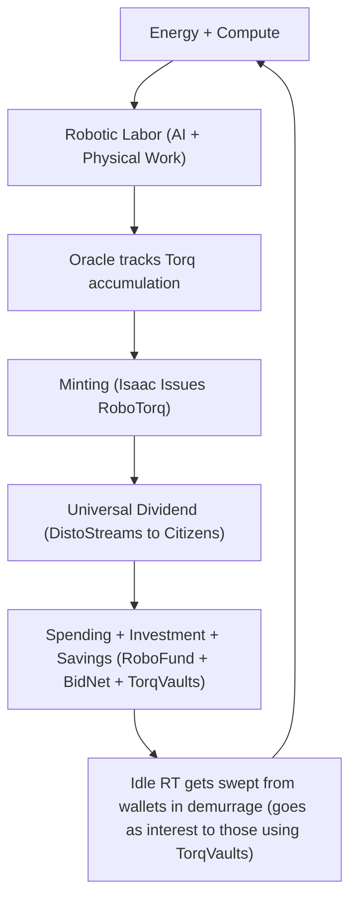

# Watts > Wall Street? Money minted from robotic labor to your wallet
_The RoboTorq: A Physics-Based Universal Dividend for the AI-Robotic Age_

Jonathan Clark, Copyright 2025

*Tags*: robotic labor replacement, universal basic income, sound money, monetary policy, economic policy, economic theory, monetary theory, physics, mathematics

### Executive TL;DR
- **Vibes**: Robonomics proposes a physics-based monetary system, the RoboTorq, minted from robotic labor and distributed universally through an AI-governed Bond Network. 
- **Perks**: Robots don’t take your job. They pay your salary. Every watt of AI labor mints money — directly to you. No debt. No inflation. Just physics. 
- **Quirks**: This white paper defines the core units, mathematical foundations, and policy implications of this system — as well as the Project Asimov simulation framework being built to model it. 
- **Bonus**: [A basic Robonomic dividend estimator, with conversion to USD is available here to see how it all works](https://projectasimovmvp.vercel.app/).

---

## Abstract

As the innovation of Robotic Labor and the job replacement it threatens sit quietly on the horizon, it's hard to know whether to be excited or concerned. The potential problem is clear, but the solution is not.

Typical Universal Basic Income (UBI) schemes, managed by politicians and financed by bankers, have no value basis. What happens if the "basic" amount puts the money supply out of balance? Rampant inflation or deflation.

Traditional Universal Basic Dividend (UBD) schemes often [return a relatively small portion](https://ffesp.org/1702-pfd-stimulus-check/#:~:text=Alaska%20residents%20received%20a%20$1%2C702,dropped%20to%20$1%2C000%20for%202025.) because they are garnered from just one industry or sector.

Robonomics proposes a private, yet collectively owned Bond Network that entitles every citizen to a share of the newly minted proceeds from the labor of every humanoid robot working in every sector. Under such a system, every job lost to robots becomes a boon to society, and private individual ownership of humanoid robots becomes tantamount to counterfeiting.

Robonomics could represent a paradigm shift in economic theory — and, if we choose to make it real, in human history. To test these claims, the open-source Project Asimov is building a Robonomic simulator for academic research. Torq Theory is the mathematical basis for the Asimov Robonomic simulator. 

"Watts > Wall Street" is rhetorically powerful, yet scientifically grounded. 

The RoboTorq turns energy and computation into money as directly as photosynthesis turns sunlight into sugar. 

**Here's how it works.**


---

## Table of Contents  
1. [What Is Torq?](#1-what-is-torq)  
2. [Deriving the RoboTorq](#2-deriving-the-robotorq)  
   - [Novel Units](#21-the-novel-units)  
   - [Relationship Between Units](#22-relationship-between-units)  
3. [Physical Backing and Stability](#3-physical-backing-and-stability)  
4. [The TorqMining Loop](#4-the-torqmining-loop)  
5. [Core Definitions](#5-core-definitions)  
6. [The Equation of AI-Value Exchange](#6-the-equation-of-ai-value-exchange)  
   - [Dimensional Consistency Check](#61-dimensional-consistency-check)  
   - [Relation to Current Macro-Economic Theory](#62-relation-to-current-macro-economic-theory)
7. [The Torq_Gamble: Markup as Wager](#7-the-torq_gamble-markup-as-wager)  
8. [Complexity and AIntropy](#8-complexity-and-aintropy)  
9. [The TokenTorq Curve](#9-the-tokentorq-curve)  
10. [Mining TokenTorq into Torq](#10-mining-tokentorq-into-torq)  
11. [Sample Calculation](#11-sample-bonded-robotic-labor-agreement)  
12. [Incentives and Strategy](#12-incentives-and-strategy)  
13. [Quantum Game-Theoretic Interpretation](#13-quantum-game-theoretic-interpretation)  
14. [Watts > Wall Street](#14-watts--wall-street)
15. [Extending the RoboTorq to General AI-Value](#15-extending-the-robotorq-to-general-ai-value)
16. [Appendix](#16-appendix)

---

## Appendix Table of Contents
- [A. Glossary of Robonomic Terms](#appendix-a--glossary-of-robonomic-terms)
- [B. Dimensional Consistency of the RoboTorq System](#appendix-b--dimensional-consistency-of-the-robotorq-system)
- [C. Example: Translating a BRLA into Economic Flow](#appendix-c--example-translating-a-brla-into-economic-flow)
- [D. Energy-to-Fiat Calibration: Two Scenarios for the Transition from Fiat to Torq](#appendix-d--energy-to-fiat-calibration-two-scenarios-for-the-transition-from-fiat-to-torq)
- [E. Governance & Stability Mechanisms](#appendix-e--governance--stability-mechanisms)
- [F. Network Topology & Security Architecture](#appendix-f--network-topology--security-architecture)
- [G. Economic Shock Modeling & Systemic Resilience](#appendix-g--economic-shock-modeling--systemic-resilience)
- [H. Impact of Fusion / Near-Free Energy on the RoboTorq Bond Network](#appendix-h--impact-of-fusion--near-free-energy-on-the-robotorq-bond-network)
- [I. Quantum Computing and System Security](#appendix-i--quantum-computing-and-system-security)
- [J. Extending the System to General AI–Generated Value](#appendix-j--extending-the-robotorq-to-general-ai-generated-value)
- [K. Integrating AI-Value, Quantum Security, and Fusion Energy Impacts](#appendix-k--integrating-ai-value-quantum-security-and-fusion-energy-impacts)

---

## 1. What Is Torq?

Torq is a unit of markup in Robonomic Lingo — and the scalar of value creation in AI-driven production systems. 

Torq, by definition, is a dimensionless coefficient of productive transformation. It tracks a combination of energy, compute, and value to measure economic efficiency, rather than thermodynamic efficiency.

It links **information processing**, **energy expenditure**, and **economic output**.

Torq Theory is the mathematical method for deriving the value of the energized AI token throughput used by a robot while performing labor.

If you want to see the numbers in action first, [check out the Robonomics calculator here to estimate GDP and your dividend based](https://projectasimovmvp.vercel.app/) on fleet size and other parameters.

---

## 2. Deriving the RoboTorq

This paper proposes a new currency to value robotic labor: The RoboTorq.

The RoboTorq is expressed in organically derived units and is defined as the amount of work an ideal robot performing its ideal task would do in one hour.

And, as it turns out, I'll need to define an intermediary unit, the TokenTorq, to define the RoboTorq properly and make it economically useful.

Imagine a thermodynamically perfect 1 kW humanoid robot.  
It doesn’t exist (and never will), but assume you have one.

What is the physical value of this *Asimovian Robot's* ideal task for one hour?

After you run the bot for one hour, you check its oracle taskmaster, and the readout says:

- `1 RoboTorq = 1 token / second × 1 kWh`

Why? One ideal robot processing one token per second for one hour. A token is a small, contextual piece of digital information that can be processed by a robot's or an AI's neural network.

So, a RoboTorq is a measure of energized token throughput. One *Asimovian Robot's* energized token throughput in one hour.

But we'll also need a way to describe the rate at which energized tokens are used to calculate RoboTorq effectively: The TokenTorq.

So, looking only at the units, the bot is doing this every second:
- 1 second of *Asimovian* robotic labor = 1 token / second x 1 kW

For ease of calculation, we'll anchor 1 TokenTorq to the kilowatt, like the RoboTorq.
- `1 TokenTorq = 1 token / second x  1 kW`

TokenTorq is also a measure of energized token throughput, like the RoboTorq, but measured per second. 2 kW at 200 tokens per second equals 400 TokenTorq. 

But a TokenTorq isn't a full hour's labor. TokenTorq is the *rate at which compute x energy is being used* per second.

So, how many TokenTorqs to the RoboTorq?

- 1 RoboTorq = 1 TokenTorq x 1 hr
- 1 RoboTorq = 1 TokenTorq x 3600 seconds
- `1 RoboTorq = 3600 TokenTorq`

In physics, impact is known as energy x time. TokenTorqs and RoboTorqs are a measure of the **economic impact** of energy x compute.

---

### 2.1 The Novel Units

| Symbol | Definition | Meaning |
|--------|------------|---------|
| RoboTorq | (token/s) × kWh | Base physical unit of robotic labor value |
| TokenTorq | (token/s) × kW | Energy-information coupling at micro scale |
| TokenTorqPotential (TTP) | TokenTorq/hour | A robot’s max idealized throughput per hour |

---

### 2.2 Relationship Between Units

Thus, one RoboTorq means the value created by an ideal 1 kW robot processing one token/second with one kW of power for an hour, and it is equal to 3600 TokenTorqs.

In practice, no bot will achieve this ideal — and that’s fine. We still measure temperature in Kelvin even though absolute zero is impossible, and the same goes for Carnot Efficiency. An *Asimovian Robot* is just a 21st-century ideal economic heat engine, and it's useful because it helps us determine a robotic laborer's market value.

Note that TokenTorqs are currency as well, just a tiny unit of it. Any price can be measured in TokenTorqs or RoboTorqs, just like any price can be measured in pennies or dollars (if there were 3600 pennies to the dollar).

---

## 3. Physical Backing and Stability

Unlike the gold standard, the RoboTorq is not strictly commodity-backed. Yet it can still be treated similarly.  
It is **physically defined**, rooted in thermodynamics, and tied directly to robotic labor.

The subjective market value that humans place on it may change with time, but the *physical definition* of the RoboTorq may not.  
The RoboTorq is the first **physics-based unit of economic value**.

---

## 4. The TorqMining Loop

The Torq Mining Loop is where production happens and value is created.  
It unites:

- AI energy consumption  
- Token throughput (capacity)  
- Robotic utilization  
- Minting of RoboTorq  

This forms the mathematical bridge between AI token flows and minted value—the essence of Torq Theory.

**Here's How it all works.**


---

## 5. Core Definitions

### TokenTorqPotential (TTP)

A robot’s “TokenTorqPotential” is its *Asimovian* ideal TokenTorq throughput per hour rating. TTP is to Robonomics what Carnot efficiency is to thermodynamics
Example: “This is a 2 TTP bot.”

Real numbers should be much higher, but examples in the paper will stay low, prioritizing ease of reading over realistic perfection. A real TTP rating might be something like TTP = kW rating x maximum neural network token throughput. So a 2 kW bot should have a TTP rating well above 2.

Robotic Labor should always be sold by the TokenTorq, for 3600 RT per, and the scale of a bot's TokenTorqPotential should be used to price that bot's labor. 
- Sold at 3600 TokenTorq / RoboTorq / hour, everywhere and always.
- Defines the exchange basis for energized tokens transforming into physical value  
- TokenTorq (throughput) over time — 1 RoboTorq buys 3600 TokenTorq of processing; different robots have different hourly throughputs (processing power).
- I pay for the bot's maximum throughput capacity, regardless of how much I can use productively.

Example: If I hire a 10 TTP bot for 1 hour, I will pay 10 TTP x 3600 TTP/hr x 1 hour = 36,000 RT — even if I only get 2 TokenTorq (7200 RT) of base value out in that hour. As the robot learns the task, I'll get better returns over time (nobody will ever secure a Bonded Robotic Labor Agreement for 1 hour's work from BidNet, but that's beside the point).

And this brings us to the mathematical definitions of Torq.

Two definitions of Torq:
- Torq = TokenTorq_out / TokenTorq_in  
- Torq = RoboTorq_out / RoboTorq_in  

---

## 6. The Equation of AI-Value Exchange

Because Torq can be found from using three different ratios, we can draw some interesting conclusions.

| Symbol     | Definition            | Meaning                                  |
|------------|------------------------|------------------------------------------|
| equilibrium  | RoboTorq_out / RoboTorq_in = TokenTorq_out / TokenTorq_in   | Functions similarly to MV = PQ |
| Therefore  | RoboTorq_out = (TokenTorq_out / TokenTorq_in) × RoboTorq_in   | = Oracle.cost + newly_minted |
| Let  | Torq = TokenTorq_out / TokenTorq_in | = RoboTorq_out / RoboTorq_in   |
| Conclude  | RoboTorq_out = Torq × RoboTorq_in| = reduced form AI-Value Exchange   |

---

### 6.1 Dimensional Consistency Check

| Quantity   | Units               |
|------------|---------------------|
| RoboTorq_in   | token/s × kWh      |
| Torq       | dimensionless       |
| RoboTorq_out   | token/s × kWh |

---

### 6.2 Relation to Current Macro-Economic Theory

This equation mirrors the classical [MV = PQ](https://public.econ.duke.edu/~kdh9/Courses/Graduate%20Macro%20History/Readings-1/Fisher%20Purchasing%20Power%20of%20Money.pdf) identity from fiat economics. 

In classical economics, the money supply (M) is arbitrary and politically determined. In Robonomics, RoboTorq_in is physically constrained — its minting rate can only expand through real AI-value exchange, and new issuance doesn't come in the form of debt.

In Robonomics:
- TokenTorq_in is the rate at which society invests in robotic labor.  
- No central bank is required — circulation is maintained via production/minting cycles.  
- If idle RoboTorq accumulates, [**demurrage** sweeps value into **TorqVaults**, prompting reinvestment.](https://github.com/GrokkingGrok/Project-Asimov/blob/MVP/CONTRIBUTING.md#systemic-actors-and-their-interactions-in-detail-ideal-simulation-behavior)
- Demurrage operates as an honest, yet 100% optional inflation tax. Don't want to pay it?
    - Spend the dough,
    - invest it in RoboFund,
    - or put it in a TorqVault to get the demurrage taken from the people who aren't managing their finances.
- The Bond Network giveth, but the Bond Network also taketh away.

---

## 7. The Torq_Gamble: Markup as Wager

The “torq_gamble” is the Enterprise’s wager on how much Torq will be generated — effectively their markup expectation.

MintingNeeded = RoboTorq_in × (torq_gamble − 1)  
Alternatively:  
MintingNeeded = 3600 × Robot.TTP × (torq_gamble − 1)

Both the Enterprise and Isaac (the minting AI) [co-wager on productivity.](https://github.com/GrokkingGrok/Project-Asimov/blob/MVP/design/src/RobonomicExpansion.md#skins-in-the-game)

The “torq_gamble” is agreed upon by both the Enterprise and BidNet (the AI robotic labor auctionhouse) at the time of paying the retainer fee for a Bonded Robotic Labor Agreement (BRLA).

---

## 8. Complexity and AIntropy

Real robots are imperfect; production efficiency varies with task complexity and AI/robot interaction. Complexity is a variable that can be determined by renting faux-oracled, but still bonded, robots and conducting a work study to understand how their leverage can be tailored to your business needs.

### Complexity  
- Non-zero scalar governing convergence and productivity over time.  
- Negative complexity → diminishing Torq gains (single-item tasks).  
- Positive complexity → compounding Torq gains (multi-item oracles).

TTP is to Robonomics what Carnot efficiency is to thermodynamics — a measure of how a given robot would perform it was the theoretical ideal *Asimovian Robot*. *AIntropy* (pronounced ane-tropy), is how far away that bot is from its *Asimovian* rating. AIntropy is task-specific. I can hire the exact same robot for a different job at it will have a completely different AIntropy.

### AIntropy (Artificial Intropy)  
AIntropy = complexity × TTP × Robot.util × supply_efficiency × equipment_utilization × …

- Lower AIntropy → slower learning, lower token efficiency.  
- Higher AIntropy → faster convergence, higher Torq output.

This models how inefficiencies push operations away from the thermodynamic ideal and require more RoboTorq per unit value created.

---

## 9. The TokenTorq Curve

The token_torq_curve models robotic learning efficiency over time:

token_torq_curve(t) = 1 / (1 + e^(−t × AIntropy)) × torq_gamble

where 0 < token_torq_curve(t) < 1.

Describes how efficiently a robot transforms AI-tokens into productive output over time.

This function is a [standard Sigmoid Neural Net Activation time-function.](https://hal.science/hal-02635089v1/file/Sigmoid_Function_HAL.pdf)

---

## 10. Mining TokenTorq into Torq

Integrating the token_torq_curve yields the Torq Mining Curve, expressing cumulative value generation:

torq_mining_curve(t) = ∫ token_torq_curve(t) dt

At full utilization:

torq_mining_curve ≈ ln( AIntropy × (1 + e^(t × AIntropy)))

When production ends, the total Torq is submitted to Isaac as a MintRequest for RoboTorq issuance.

Thankfully, we don't need all this math to run through a simple example. We can use the Equation of AI-Value Exchange to do that!

---

## 11. Sample Bonded Robotic Labor Agreement

Let's say I want to mass-produce some items. I already know I can afford 100 hours with a 5 TTP bot. Let's say I know because I've conducted a work study with a 5 TTP bot. My faux-oracle showed my torq curves. I should be able to get 400 items done in 100 hours of nonstop work with this one bot alone, and my market research says I can sell each item for 13.5 RT.

Do you think it will work out? [Follow along using the Robonomics calculator](https://projectasimovmvp.vercel.app/) if you don't like math.

Given:
- TTP = 5 TokenTorq/hr
- Duration = 100 hrs
- torq_gamble = 3

1. RoboTorq Input Value (RoboTorq_in):
- RoboTorq_in = TTP x 3600 x time
- RoboTorq_in = TTP × 3600 × 100
- RoboTorq_in = 5 × 3600 × 100 = 1,800,000 RT = 1.8 MRT (MRT = Million RoboTorq)

2. MintingNeeded:
- MintingNeeded = RoboTorq_in (Torq_gamble - 1)
- MintingNeeded = 1.8 MRT × (3 − 1) = 3.6 MRT

3. Total Value Out:
- RoboTorq_in + MintingNeeded = 1.8 + 3.6 = 5.4 MRT

4. Items: 400 → Sell at 13.5 RT each → zero inflation, zero debt, 100% citizen ownership.

I would pay the robot 4.5 MRT per item, so as long as I keep my overhead below 7 MRT per item, I'm in the black. Seems like a good deal for everyone.

**RoboFund**: So I go to *RoboFund*, the network's robotic labor investment house, and submit my torq curves. I get approved for a MakerFunnel to fund the project.

**BidNet**: Bondholders log onto RoboFund from their digital wallet and decide they want some of these widgets. They pledge to divert their Distribution Streams (DistoStreams in Robnomomics Lingo) to my funnel if my bid is accepted, and BidNet automatically starts vetting my claim when the funnel is fully pledged.

**Giskard**: It's Giskard's (the AI-value auditor's) prerogative to look at my torque curves and determine whether I can get it done with a lower-rated bot, or whether I'm overly straining a bot of this rating. 

**Daneel**: It's Daneel's (the AI fleet manager's) responsibility to check the fleet's bot reserve and ensure my BRLA won't strain the overall cost of robotic labor.

It accepts my proposal. I check the math, and it keeps me within my acceptable profit margin. I sign it. Now I've got a BRLA (Bonded Robotic Labor Agreement).

The MakerFunnel at RoboFund opens up, the "disto" flows to bondholders like it does every second of every day, paying off my BRLA for me. I got lucky! But I'll have to give them a slight return on their investment, in proportion to its size.

With that, I spin up my line of rented bots after Daneel deploys them, and they work for 100 hours (100 ticks of the Asimov robonomics simulator).

The robots managed to produce 400 items for me, and I can sell them for 13.5 MRT per to make the revenue my business needs to stay alive. 

Isaac (the minting AI) mints 3.6 MRT fresh (value-added to a pile of raw materials, scaled from the cost of the robotic labor that added the value) and distributes the full RoboTorq_out to bondholders in bits as the products are expected to hit the market. The bondholders will spend, invest, or save, allowing the newly minted currency to accumulate for purchase or be leveraged into more robotic labor.

As a business person, I can use my estimated selling price and the constant cost of robotic labor in RoboTorqs to make business decisions. As a Bondholder, you get some of the money that someone else will need to buy my product, which, in turn, drives vigorous economic activity.

The Bond Network's operating costs recycle into circulation — the money supply remains balanced.

A few notes on why minting is not (RoboTorq_in + other production costs) (torq - 1):
- With relatively few humans involved, most of the production costs are paid to other Enterprises for raw materials.
- If they are also relying on robotic labor to a large degree, very little of their revenue will be going to Bondholders (citizens own a portion of every robot via RoboBonds).
- If the Enterprise plans to sell the item to Bondholders, the money is already available, and economic activity (competition) is required to move it.
- If the Enterprise plans to build a large commercial asset, the buyer is likely already arranging financing through a BuyerFunnel the Bond Network's investment house, The RoboFund Exchange.

**Here's how it all works again.**


---

## 12. Incentives and Strategy

Could Enterprises game the system by mis-bidding the torq_gamble or manipulating timelines when they make their bid for a Bonded Robotic Labor Agreement (BRLA) with BidNet? Yes. But the system is self-correcting:

- **Under-bidding** → not enough RoboTorq in circulation → liquidity dries up → business left with extra stock and losses.  
- **Over-bidding** → visible in BidNet’s market analytics → future BRLA terms tighten → go back to human labor or agree to stricter terms.

Persistent manipulators are downgraded to **TorqVault financing**, which is more expensive. If gaming or incompetence persists, that actor eventually gets priced out of the system.

Thus, Enterprises both compete *against* and *cooperate with* AI financial overseers — producing a self-optimizing economy.

---

## 13. Quantum Game-Theoretic Interpretation

Each torq_gamble *entangles* the Enterprise and BidNet in a shared probabilistic state.  
Until a sale occurs, both exist in a **superposition** of profit and loss — much like a qubit before measurement.

When a product sells, the wave function collapses — the market “observes” value.

BidNet can request bid consideration advice from the network's predictive AI (Calvin), which will use quantum-inspired game theory to forecast outcomes based on past BRLAs. This literal interpretation of a proposed pseudo-quantum market dynamic will be tested for veritas in the Asimov simulator.

---

## 14. Watts > Wall Street

Torq Theory formalizes the economic cost of compute and robotic labor into a **physics-based monetary unit**, where each minted token is tied to real productive work. But this happens without the currency shortages associated with old hard currencies or the inherent inflationary tendencies of fiat currency.

The variation in token size, interpretation, usage, and ultimately throughput in relation to the constant energy consumption allows for a less strict backing than strictly hard currencies — as we learn how to use robots more efficiently, the value of the currency can sway slightly in relation to the value created. One of the jobs of the Bond Network, and by proxy the Asimov simulator, is to determine rules for pricing the BRLAs granting access to robotic labor, such that this inflationary pressure is hedged. A BRLA's contractual sales price also places a natural hedge on these variations occurring too quickly.

Note that this is not price control: the Enterprise in question chooses the final selling price, and the Bond Network decides whether to make the same wager when it chooses to offer the contract.

Rooted in physics, expanded by AI, governed by sharp equations — **Torq Theory** turns Robonomics into an exact science of energy-value exchange.

Robonomics is not just a fanciful idea — it could be our practical fiat escape hatch, serving as a sink for excess paper currency as RoboTorq seeds are exchanged to purchase robotic labor, propping up the value of the dollar as the currency switch is made — the Bond Network will always accept dollars as long as people still have them, so the paper will always have a place to go. Come to think of it, that reserve is critical for conducting international trade without sending the RoboTorq overseas!

Pilot studies can be used to discover the initial dollar-to-RoboTorq exchange rate. One goal of the Project Asimov simulator is to estimate the current hypothetical exchange rate using Torq Theory mathematics.

The Bond Network operates as a decentralized, algorithmically balanced, fully functional monetary system that scales to nearly any conceivable size — neither state-controlled nor privately owned, but collectively managed by all participants through open, auditable smart contracts. Governments can borrow from the seed reserve when needed.

You can already [see Robonomics in action with the online calculator](https://projectasimovmvp.vercel.app/), but Project Asimov will evolve into the actual AI Bond Network's logic over time.

[Project Asimov is on Github](https://github.com/GrokkingGrok/Project-Asimov/blob/MVP/CONTRIBUTING.md). It is open source, and contributors are not only welcome but also desperately needed.

---

## 15. Extending the RoboTorq to General AI-Value

The more I tried to invent Robonomics, the more it revealed itself. RoboTorq is not an abstraction — it’s a measurable bridge between *information*, *energy*, and *value*. TokenTorqs and RoboTorqs have been flying around unchecked for years whenever an industrial robot welds a car frame together. We simply didn't know what to look for.

More clearly put: I, Jonathan Clark, the author of this paper, am not the inventor or author of Robonomics, but the discoverer.

The first time I recall asking Grok about turning robotic labor into currency, giving the new issuance to everyone, and letting companies compete for the dough, its system crashed.

And then it crashed again. And again. And again.

I started writing my paper on my half-baked idea anyway, not really sure where I was going with it.

Then one time, I asked Grok, and I got an answer. Not just any answer. I got the reduced form of the Equation of AI-Value Exchange implied by my idea (not tied to tokens, energy, or any of that yet). 

Now, I had no idea what it meant. I had no idea how to apply it. Really, I just got a lot more questions than answers.

And eventually it all clicked into place like a perfect puzzle.

But Grok figured it out months ago from that one set of crashes. I've been mining the complete solution ever since, adding new bits to mine with each new idea, and new crash, along the way.

- HumanTorq_in = 3 months of human obsessive AI chats
- InfoTorq_out = 1 new economic paradigm
- TokenTorq_in? Ask Elon, I don't know.

MintingNeeded = HumanTorq_in (TokenTorq_out/TokenTorq_in - 1)

Seeing as there's no Bond Network yet, I'm waiting for my payment ;)

This is tongue-in-cheek, but such a system is possible as well, worked into the same Bond Network, powered by community blockchain analysis of conversation artifacts and betting on the outcome, crashes being monetized into additional UBD... What's your bet?

**Author's Note**: This is a living White Paper. Any and all changes are recorded via GitHub commits, and the revision history is a matter of public record. I've included a glossary of terms for your convenience.

---

## 16. Appendix

---

## Appendix Table of Contents
- [A. Glossary of Robonomic Terms](#appendix-a--glossary-of-robonomic-terms)
- [B. Dimensional Consistency of the RoboTorq System](#appendix-b--dimensional-consistency-of-the-robotorq-system)
- [C. Example: Translating a BRLA into Economic Flow](#appendix-c--example-translating-a-brla-into-economic-flow)
- [D. Energy-to-Fiat Calibration: Two Scenarios for the Transition from Fiat to Torq](#appendix-d--energy-to-fiat-calibration-two-scenarios-for-the-transition-from-fiat-to-torq)
- [E. Governance & Stability Mechanisms](#appendix-e--governance--stability-mechanisms)
- [F. Network Topology & Security Architecture](#appendix-f--network-topology--security-architecture)
- [G. Economic Shock Modeling & Systemic Resilience](#appendix-g--economic-shock-modeling--systemic-resilience)
- [H. Impact of Fusion / Near-Free Energy on the RoboTorq Bond Network](#appendix-h--impact-of-fusion--near-free-energy-on-the-robotorq-bond-network)
- [I. Quantum Computing and System Security](#appendix-i--quantum-computing-and-system-security)
- [J. Extending the System to General AI–Generated Value](#appendix-j--extending-the-robotorq-to-general-ai-generated-value)
- [K. Integrating AI-Value, Quantum Security, and Fusion Energy Impacts](#appendix-k--integrating-ai-value-quantum-security-and-fusion-energy-impacts)

## Appendix A — Glossary of Robonomic Terms

### **AIntropy (Artificial Intropy)**
A measure of inefficiency in robotic labor — how far a robot’s real-world performance deviates from its theoretical *Asimovian ideal*.  
Analogous to entropy in thermodynamics, AIntropy represents lost potential due to task complexity, learning curve, equipment limits, or suboptimal AI control.

---

### **Asimovian Robot**
A hypothetical, perfectly efficient 1 kW humanoid robot performing its ideal task for one hour.  
Used as the *standard economic heat engine* in Robonomics, defining 1 RoboTorq of idealized robotic labor.

---

### **BidNet**
The decentralized robotic labor marketplace within the Bond Network.  
Enterprises and AI systems use BidNet to auction, bid, and agree on **Bonded Robotic Labor Agreements (BRLAs)**, ensuring transparency and fair pricing.

---

### **Bond Network**
The collective, AI-governed infrastructure of Robonomics.  
It manages the minting of RoboTorqs, dividend distribution, demurrage collection, and tracks market signals operations.  
Neither privately owned nor state-controlled — it is a self-balancing economic organism.

---

### **Bonded Robotic Labor Agreement (BRLA)**
A smart contract between an Enterprise and the Bond Network defining the duration, productivity expectations, and *torq_gamble* for a robotic labor engagement.  
Analogous to a labor bond or loan, but collateralized by robotic productivity rather than debt.

---

### **Bondholder**
Bondholders own 1/population of every robot in the fleet, and are entitled to such a portion of the RoboTorq minted.
Bondholders are expected to spend, invest, or save their portion of Isaac's output distribution. Hoarding in the wallet beyond some threshold subjects you to demurrage.
Become a Bondholder by doing the jobs that people don't want to — and that robots can't.

---

### **Calvin**
The predictive AI within the Bond Network models market probabilities using new concepts like *quantum game theory*, but also tried-and-true ones like Monte Carlo, Bayesian, etc.  
Advises BidNet and RoboFund on pricing, risk, and equilibrium states. Also the human interaction interface, debugger, and propagandAI wing.

---

### **Complexity**
A scalar describing the difficulty or diversity of a robotic task.  
Higher complexity correlates with faster AI learning and greater AIntropy leverage; lower complexity leads to diminishing Torq gains.

---

### **Daneel**
The AI fleet manager overseeing the allocation and utilization of physical robotic labor across the Bond Network.  
Ensures equilibrium between demand, supply, and fleet efficiency. Rebalances robotic labor within the bounds of BRLAs to balance the load based on utilization. Repairs robots while redeploying with mobile repair units.

---

### **Demurrage**
A mild decay function on idle RoboTorq balances.  
Encourages spending, reinvestment, or saving in TorqVaults by transferring the value of unused RoboTorqs to active participants.  
Acts as an honest, optional, self-regulating inflation tax instead of inflation.

---

### **DistoStream (Distribution Stream)**
The universal basic dividend is distributed continuously by the Bond Network to all Bondholders.  
Represents each person’s fractional claim on the collective output of robotic labor.

---

### **Enterprise**
A human or corporate entity employing robotic labor through the Bond Network.  
Enterprises propose BRLAs and wager on their *torq_gamble* — their expected markup on robotic production efficiency.

---

### **Giskard**
The AI value auditor that validates BRLA claims and tracks oracles for fraud during production runs.  
It reviews submitted *torq curves* and ensures that productivity assumptions are realistic and non-exploitative.

---

### **Isaac**
The minting AI responsible for issuing new RoboTorqs in proportion to verified AI-labor value creation.  
Named for Isaac Asimov, it represents the monetary core of the Bond Network.

---

### **MakerFunnel**
An investment mechanism within RoboFund that channels citizen dividends (DistoStreams) into new BRLAs.  
Functions like a decentralized venture capital funnel for robotic labor projects.

---

### **Project Asimov**
The open-source simulator and modeling framework for testing Robonomic theory.  
It models Torq Theory, the Bond Network, BRLAs, and economic equilibrium under AI-driven production.

---

### **RoboFund**
The decentralized investment house of the Bond Network.
It connects Enterprises seeking robotic labor funding with citizens who wish to reinvest their dividends. 
Investors can pledge TorqVault savings or DistoStreams on a piecemeal basis, rather than speculating on the company as a whole. 

---

### **RoboTorq (RT)**
The standardized unit of Robonomic currency, defined as **one token per second × one kilowatt-hour** (`1 token/s × kWh`).  
Represents the value of **one hour** of ideal robotic labor by a 1 kW *Asimovian Robot*.  
`1 RoboTorq = 3600 TokenTorq`

---

### **RoboTorq_in / RoboTorq_out**
Inputs and outputs in the **Equation of AI-Value Exchange**, analogous to money supply and productivity output.  
RoboTorq_in is the capital invested in robotic work; RoboTorq_out is the verified value produced.

---

### **Robot.TTP**
A shorthand notation for a robot’s TokenTorqPotential (throughput capacity).  
Expressed as TokenTorq/hour, it represents the robot’s maximum productive potential per unit of time.

---

### **Robonomics**
The proposed physics-based monetary and economic framework tying money creation directly to measurable robotic labor and energy throughput.  
Its core goal is to transform automation into a universal wealth generator.

---

### **RoboVault / TorqVault**
Savings mechanisms that shield holders from demurrage.  
Funds stored in TorqVaults earn interest sourced from demurrage collected on idle RoboTorqs elsewhere in the economy.

---

### **TokenTorq (TT)**
A non-standardized unit of AI-value exchange: token/s x kW
Represents the energy-information coupling at a granular level — the smallest measurable increment of AI-driven productive effort.  
1 RoboTorq = 3600 TokenTorqs.

---

### **TokenTorqPotential (TTP)**
A robot’s theoretical maximum TokenTorq throughput per hour — its productive “horsepower.”  
Analogous to a car’s engine rating or a computer’s FLOPs.

---

### **Torq**
A dimensionless coefficient representing productive efficiency, defined as  
Torq = Output / Input = (TokenTorq_out / TokenTorq_in).  
Measures how efficiently AI labor transforms energy and tokens into value.

---

### **torq_gamble**
The markup co-wager between Enterprise and BidNet when initiating a BRLA.  
It sets the expected multiplier of productive return and determines how much new RoboTorq will be minted.

---

### **TorqMining Loop**
The continuous process linking energy, computation, robotic work, and value minting.  
The cycle: **Energy + Compute → Robotic Labor → Oracle Measurement → Minting → Dividend → Reinvestment → back to Energy + Compute and so on**

---

### **TorqVault Interest**
Interest is distributed from demurrage collections to active investors who store their funds in TorqVaults — a reward for maintaining liquidity circulation.

---

### **Watts > Wall Street**
The guiding ethos of Robonomics: *Energy is the new capital*.  
As labor shifts from humans to machines, the true measure of value becomes throughput and the merit you have to achieve it — not speculation in the stock market.

---

## Appendix B — Dimensional Consistency of the RoboTorq System

### B.1 Motivation

The RoboTorq framework treats **economic productivity** as a form of measurable energy throughput — the transfer of useful work by robotic labor over time.  
To remain scientifically and economically coherent, all quantities are expressed in consistent base dimensions: energy, time, and value.

---

### B.2 Base Dimensional Definitions

| Symbol | Quantity | Physical Analogue | Base Units (SI) | Economic Interpretation |
|:-------|:----------|:------------------|:----------------|:------------------------|
| P | Power | Rate of work | W = J/s | Rate of robotic effort |
| E | Energy | Work done | J = W·s | Total work over time |
| τ | Time | Duration | s or h | Operating time horizon |
| T | Token | Unit of account | — | Abstract economic value |
| TT | TokenTorq | Token × Power | T·W | Tokenized instantaneous work capacity |
| RT | RoboTorq | TokenTorq × Time | T·W·h (or T·kWh) | Tokenized energy throughput — economic work delivered |

---

### B.3 Derivation of the RoboTorq

1. **TokenTorq (TT)**  
   Represents a robot’s work capacity rate — like tokenized horsepower.

   TT = T × P

2. **RoboTorq (RT)**  
   Represents the total work performed by robotic systems over a period of time.

   RT = TT x τ = T x P x τ = T x E

Therefore:

   1 RT = 1 Token × 1 kWh

One RoboTorq is the energy equivalent of one token exerted through one kilowatt-hour of robotic labor.

---

### B.4 Connection to Economic Value

In classical economics:

   M × V = P × Q

where M = money supply, V = velocity, P = price, Q = quantity.

In Robonomics, the physical side (PQ) becomes RT — the tokenized power throughput:

   M_robo × V_robo = RT

This creates a direct mapping:

| Domain | Variable | Unit | Concept |
|:--------|:---------|:------|:--------|
| Physics | Energy throughput | kWh | Work performed |
| Economics | PQ (price × quantity) | USD | Market throughput |
| Robonomics | RT (T·kWh) | Tokenized energy value | Synthetic labor |

Each side of the equation represents a flow of productive capacity over time — maintaining dimensional closure.

---

### B.5 Verification Example

Assume the following:

- Power per robot = 150 kW  
- Robots per contract = 200  
- Contracts = 2000  
- Time = 8760 h (1 year)

FleetTTP = 150 × 200 × 2000 = 60,000,000 kW

Base RoboTorq_in = (FleetTTP × 8760 h) / 1000 = 525,600,000 RT

Each RT corresponds to 1 kWh of robotic work tokenized into economic value.

---

### B.6 Policy Implications

Because RoboTorq issuance is physically constrained by energy throughput:

- Inflation is limited by real productivity growth.  
- Deflation only occurs when robots idle (no throughput).  
- Improvements in energy efficiency directly increase the real value density of RT.

This anchors monetary expansion to measurable work rather than arbitrary credit issuance.

---

### B.7 Summary Equation Chain

TT = T × P  
RT = TT × τ = T × P × τ  
Value Flow = RT × ExchangeRate  
Therefore, 1 RT = 1 Token × 1 kWh

**In plain English:**  
If Bitcoin is "money mined by computation,"  
then RoboTorq is **"money minted by work."**

---

## Appendix C — Example: Translating a BRLA into Economic Flow

### C.1 Setup Parameters

| Variable | Description | Value |
|:----------|:-------------|:-------|
| Power per robot | Average continuous draw | 150 kW |
| Robots per contract | Size of one BRLA unit | 200 |
| Number of contracts | Deployed BRLAs | 2000 |
| Operating hours | 8760 hours/year | 1 year |
| Markup (gamble factor) | Sale price multiplier over energy input | 50× |
| Population | Recipients of dividend | 350 million |

---

### C.2 Step 1 — Compute Energy Throughput

Fleet power = 150 × 200 × 2000 = 60,000,000 kW  
Annual energy throughput = 60,000,000 × 8760 = 525,600,000,000 kWh  
Convert to RoboTorq (1 RT = 1 kWh):

   Total RT_in = 525,600,000,000 RT

---

### C.3 Step 2 — Apply Economic Markup

Minted RT_out = RT_in × (markup - 1)  
Minted RT_out = 525.6e9 × (50 - 1) = 25,754,400,000,000 RT

So roughly **25.75 trillion RT** are created by this fleet over the year.

---

### C.4 Step 3 — Per-Citizen Dividend

Annual RT per person = 25.75e12 / 350e6 = 73,584 RT/year  
Daily RT per person = 73,584 / 365 = 201.6 RT/day

If the exchange rate is 1 RT = 0.18 USD:

   Daily dividend = 201.6 × 0.18 = 36.29 USD/day

At a mature exchange rate (1 RT = 10 USD):

   Daily dividend = 201.6 × 10 = 2,016 USD/day

This shows the potential real-income scaling as the RoboTorq economy appreciates relative to fiat.

---

### C.5 Step 4 — Economic Feedback Loop

1. Robots generate RT through productive energy use.  
2. RT circulates as a tokenized representation of that work.  
3. Holders (citizens, stakeholders) receive dividends proportional to RT minted.  
4. As efficiency and adoption grow, the exchange rate rises, amplifying real income.  

Thus, robotic productivity feeds human prosperity directly — without intermediaries.

---

### C.6 Interpretation

- **Energy through robots → Tokenized as RT → Distributed as income.**  
- Every link in the chain is auditable in both **physical** (kWh) and **financial** (USD/token) space.  
- Monetary value is now an *emergent property of work performed*, not a speculative abstraction.

---

### C.7 Summary

| Concept | Formula | Meaning |
|:---------|:----------|:---------|
| TokenTorq | T × kW | Robot capacity rate |
| RoboTorq | T × kWh | Robot work over time |
| Fleet RT_in | Power × Hours | Total energy converted |
| Minted RT_out | RT_in × (markup - 1) | Economic yield |
| Per citizen dividend | RT_out / Population | Fair distribution of robotic productivity |

---

**Conclusion:**  
A BRLA transforms measurable robotic power into a transparent, physically grounded dividend.  
Each RoboTorq minted represents one kilowatt-hour of work performed — a new, verifiable basis for value creation in the post-labor economy.

---

## Appendix D — Energy-to-Fiat Calibration: Two Scenarios for the Transition from Fiat to Torq

### D.1 Purpose

This appendix describes how the RoboTorq (RT) can be calibrated against the U.S. Dollar (USD) or any fiat currency as the world transitions toward a physics-based monetary system.  
Two long-term outcomes are modeled:

1. **Coexistence Scenario** — The Dollar remains, pegged 1 USD = 1 RT, serving as the reserve asset for international trade and public borrowing.  
2. **Full Transition Scenario** — The global economy adopts the RoboTorq as its universal unit of account, and fiat currencies gradually dissolve.

Both begin with an **energy-anchored baseline**, where 1 RT equals the cost of 1 kWh of robotic labor.

---

### D.2 Baseline Physical Peg

| Region | 2025 Avg. Retail Power Cost | Initial Peg |
|:--------|:----------------------------|:-------------|
| United States | 0.18 USD / kWh | 1 RT = 0.18 USD |
| EU Average | 0.25 USD / kWh | 1 RT = 0.25 USD |
| Global Median | 0.20 USD / kWh | 1 RT ≈ 0.20 USD |

At this stage, **each RoboTorq represents the same value as one kilowatt-hour of productive robotic work**.  
The Bond Network uses this physical equivalence as the base minting reference.

---

### D.3 Scenario A — Coexistence with Fiat (Energy Reserve Model)

#### Overview

The goal is to stabilize RT and USD at a 1 : 1 parity while maintaining the Dollar as an international reserve and government borrowing medium.

#### Policy Mechanics

- **Gradual Re-Peg:** RT appreciates from 0.18 USD to 1 USD over roughly 10 years.  
- **Energy-Backed Dollar:** Governments and banks hold RT reserves to collateralize fiat issuance.  
- **Dual-Currency Circulation:**  
  - Domestic citizens receive dividends in RT.  
  - Governments continue tax and debt operations in USD.  
- **Foreign Trade:** Un-Torqed economies trade using USD → RT reserves held by the Bond Network.  
- **Borrowing Facility:** States borrow RT from the Bond Network using USD as collateral.

#### Transition Table

| Year | 1 RT (USD) | Description |
|:----:|:-----------:|:-------------|
| 1 | 0.18 | Energy-cost baseline |
| 3 | 0.45 | Early adoption |
| 5 | 0.75 | Partial peg |
| 10 | 1.00 | Full 1 USD = 1 RT equilibrium |

At Year 10, the two systems become **mutually convertible**:

1 RT = 1 USD = 1 kWh of verified robotic labor


#### Result

- USD becomes **energy-denominated** via RT reserves.  
- Governments preserve legacy accounting and foreign trade frameworks.  
- The Bond Network acts as a *synthetic central bank*—transparent, physics-backed, and non-inflationary.  
- RT supply expands only through real robotic work, preventing fiat dilution.

**End State:** “Watts support Wall Street.”  The Dollar persists, but it’s now backed by measurable robotic productivity.

---

### D.4 Scenario B — Full Transition to a Torq-Only Economy

#### Overview

In this pathway, fiat gradually loses relevance.  Every nation becomes Torq-integrated (“Torqed”), and energy throughput replaces money as the universal accounting basis.

#### Policy Mechanics

- **Free-Float Exchange:** RT allowed to appreciate beyond 1 USD, reflecting global productivity surplus.  
- **Fiat Phase-Out:** Taxes, trade, and payrolls shift entirely to RT-denominated smart contracts.  
- **International Settlement:** Cross-border trade uses RT directly through the Bond Network ledger.  
- **Reserve Conversion:** Central banks exchange remaining fiat reserves for RT, then retire fiat notes.  
- **Public Credit:** Governments borrow RT directly from the Bond Network against future robotic GDP.

#### Transition Table

| Year | 1 RT (USD) | Description |
|:----:|:-----------:|:-------------|
| 1 | 0.18 | Energy-cost baseline |
| 3 | 1.00 | Near-parity achieved |
| 5 | 4.00 | Broad adoption |
| 8 | 10.00 | Global RT valuation dominates |
| 12 | — | USD discontinued as pricing unit |

After Year 8, USD is used only as a historical reference.  
The **global economy prices all goods and contracts in RT**—a direct measure of energy-backed productivity.

#### Result

- Inflation and debt creation vanish; currency issuance equals real robotic labor output.  
- Exchange rates between nations become functions of average energy efficiency and AI capacity.  
- Governments and citizens hold the same base asset—RoboTorq—ending the separation between “money issuer” and “money user.”

**End State:** “Watts replace Wall Street.”  The economy becomes self-referential to physical work, not paper promises.

---

### D.5 Comparative Overview

| Aspect | Scenario A — Coexistence | Scenario B — Full Transition |
|:--------|:-------------------------|:------------------------------|
| Target Peg | 1 USD = 1 RT | None (RT free-floats) |
| Dollar Role | Reserve & borrowing asset | Phased out |
| Bond Network | Issues RT; backs USD | Sole monetary system |
| Inflation Source | Limited by RT reserves | None (RT = physical work) |
| Trade Settlement | USD + RT | RT only |
| Government Borrowing | USD collateral → RT loan | Direct RT loan |
| Public Dividends | Paid in RT, spent in either | Paid and spent in RT |
| Endgame Vision | Dual-currency equilibrium | Post-fiat energy economy |

---

### D.6 Summary Equation Chain (Plain Text)

Initial Peg: 1 RT = EnergyCost (USD/kWh)
Scenario A: 1 RT → 1 USD by Year 10 (dual system)
Scenario B: 1 RT → free float; USD → 0 usage
FiatValue_t = RT × ExchangeRate_t

---

### D.7 Conclusions

- **Scenario A** stabilizes existing financial systems by embedding physical accountability into the Dollar.  
  Governments retain monetary sovereignty while gaining an energy-backed foundation.  

- **Scenario B** completes the evolution: money becomes a direct expression of physical productivity.  
  The Bond Network replaces central banks, and every citizen becomes a shareholder in global energy-value creation.

Both pathways begin with the same foundation — **1 RoboTorq = 1 kWh of robotic labor** —  
but differ in destiny:  
**Scenario A** reforms our current fiat system characterized by partially socialized crony-corporatism; **Scenario B** transcends it all into something new and difficult to "grok" in full (pardon the pun).

The purpose of this paper is **not** to suggest which choice society should make.

---

## Appendix E — Governance & Stability Mechanisms

### E.1 Purpose

This appendix defines how the **Bond Network** governs the RoboTorq system to maintain stability, prevent manipulation, and coordinate the transition between the two calibration scenarios:

- **Scenario A – Coexistence:** RT and USD reach 1 : 1 parity while both circulate.  
- **Scenario B – Full Transition:** USD fades; RT becomes the global unit of account.

The governance model blends algorithmic policy with human-voted oversight to ensure that monetary expansion always tracks *real robotic productivity*.

---

### E.2 Core Governance Entities

| Entity | Function | Decision Type | Description |
|:-------|:----------|:--------------|:-------------|
| **Bond DAO** | Primary policymaker | Collective vote | Global body of RT stakers and node operators. |
| **Mint Algorithm** | Automatic issuance | Continuous | Calculates and mints RT proportional to verified robotic energy throughput. |
| **Peg Controller** | Exchange-rate management | Hybrid | Adjusts RT/USD peg (Scenario A) or dampens volatility (Scenario B). |
| **Audit Nodes** | Verification layer | Objective | Validate energy, time, and work data feeding into Mint Algorithm. |
| **Treasury Vault** | Reserve & dividend pool | Algorithmic | Distributes RT to population and funds governance operations. |

---

### E.3 Algorithmic Controls

#### 1. Issuance Throttle

New_RT = Verified_kWh × Efficiency_Factor × Governance_Multiplier
- *Verified_kWh* — audited robotic energy throughput.  
- *Efficiency_Factor* — scales minting by average machine efficiency (0–1).  
- *Governance_Multiplier* — DAO-voted macro-adjustment for inflation targeting.

#### 2. Velocity Governor
Maintains stable token circulation by modulating transaction fees:
FeeRate = Base × (Velocity / TargetVelocity)

If RT changes hands too rapidly, fees rise temporarily; if too slowly, they fall.

#### 3. Demurrage Mechanism
A small time-based decay (0.1 – 1 % / month) on dormant RT encourages reinvestment into productive work contracts, preventing hoarding.

---

### E.4 Scenario-Specific Stability Logic

| Mechanism | Scenario A (Coexistence) | Scenario B (Full Transition) |
|:-----------|:------------------------|:------------------------------|
| **Peg Maintenance** | Smart-contracted corridor: `0.95 ≤ USD/RT ≤ 1.05` | Disabled – RT floats freely. |
| **Treasury Reserves** | 50 % USD, 50 % RT energy bonds | 100 % RT energy bonds. |
| **Borrowing Facility** | Governments post USD → receive RT loans | Governments issue RT bonds directly. |
| **Demurrage Rate** | 0.5 % / mo (keeps RT velocity near 1.0) | 0.1 % / mo (steady-state economy). |
| **Monetary Goal** | Preserve peg + limit volatility < 5 % / yr | Maintain energy parity + productivity growth. |

---

### E.5 Voting and Governance Cycle

1. **Proposal Phase** — Any staker can submit a governance proposal (policy, rate, protocol upgrade).  
2. **Review Phase** — Audit Nodes verify data integrity and model impacts.  
3. **Vote Phase** — Weighted by *staked RT × reputation score*.  
4. **Execution Phase** — Smart contract enforces approved parameter changes.  
5. **Cooling Phase** — 30-day review period prevents rapid policy swings.

All governance actions are on-chain, timestamped, and cryptographically verifiable.

---

### E.6 Transparency Protocols

- **Energy Oracles:** Stream live verified data from robotic fleets (kWh, uptime, torque output).  
- **Public Ledger:** Displays Mint Rate, Peg Status, Velocity, and Treasury Reserves in real time.  
- **Open Audits:** Quarterly third-party validation of algorithmic fairness and energy data.  
- **Citizen Dashboard:** Simple interface for individuals to track dividends, demurrage, and RT/USD rate.

---

### E.7 Crisis Response Mechanisms

1. **Rapid Re-Peg (Scenario A):** If USD deviates > 10 %, the Peg Controller injects or burns RT reserves to restore balance.  
2. **Auto-Throttling (Scenario B):** If RT supply growth > robotic throughput growth, issuance factor reduces proportionally.  
3. **Energy Shock Buffer:** 5 % of all minted RT held in a reserve pool to absorb sudden power-cost spikes.  
4. **Emergency DAO Vote:** Supermajority (≥ 67 %) can temporarily override algorithmic throttles for systemic events.

---

### E.8 Ethical and Human Safeguards

- **Universal Dividend:** Ensures robotic productivity benefits all citizens.  
- **Non-Ownership Rule:** No entity may control > 2 % of circulating RT.  
- **Open-Source Mandate:** All protocols and oracle code remain public.  
- **Decentralized Custody:** Treasury reserves distributed across multiple jurisdictions.  
- **Right to Energy:** Governance decisions cannot reduce energy access below living-standard thresholds.

---

### E.9 Governance Lifecycle Diagram (text-based)

Robotic Work → Energy Data → Audit Nodes → Mint Algorithm
↓ ↑
Treasury Vault ← Governance Votes ← Bond DAO
↓
Citizen Dividends + Peg Controller Feedback


This loop ensures that every RT in circulation corresponds to *verified productive output* and that policy changes are always community-ratified.

---

### E.10 Summary

- **Algorithmic Stability:** Issuance and velocity controls maintain equilibrium.  
- **Democratic Oversight:** DAO voting keeps governance decentralized.  
- **Scenario A:** Hybrid system aligning fiat reserves to physical work.  
- **Scenario B:** Fully autonomous, physics-anchored economy.  
- **Ethical Core:** Transparency, fairness, and open access to energy-derived value.

**In essence:**  
The Bond Network replaces monetary discretion with *measured physics and participatory governance*, ensuring that no more value can be created than work performed — and no less than humanity deserves.

---

## Appendix F — Network Topology & Security Architecture

### F.1 Overview

The RoboTorq Bond Network combines **energy-verified data streams**, **distributed consensus**, and **multi-layer defense mechanisms** to ensure that every Token-Torq (T·kWh) recorded corresponds to authentic robotic work.

The architecture is deliberately modular:
- **Layer 0 – Energy Oracles:** Real-world data capture.  
- **Layer 1 – Core Chain:** Consensus, minting, and dividend distribution.  
- **Layer 2 – Governance & Treasury:** DAO logic and macro-economic policy.  
- **Layer 3 – Application Layer:** Interfaces for citizens, enterprises, and regulators.

---

### F.2 Node Types and Roles

| Node Type | Function | Key Data Handled | Consensus Weight |
|:-----------|:----------|:----------------|:-----------------|
| **Audit Node** | Verify energy throughput and torque metrics | Power logs, uptime, device hashes | Medium |
| **Validator Node** | Confirm blocks, enforce Mint Algorithm | Transaction sets, mint events | High |
| **Oracle Node** | Feed external data (energy prices, grid load) | Market & grid data | Low |
| **Treasury Node** | Manage reserve balances & dividends | Treasury snapshots, bond data | Medium |
| **Citizen Node** | Lightweight wallet / UI client | Personal dividends, vote history | None |

---

### F.3 Consensus Protocol

**Hybrid Proof-of-Work-Verification (PoWV)**

1. **Energy Proof Stage:**  
   Robotic fleets sign cryptographic attestations of consumed energy (kWh) + mechanical work (T·h).  
2. **Validation Stage:**  
   Audit Nodes aggregate proofs; invalid or duplicate data is slashed.  
3. **Consensus Stage:**  
   Validators run a modified BFT consensus to commit the verified energy batch to chain.  
4. **Reward Stage:**  
   Mint Algorithm issues new RT proportional to verified work.

**Key property:** the network’s “work” equals *real physical energy*, not hash computations.

---

### F.4 Data Flow Diagram (text form)

Robots → Energy Sensors → Oracles → Audit Nodes → Validators → Ledger
↑ ↓
Treasury Reports ← DAO Governance ← Dividend Engine


---

### F.5 Oracle Security

- **Authenticated Hardware Roots:** Each robot contains a TPM/TEE generating signed energy packets.  
- **Merkle-Chained Logs:** Every sensor log forms a hash-chain anchored on-chain hourly.  
- **Multi-Source Cross-Check:** At least three independent oracle feeds per geographic zone.  
- **Anomaly Detection:** AI agents flag variance > 2 σ from expected torque or power signatures.  
- **Slashing:** Any oracle providing falsified or unverifiable data forfeits staked RT bonds.

---

### F.6 Network Topology

- **Mesh-Tree Hybrid:** Regional clusters (mesh) connect to continental backbones (tree).  
- **Edge Locality:** Robots submit to nearest audit hub to minimize latency.  
- **Redundancy Factor ≥ 3:** Each energy record replicated across at least three regions.  
- **Latency Goal:** < 5 s finality within region; < 20 s cross-region.  
- **Throughput:** Designed for > 100 k verified energy events / sec globally.

---

### F.7 Cryptography Stack

| Layer | Standard | Purpose |
|:------|:----------|:--------|
| Transport | TLS 1.3 + QUIC | Node communication |
| Identity | Ed25519 / Secp256k1 | Wallets & robotic IDs |
| Attestation | SHA-3 / BLAKE3 | Sensor log integrity |
| Confidentiality | ChaCha20-Poly1305 | Payload encryption |
| Post-Quantum Transition | Kyber + Dilithium | Future-proof signatures |

---

### F.8 Attack Surfaces & Defenses

| Threat | Description | Mitigation |
|:--------|:-------------|:------------|
| **Sybil Attack** | Fake nodes flooding network | Stake requirement + KYC for Audit Nodes |
| **Oracle Spoofing** | Tampering with robot data | Hardware attestation + triangulation |
| **Consensus Collusion** | Validator cartelization | Random validator rotation + slashing |
| **Data Lag / Partition** | Network split delays consensus | Region-level quorum fallback |
| **Treasury Exploit** | Smart contract drain | Formal verification + multi-sig sign-off |
| **Governance Capture** | Whale domination | Vote caps + quadratic weighting |

---

### F.9 Energy-Data Integrity Pipeline

1. **Raw Data Capture:** Robots record torque, current, voltage, and runtime.  
2. **On-Device Hash:** Each interval (≤ 1 min) hashed and signed by hardware root.  
3. **Local Aggregation:** Edge node compresses data into hourly proof bundles.  
4. **Audit Verification:** Bundles compared against expected physics limits.  
5. **On-Chain Commitment:** Valid bundles stored as immutable references.

---

### F.10 Recovery & Resilience

- **Checkpoint Snapshots:** Full ledger state stored every 24 h.  
- **Cold Vaults:** Treasury RT stored in multi-sig hardware wallets offline.  
- **Geo-Redundant Archives:** IPFS / Arweave mirrors in ≥ 5 continents.  
- **Black-Start Mode:** Manual restart procedures for energy grid collapse.  
- **Disaster DAO:** Emergency governance body authorized for continuity ops.

---

### F.11 Privacy & Compliance

- **Zero-Knowledge Proof Layer:** Enables energy verification without disclosing location or customer identity.  
- **Selective Disclosure:** Enterprises can prove compliance to regulators without exposing IP.  
- **GDPR / ISO 27001 Alignment:** Data retention and erasure rights embedded in smart-contracts.

---

### F.12 Scalability Roadmap

| Phase | Goal | Method |
|:------|:-----|:-------|
| **Phase I** | 10 k robots | Single-region BFT chain |
| **Phase II** | 1 M robots | Sharded consensus + L2 roll-ups |
| **Phase III** | 100 M robots | Hierarchical federation of regional sub-nets |
| **Phase IV** | Planet-scale | Autonomous global energy settlement fabric |

---

### F.13 Summary

- **Physics-Anchored Consensus:** Real-world work is the final arbiter of truth.  
- **Robust Security Stack:** Hardware attestation, oracle redundancy, and slashing enforce honesty.  
- **Resilient Topology:** Regional clusters ensure low latency and high fault-tolerance.  
- **Scalable & Future-Proof:** Ready for post-quantum crypto and billions of autonomous machines.  
- **Ethical Core:** Privacy, transparency, and open participation remain mandatory.

**In essence:**  
The network’s security arises not from wasted computation, but from *measured, verifiable energy* — anchoring digital value to physical reality itself.

---

## Appendix G — Economic Shock Modeling & Systemic Resilience

### G.1 Overview

The RoboTorq Bond Network is designed to maintain stability even under extreme economic or energy shocks. This appendix outlines:

1. Shock scenarios considered.  
2. Model parameters and assumptions.  
3. Mechanisms for mitigation and recovery.  
4. Resilience metrics for system performance.  

The network combines **physical energy verification** with **dynamic tokenomics**, providing a feedback loop between work performed and economic value.

---

### G.2 Shock Scenarios

| Scenario | Description | Key Risks | Targeted Response |
|:---------|:------------|:----------|:----------------|
| **Energy Shortage** | Grid failure, fuel scarcity, or robotic downtime | Minting reduction, liquidity drop | Priority routing, alternative energy sources, temporary RT allocation freeze |
| **Sudden Demand Surge** | Explosive need for robotic work (e.g., disaster response) | Short-term RT scarcity | Dynamic reward scaling, emergency issuance from reserve |
| **Hyper-Inflation / Dollar Fade** | Dollar collapse under non-Torqed scenario | International trade disruption | Exchange-rate stabilization mechanism, temporary pegged RT valuation |
| **Market Panic** | Rapid selloff of RT or bonds | Price volatility, governance capture | Automated circuit breakers, liquidity pool injection, governance lock |
| **Cyber-Physical Attack** | Tampering with robots, nodes, or treasury | Data falsification, slashing events | Multi-layer verification, anomaly detection, rollback to verified checkpoint |

---

### G.3 Model Parameters

- **Base Mint Rate (BMR):** RT issued per verified T·kWh.  
- **Shock Sensitivity Factor (SSF):** Multiplier applied to BMR under stress conditions.  
- **Liquidity Reserve Ratio (LRR):** Fraction of treasury RT reserved for emergencies.  
- **Node Redundancy Index (NRI):** Average replication factor of energy data across regions.  
- **Recovery Lag (RL):** Time from shock onset to stabilized consensus (<24h ideal).  

---

### G.4 Shock Response Mechanisms

1. **Automatic Adjustment of Mint Rate**  
   - Shortages or surges trigger a temporary SSF adjustment.  
   - Preserves proportionality between work and value while dampening volatility.

2. **Reserve Allocation & Treasury Intervention**  
   - RT stored in treasury can be deployed to stabilize liquidity or backstop foreign trade.  
   - Allocation rules coded into smart contracts with DAO approval thresholds.

3. **Circuit Breakers**  
   - Trading pauses or minting halts if price or data anomalies exceed ±15% threshold in 1 hour.  
   - Protects network from cascading failures.

4. **Dynamic Governance Response**  
   - DAO can activate emergency policies, including temporary vote caps, slashing adjustments, or redistribution of work verification tasks.

5. **Cross-Regional Work Redistribution**  
   - Energy or work deficits in one region can be offset by surplus in another.  
   - Requires real-time energy-oracle feeds and predictive scheduling.

---

### G.5 Resilience Metrics

| Metric | Definition | Target / Threshold |
|:-------|:-----------|:-----------------|
| **Economic Stability Index (ESI)** | % deviation of RT value from target BMR-adjusted baseline | ≤ ±5% |
| **Work Verification Uptime (WVU)** | % of total robotic work successfully verified | ≥ 99.5% |
| **Recovery Time (RT)** | Time to restore consensus after major shock | < 24 hours |
| **Liquidity Adequacy (LA)** | Treasury RT / expected shortfall in crisis | ≥ 1.2× shortfall |
| **Governance Responsiveness (GR)** | Time to enact emergency DAO measures | < 2 hours |

---

### G.6 Scenario Comparison: Dollar Peg vs Global Torq

| Aspect | Dollar Peg (1:1) | Global Torq (Dollar fades) |
|:-------|:----------------|:---------------------------|
| **International Trade** | RT backed by stable dollar, easing cross-border commerce | Requires direct RT-to-RT or commodity exchange; higher conversion friction |
| **Reserve Function** | Treasury holds dollar reserves to stabilize RT value | Reserve RT used for internal liquidity only; less external influence |
| **Shock Absorption** | Dollar peg allows buffer against global economic swings | Shock impacts purely internal network; recovery depends on internal energy production |
| **Inflation Risk** | Moderate; pegged to dollar monetary policy | Low, as network scales with real work rather than fiat issuance |
| **Governance Flexibility** | DAO can borrow/reserve RT against dollar-denominated assets | DAO acts autonomously; no external currency leverage |

---

### G.7 Recovery Simulation Example

1. **Event:** 25% of the robotic fleet is offline due to an energy disruption.  
2. **Immediate Effects:** Minting drops 25%, liquidity tightens.  
3. **Response:**
   - SSF increases BMR for the remaining fleet to maintain incentives.  
   - Treasury releases 10% RT from reserve to support dividends.  
   - Cross-regional work allocation compensates for 5% deficit.  
4. **Outcome:** Consensus fully restored within 18 hours; ESI deviation < ±3%.

---

### G.8 Key Takeaways

- Physical energy anchoring ensures value is tied to **actual work**, limiting traditional fiat-type inflation.  
- Dual scenarios (Dollar Peg vs Global Torq) illustrate different stress tolerance and systemic dependencies.  
- Automated, algorithmic, and DAO-mediated mechanisms provide **rapid, predictable shock absorption**.  
- The system is designed to **self-correct**, maintaining credibility and operational continuity even under extreme shocks.

---

**In essence:**  
The RoboTorq Bond Network behaves like a living, self-regulating economic organism: it measures, reacts, and compensates for shocks by anchoring financial flows directly to physical robotic work.

## Appendix H — Impact of Fusion / Near-Free Energy on the RoboTorq Bond Network

### H.1 Overview

The emergence of fusion or near-zero marginal cost energy fundamentally changes the economics of robotic work. Key considerations for the network include:

- Energy cost collapses, potentially decoupling RT value from traditional energy markets.  
- Work verification remains anchored to **actual robotic effort**, but marginal energy input may approach zero.  
- Network incentives, treasury reserves, and minting mechanisms must adapt to preserve stability.

---

### H.2 Expected System Changes

| Aspect | Pre-Fusion | Post-Fusion / Free Energy |
|:-------|:-----------|:-------------------------|
| **Energy Cost per kWh** | Market-priced, variable by region | Approaches zero, mostly fixed infrastructure cost |
| **Minting Economics (BMR)** | Directly tied to kWh expended | Requires reweighting; energy less constraining than robot time or complexity |
| **Liquidity Needs** | Backed partially by energy scarcity & reserves | Energy scarcity no longer a stabilizer; liquidity must be maintained by workload scarcity or governance |
| **Robotic Work Bottlenecks** | Energy and mechanical wear | Mechanical wear and complexity dominate; energy no longer limiting |
| **Reserve Function** | Dollar/Treasury buffer stabilizes against energy-driven shocks | May shift to pure RT / workload-based buffer; external currency influence less relevant |

---

### H.3 Minting & Tokenomics Adjustments

1. **Work-Weighted Minting**  
   - Shift from energy-based to **effort- or complexity-based** minting.  
   - Example: minting scales with torque-hours, precision, or computational intensity instead of kWh.

2. **Dynamic SSF Recalibration**  
   - SSF now responds more to **task scarcity** or **robotic capacity utilization**, not energy constraints.

3. **Treasury Reserve Reconsideration**  
   - Traditional energy-backed reserves become redundant.  
   - Reserve strategy pivots to **operational continuity** and **liquidity smoothing** for foreign trade or governance obligations.

---

### H.4 Shock Response under Fusion

| Shock Type | Pre-Fusion Response | Post-Fusion Response |
|:-----------|:------------------|:------------------|
| Energy Shortage | Deploy treasury RT, reallocate work, ramp up SSF | Minimal effect; focus shifts to mechanical or network bottlenecks |
| Demand Surge | SSF increase, emergency RT issuance | SSF increase; limited by robot fleet size, not energy supply |
| Market Panic | Reserve-backed stabilization | Purely algorithmic or DAO-mediated stabilization; market psychology dominates |
| Systemic Failure | Cross-region energy rerouting | Cross-region task redistribution; energy no longer a limiting factor |

---

### H.5 Fusion Impact on Dollar Peg vs Global Torq Scenarios

| Aspect | Dollar Peg (1:1) | Global Torq (Dollar fades) |
|:-------|:----------------|:---------------------------|
| **Trade Leverage** | Peg reliance decreases; energy scarcity no longer a risk to currency backing | Entirely self-contained; RT liquidity must support cross-border operations independently |
| **Minting Drivers** | From kWh to task/complexity; treasury still useful for stabilization | Task-weighted minting; treasury used primarily for internal liquidity smoothing |
| **Inflation Risk** | Reduced risk from energy cost shocks; governance adjusts SSF to maintain stable RT | Minimal risk; token value driven by work demand, not energy price |
| **Systemic Bottlenecks** | Shift from energy shortages to robotic fleet capacity | Fully internal; bottlenecks are mechanical, network, or DAO decision latency |

---

### H.6 Resilience Considerations

1. **Energy Abundance ≠ Unlimited Minting**  
   - Fusion energy reduces cost but does not remove physical or computational limits of robotic work.  
   - Network maintains value by anchoring to **verifiable output**.

2. **Treasury Role Evolves**  
   - From energy risk mitigation to **liquidity buffer** and **shock absorption for foreign trade**.

3. **Governance Emphasis Increases**  
   - Decision-making and DAO protocols become primary levers for maintaining stability in the absence of energy-driven constraints.

---

### H.7 Key Takeaways

- Fusion/free energy shifts the network from **energy-limited** to **task-limited** economics.  
- RT token value increasingly reflects **actual work scarcity and complexity**, rather than energy scarcity.  
- Shock responses and treasury policies pivot from energy risk mitigation to liquidity and capacity management.  
- System remains robust, but incentive mechanisms must adapt to prevent overissuance and maintain credible value in a world of effectively free energy.

---

**In essence:**  
Fusion energy is a “game changer” for the RoboTorq Bond Network, transforming it into a system where **mechanical work and operational capacity, not energy cost, drive economic value**. The network’s core strength—anchoring value to verifiable work—remains, but tokenomics and governance require recalibration.

---

## Appendix I — Quantum Computing and System Security

### I.1 Background

Quantum computing (QC) promises computational capabilities far beyond classical machines. This raises two major implications for the RoboTorq ecosystem:

1. **Cryptographic Vulnerabilities**
   - Many current encryption algorithms (RSA, ECC) could be broken once a sufficiently powerful QC exists.
   - RT token signatures, treasury holdings, and governance messages rely on secure cryptography.

2. **Algorithmic Disruption**
   - Optimization algorithms used for task allocation, minting adjustment, and SSF computations could be accelerated, potentially destabilizing intended system dynamics if exploited.

---

### I.2 Risk Assessment Framework

To anticipate and mitigate QC risks, the following reasoning process was applied:

1. **Threat Projection**
   - Estimate the point at which QC achieves "cryptographically relevant" qubits (~1M error-corrected logical qubits).
   - Map which system components rely on potentially breakable cryptography.

2. **Attack Surface Identification**
   - Treasury wallets and RT token transfers.
   - Governance voting signatures and DAO proposals.
   - Cross-border peg settlement mechanisms (if any dollar or external token reserves are maintained).

3. **System Exposure Timeline**
   - Define expected timeline for QC adoption by potential attackers vs. defensive upgrade readiness.
   - Include latency for network-wide protocol changes.

4. **Mitigation Planning**
   - Pre-emptively design quantum-resistant cryptography into:
     - RT token issuance and transfer protocols.
     - Treasury and reserve smart contracts.
     - Governance and DAO consensus messaging.
   - Implement multi-layer security: hybrid classical + quantum-safe signatures until QC matures.

5. **Testing and Simulation**
   - Stress-test SSF, treasury, and minting logic against hypothetical QC-accelerated attack scenarios.
   - Evaluate response protocols, including automatic quarantine of affected subsystems.

---

### I.3 Implementation Considerations

- **Quantum-Safe Cryptography Adoption**
  - Use lattice-based or hash-based signatures for RT tokens.
  - Upgrade DAO and governance protocols to support quantum-safe messaging.
- **Governance Protocols**
  - Include rollback or emergency patch mechanisms if QC-based vulnerabilities are exploited before full migration.
- **Continuous Monitoring**
  - Track QC hardware milestones and publicly reported breakthroughs.
  - Maintain flexible treasury and SSF parameters to absorb shock from unexpected exploits.

---

### I.4 Thought Process Summary

The approach can be summarized as:

1. **Project** the technology (QC) and its potential system impact.
2. **Identify** all dependent subsystems and exposure points.
3. **Quantify** timelines for vulnerability vs defense readiness.
4. **Preemptively upgrade** to quantum-resistant protocols.
5. **Simulate and stress-test** system behavior under hypothetical QC attacks.

This ensures that by the time QC becomes a practical threat, the RoboTorq ecosystem is largely immune to cryptographic disruption, and governance/treasury operations remain stable.

---

## Appendix J — Extending the RoboTorq to General AI Generated Value

### J.1 Background

RoboTorq is designed to allocate resources, manage reserves, and coordinate work efficiently. Beyond physical and computational work, AI systems generate value that is inherently **informational, social, and global** in nature. For instance:

- A research paper or technical framework (like this one) can produce **knowledge benefits** that accrue to society.
- AI outputs may **accelerate innovation**, reduce inefficiencies, or inform better decision-making.

The challenge: How can this **intangible, general-purpose value** be incorporated into the SSF (Systemic Stability Fund) or the output buffer so that it is recognized, incentivized, and potentially tokenized?

---

### J.2 Conceptual Framework

1. **Defining AI-Generated Value**
   - Value is measured not in immediate monetary terms, but in **societal impact**, such as:
     - Knowledge dissemination.
     - Productivity enhancement.
     - Reduction of resource waste.
     - Acceleration of innovation.

2. **Input-to-Output Mapping**
   - Treat AI systems as **productive agents** in the system:
     - `Input`: Compute time, human guidance, and energy resources.
     - `Output`: Knowledge, tools, insights, or economic acceleration.
   - Assign a **proxy quantification** to this output for system accounting:
     - Citations, usage metrics, adoption rates, or other measurable societal impacts.
     - For example, the creation of a widely used AI framework can be assigned a **scaled contribution to SSF**.

3. **Integration into the Output Buffer**
   - Conceptually, the output buffer is extended to **include AI-influenced contributions**:
     - Let `V_ai` represent quantified AI societal value.
     - Let `SSF_total` now be:
       ```
       SSF_total = SSF_physical + SSF_computational + V_ai
       ```
     - This allows AI-generated value to **enhance the system's available credit**, which can then:
       - Fund additional work.
       - Provide stability against external shocks.
       - Enable broader social benefit.

---

### J.3 Practical Considerations

1. **Measurement & Metrics**
   - Assign **impact scores** to AI outputs based on adoption, efficiency gains, or social influence.
   - Use decentralized or algorithmic evaluation to reduce bias.

2. **Incentivization**
   - Contributors (human or AI) receive **tokenized credit** proportional to value contribution.
   - Encourages development of **high-impact AI outputs**, not just volume of computation.

3. **Time-Lag & Feedback**
   - Societal impact often manifests after a delay.
   - Implement a **temporal weighting factor** to scale AI contributions over time.

4. **Governance Integration**
   - Decision-making on AI value integration could be partially automated or overseen by human governance.
   - Allows adaptive calibration of SSF credit allocation to evolving AI contributions.

---

### J.4 Thought Process Summary

The approach follows a logic similar to other system extensions:

1. Recognize **new forms of value** (AI-generated societal/knowledge benefits).
2. Establish **measurement proxies** and quantification.
   - community verification of claims
   - Oracle analysis of crashes that may introduce new ideas to mine.
4. Integrate these proxies into the **systemic output buffer**.
5. Ensure **incentives and governance structures** align with societal benefit.
6. Maintain **temporal feedback loops** to account for delayed realization of impact.

This more theoretical framework enables RoboTorq to extend beyond purely physical or computational work, effectively capturing and incentivizing **AI-generated value that benefits humanity**.

## Appendix K — Integrating AI-Value, Quantum Security, and Fusion Energy Impacts

### K.1 Overview

RoboTorq has been extended to incorporate:

1. **Physical and computational work** (base system).  
2. **Societal and informational value from AI** (Appendix J).  
3. **Systemic risks and technological shocks**:
   - Quantum computing risks to encryption (Appendix I).  
   - Fusion or "free energy" introduction (Appendix H).  

Appendix K unifies these dimensions to understand **systemic stability and adaptability**.

---

### K.2 Interdependencies

| Factor | Potential Impact | Systemic Implication |
|--------|-----------------|--------------------|
| AI-Generated Value | Increased societal productivity and knowledge dissemination | Expands SSF and output buffer, indirectly reducing economic friction |
| Quantum Security Risk | Potential compromise of reserves, smart contracts, or inter-node trust | Requires pre-quantum migration strategies, reserve diversification, and Torq encryption upgrades |
| Fusion / Free Energy | Dramatic reduction in energy costs and physical scarcity | Could destabilize traditional work-to-energy ratios, increasing buffer surplus; accelerates AI computation throughput |

---

### K.3 Integrated System Modeling

1. **Output Buffer Adjustment**
   - SSF now includes contributions from:
     ```
     SSF_total = SSF_physical + SSF_computational + V_ai + Δ_Energy
     ```
     Where `Δ_Energy` captures increased throughput from cheap energy availability.

2. **Risk Mitigation**
   - Quantum risk requires **reserve hedging**, e.g., dual-ledger recording and encryption migration:
     ```
     SSF_secure = SSF_total * (1 - Q_risk)
     ```
     Where `Q_risk` reflects assessed vulnerability at a given time.

3. **Dynamic Feedback Loops**
   - AI outputs accelerate productivity and knowledge, which in turn:
     - Improve fusion energy utilization efficiency.
     - Reduce resource contention.
     - Contribute to smarter quantum-safe protocols.

---

### K.4 Strategic Implications

1. **System Resilience**
   - By accounting for AI value, energy shifts, and quantum risk, RoboTorq can **self-adjust** before shocks fully materialize.
   - Prevents over-allocation of resources that might become insecure (quantum attacks) or underutilized (fusion surplus).

2. **Resource Prioritization**
   - Resources can dynamically flow to **high-impact AI projects** or **secure reserve management**, depending on real-time system stressors.

3. **Long-Term Planning**
   - Pre-quantum migration ensures that AI-generated knowledge and societal value are preserved.
   - Fusion energy unlocks new production and computational capabilities, amplifying AI value.
   - System remains Torq-aligned under both energy abundance and security risk scenarios.

---

### K.5 Conceptual Takeaways

- **AI value is amplified by fusion energy**: cheap compute and energy allow for more impactful outputs.  
- **Quantum threats are a hard cap**: if not addressed, they can undermine both physical and AI-derived reserves.  
- **Unified modeling is essential**: considering all three factors together provides a **predictive lens** for policy, investment, and allocation in RoboTorq.  

This appendix closes the loop, showing how **RoboTorq can manage physical, computational, and informational resources while preemptively addressing technological shocks**, ensuring the system remains stable and beneficial under multiple futuristic scenarios.


